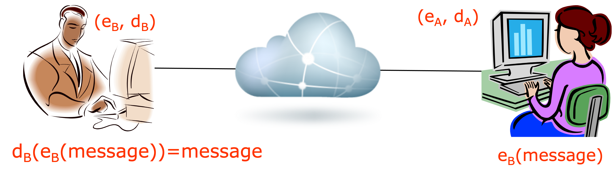
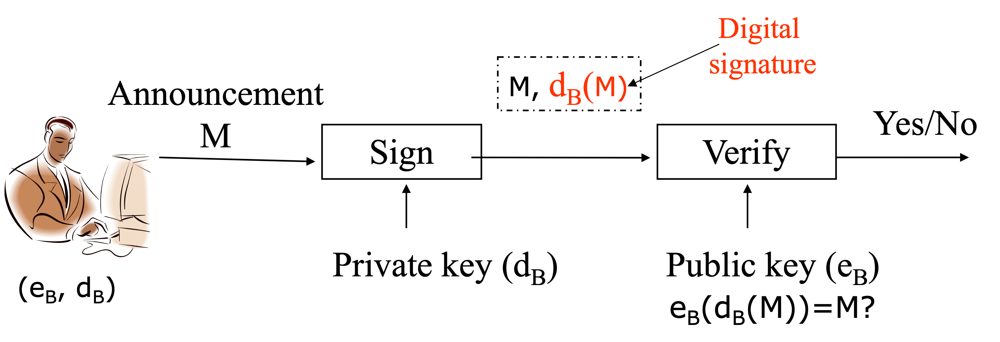

# Introduction to asymmetric cryptography

We are first going to discuss different type of cryptography.
Next we introduce the public key crypto.
One example of public key crypto is RSA. So we are
going to discuss a little bit more about RSA and see how it works.
The Linux command line tool *openssl* implements a lot of cryptographic functions.
We are going to use it for hands-on exercises.

## Different types of cryptography

We have discussed the secret key cryptography, i.e., symmetric crypto.
Based on the number of keys, we can actually categorize cryptography into three types.
One is the hash functions, which will be introduced in another tutorial.
When we use hash functions, there's no key over there.
The second type of cryptography is the secret key crypto,
in which the sender and the receiver use the same key for encryption and decryption.
The third type is public key crypto.
In public key crypto, each person or entity has two keys, (public key, private key). Why do we mention entity? A computer server like web server can also have a public and private key pair.
Who has a key pair really depends on the application.
But for simplicity, we often just say a person has a key pair.

Before we introduce public key crypto, let's review what we have learned about the secret key crypto.
In the picture below, we have Bob on the left and Alice on the right.
Bob is sending Alice a message, which is called plaintext.
Bob is going to use an encryption algorithm, for example AES, and a secret key
to encrypt the plaintext.
This procedure produces the ciphertext.
The ciphertext goes through the Internet and finally arrives at the receiver, Alice.
Alice uses a decryption algorithm, e.g., AES,
and the same key used by Bob to decrypt the ciphertext and obtain the original plaintext.
This is a basically how we use a secret key crypto algorithm to encrypt a message.


Secret key crypto is also called symmetrical crypto (because of the same key for encryption and decryption by sender and receiver) or conventional crypto (because that was conventionally used).

## Public Key Cryptography

### Encryption and Decryption
The picture below shows how encryption and decryption are done in public key crypto.
We have again Bob on the left and Alice on the right.
In any scenario of public key crypto, each person or entity has two keys.
Here Bob has the public and private key pair (e<sub>B</sub>, d<sub>B</sub>),
where e<sub>B</sub> is Bob's public key and d<sub>B</sub> is his private key.
Like Bob, Alice has her own public and private key pair (e<sub>A</sub>, d<sub>A</sub>), which is different from (e<sub>B</sub>, d<sub>B</sub>).
The public key shall be released to the public and known by people who want to know it. Actually how to realiably publish public keys is another problem although we will not discuss it in this tutorial.
The private key shall be keep secret to the person/entity who owns it.


Let's say Bob is going to send Alice a message *M*, which is the plaintext.
Pay attention to how the encryption is done.
Bob needs an encryption algorithm and a key.
In this case, Bob is going to use Alice's public key e<sub>A</sub> for the encryption.
Alice's public key is supposed to be known by the public.
That is why it is called *public* key.
Bob uses an encryption algorithm such as RSA introduced later and Alice's public key to encrypt the message.
The encryption produces the ciphertext, i.e., e<sub>A</sub>(M), 
which means e<sub>A</sub> is used to encrypt the message *M*.
The ciphertext goes through the Internet and arrives at the receiver, Alice.
Alice then uses a decryption algorithm such as RSA and her private key d<sub>A</sub>, which is different
from her public key, to decrypt the ciphertext and produce the original plaintext.
That is, 

<p align="center"> d<sub>A</sub>(e<sub>A</sub>(M))=M. </p>

You can see in public key crypto, 
the encryption and the decryption use *different* keys.
That's why public key crypto is also called asymmetrical crypto.
Also pay attention to the fact that Bob uses Alice's public key (not Bob's keys) to encrypt the plaintext.

The public key crypto often involves a lot of mathematical calculations,
which are time consuming for computers.
As we have learned, encrypton in secret key crypto uses substitutions and permutations,
which can be done fast by computers. 
Secret key crypto performs encryption that doesn't involve a lot of mathematical calculation.
But public key crypto often involves a lot of
mathematics, thus is often much slower than secret key crypto.

### Applications: Data transmission and secure storate
One application of public key crypto is secret data transmission as the example above shows.
Let's look at another example here.
In this example Alice has a message *M* to send to Bob.
She is going to use Bob's public key e<sub>B</sub> to encrypt this message *M*.
The ciphertext e<sub>B</sub>(M) is sent to Bob.
Bob then uses his private key d<sub>B</sub> to decrypt this ciphertext and recover the original message.
That is,

<p align="center"> d<sub>B</sub>(e<sub>B</sub>(M))=M. </p>



You can also use public key crypto for secure storage, storing encrypted data such as files on a hard disk.
You can use your public key to encrypt files or other data and put the encrypted data on your hard disk.
Because only you have the private key, only you can actually decrypt the encrypted data.
That's the idea of secure storage with public key crypto.

## Key exchange
If we have a lot of data to transmit across the Internet,
we actually do not use public key crypto for encryption and decryption because it's too slow.
You don't want to wait for your messages to arrive after a long delay, right?
That's why when we need real-time interaction with each other,
we are going to use secret key crypto to encrypt messages.

However in secret key crypto when we do encryption and decryption
we need to share a secret key between the sender and the receiver.
But on the Internet, how can we share a key with somebody far away?
Calling somebody is really awkward, not convenient either.
How do we actually share a secret key across the Internet?
This problem is called *key exchange*.


The problem of key exchange can be solved by public key crypto.
Let's look at this example here.
We have Alice on the left and Bob on the right.
Alice wants to send a secret key *K* (for secret key crypto) to Bob.
Alice can just use Bob's public key e<sub>B</sub> to
encrypt this secret key *K* and send e<sub>B</sub>(K) over to Bob.
When Bob receives it, he can use his private key d<sub>B</sub> to decrypt this encrypted secret key and  recover the secret key. That is,

<p align="center"> d<sub>B</sub>(e<sub>B</sub>(K))=K. </p>

Once this secret key *K* is shared between Alice and Bob, they can use this secret K to encrypt messages.
Here is an example.
Alice has a message M.
She uses K to encrypt M with the AES algorithm.
The ciphertext K(M) is sent to Bob.
When Bob receives it, he can use the shared key K to decrypt the ciphertext, that is

<p align="center"> K<sup>-1</sup>(K(M))=M. </p>

Here K<sup>-1</sup> means that K is used to decrypt the encrypted message K(M).


### Two Properties of Public Key Crypto
Here are two important properties of public key crypto, not limited to RSA.

#### d(e(M))=M

A message M can be encrypted with one’s public key e, i.e., e(M).
Only the one’s private key can be used to decrypt e(M), that is, d(e(M))=M.
We have been using this property for encryption and decryption for secret message transmission.

#### e(d(M))=M
One can encrypt a message by its private key d, i.e., d(M).
Only the one’s public key can be used to decrypt d(M), that is, e(d(M))=M.

Here is a question for you.
Can we use the second property for secret data transmission?
For example, Alice encrypts a message M with her private key and gets d<sub>A</sub>(M).
She sends the ciphertext to Bob, who can use Alice's public key to decrypt the ciphertext e<sub>A</sub>(d<sub>A</sub>(M))=M. Technically this is fine. Is this secure? If a bad guy over the Internet intercepts the ciphertext during its transmission, can the bad guy decrypt the ciphertext?

### Naive digital signature

The second property of public key crypto is actually the foundation of a critical application, digital signature.
Let's see a naive digital siganture scheme.
In this example Bob wants to publish an announcement M.
He wants to sign the message and let everybody know he makes that announcement.
Everybody can verify he makes that announcement.

How can we produce such a digital signature?
This is how it works.
Bob has his public and the private key pair (e<sub>B</sub>, d<sub>B</sub>).
e<sub>B</sub> is his public key and d<sub>B</sub> is his private key.
Signing the annnoucement M means Bob is going to use his *private key* to encrypt M.
That is, the digital siganture is d<sub>B</sub>(M).
When bob publishes the annoucement, 
he publishes both M and the digital signature d<sub>B</sub>(M), M | d<sub>B</sub>(M), where | means concatenation.



How can you verify the signed annoucement is from Bob?
Let's assume you have Bob's public key.
This is how we do it.
Basically anybody can use Bob's public key
to decrypt the digital signature, that is the encrypted annoucement M.
if the decrypted M is the same as the published M, the annoucement M is from Bob
because only Bob's public key can decrypt this encrypted M right.
Then we are sure the annoucement is from Bob.

This is a naive digital signature because you can see
here the whole annoucement is encrypted with Bob's private key as the digital signature.
That's not very efficient since this digital siganture is too long.
When we discuss hash functions, we will see the real world digital siganture.

## RSA

One example of public key crypto is RSA, which is a very popular one.
Let's look at how we use RSA to encrypt and decrypt messages.
When we talk about messages, you know
all the messages, docs and data are stored as sequences of binary numbers on computers.
A message is just a sequence of bits.
For example, American Standard Code for Information Interchange (ASCII) encodes 128 English letters and other particular characters into seven-bit integers. 
So encrypting a message is equivalent to encrypting a number.
So here is an example. Let's say *m* is 10100001.
We don't care about what the binary number means in terms of messages.
But this binary number is equal to the decimal number 161.
So when we say we want encrypt *m*, we actually encrypt the corresponding number 161.

### RSA: Creating public/private key pair

Let's first look at how we create a public key and the private key.
Recall in public key crypto, everybody must have a a pair of public and private keys.

**Step 1**: You choose two large prime numbers.
So what is a prime number?
A prime number has only two factors, one and itself. 

**Step 2**: You compute n=p &times; q,
and z = (p - 1) &times; (q - 1).

**Step 3**. Now you choose e.
e shouldn't have common factors with z. Really we do not consider 1 as a common factor.
We also say e and z are relative prime.

**Step 4**. Finally you choose d.
d should be chosen this way so that e &times; d mod z = 1.
That is, when we perform e &times; d divided by z, the remainder is one.

We are done with creating the public and private key pair.
The public key is (n, e) and the private key is (n, d).
So you can see here in RSA, for each key we have two numbers.
Because of the roles of e and d above, I use e to refer to public key and d for private key for a public and private key pair (e, d).

### RSA: encryption, decryption

Now let's look at RSA encryption and decryption.
When we encrypt a message m, we just do the calculation m<sup>e</sup> mod n, which produces the ciphertext c.
That is,

<p align="center"> c=m<sup>e</sup> mod n. </p>

We are done done with the encryption!

Let's see how to decrypt the ciphertext c, which is treated as a number.
You just do c<sup>d</sup> mod n, which produces the original message m! A majic!

<p align="center"> c<sup>d</sup> mod n = m. </p>

You can refer to a lot of college textbooks on why this works and proof.
Anyway this is just show it works.
The process is just as simple as that.
But you can see here RSA involves exponential calculation.
That's slow in computers.
That's why we said public key crypto is often slow compared with secret key crypto.

Here is one example of performing RSA encryption and decryption with small numbers.
p=5 and q=7. p and q are prime numbers.
Therefore, n = p &times; q = 35; z = (p-1) &times; (q-1) = 24.
We choose e = 5, which is relatively prime to z=24.
d = 29 by solving ed mod z =1.

Now we want to encrypt this message 00001000, which is the decimal number 12.
We do the encryption:

m<sup>e</sup> mod n=12<sup>5</sup> mod 35=17.

Now we do the decryption, 

c<sup>d</sup> mod n=17<sup>29</sup> mod 35 = 12.

A calculator software program on computers can do this if the calculator has the *mod* functionality.

## OpenSSL
OpenSSL is a crypto library that implements various cryptographic functionalities. openssl is a command line tool under Linux. openssl uses various cryptography functions of OpenSSL's crypto library and can be used for
- Encryption and Decryption with Ciphers
- Calculation of Message Digests = Creation and management of private keys, public keys and parameters
- Many oore…

## Hands-on

### Hands-on 1: Use RSA to Encrypt and Decrypt a Message
1. Generate Public and Private Key Pair
```
openssl genpkey -out privkey.pem -algorithm rsa
```
- *<a href="https://www.openssl.org/docs/manmaster/man1/openssl-genpkey.html">openssl genpkey</a>*: Generate a private key
- The created privkey.pem can be used as the private key although it contains the public key
- *-out outfile*: Output file, privkey.pem in this case, which stores the private key
- *-algorithm val*: The public key algorithm, *rsa* in this case 

2. Extract public key from privkey.pem and save it in pubkey.pem
```
openssl rsa -in privkey.pem -outform PEM -pubout -out pubkey.pem
```
- *<a href="https://www.openssl.org/docs/manmaster/man1/openssl-rsa.html">openssl rsa</a>*: RSA related operations
- *-in filename/uri*: the input to read a key from, privkey.pem in this case
- *-outform DER/PEM*: The key output format, PEM in this case
- *-pubout*: a public key will be output
- *-out filename*: The output filename to write a key, pubkey.pem in this case

3. Create a file
```
echo "Welcome to LinuxCareer.com" > encrypt.txt
```
- *<a href="https://www.guru99.com/linux-redirection.html"> > </a>*: Redirect the output, in this case to a file, encrypt.txt

4. Encryption
```
openssl rsautl -encrypt -inkey pubkey.pem -pubin -in encrypt.txt -out encrypt.dat
```
- *<a href="https://linux.die.net/man/1/rsautl">rsautl</a>*: sign, verify, encrypt and decrypt data using the RSA algorithm
- *-encrypt*: encrypt the input data using an RSA public key
- *-inkey file*: input key file
- *-pubin*: input file is an RSA public key
- *-in filename*: input filename to read
- *-out filename*: output filename to write to

5. Encode the binary ciphertext with base64
Encoding with base64 is not necessary, but needed for sending the ciphertext through our chat server
```
openssl enc -base64 -in encrypt.dat -out encrypt.dat.base64
```
- encrypt.dat is binary 
- encrypt.dat.base64 is printable

6. Decryption with RSA
- Decode encrypt.dat.base64 and get the binary ciphertext 
```
openssl enc -base64 -d -in encrypt.dat.base64 -out encrypt.dat
```
- Decryption
```
openssl rsautl -decrypt -inkey privkey.pem -in encrypt.dat -out new_encrypt.txt
```

### Hands-on 2: RSA Encrypted Message through Chat Server
- Use OpenSSL and RSA to encrypt a message
  - The message can be saved in a file first
- Send the message via the chat server
- Use OpenSSL and RSA to decrypt the ciphertext

### Hands-on 3: RSA
Consider RSA with p = 5 and q = 11.
- What are n and z?
- Let e be 3. Find d such that de = 1 (mod z). 
- Encrypt the message m = 8 using the key (n, e). Let c denote the corresponding ciphertext.
- Decrypt the ciphertext. 
