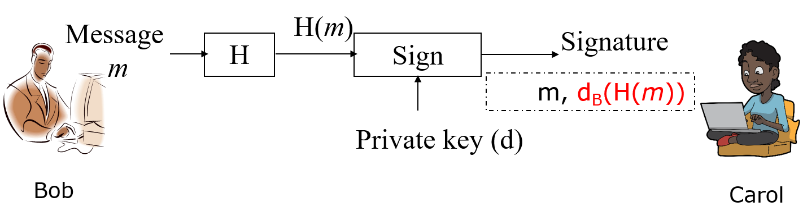
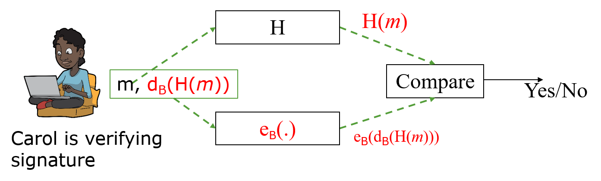
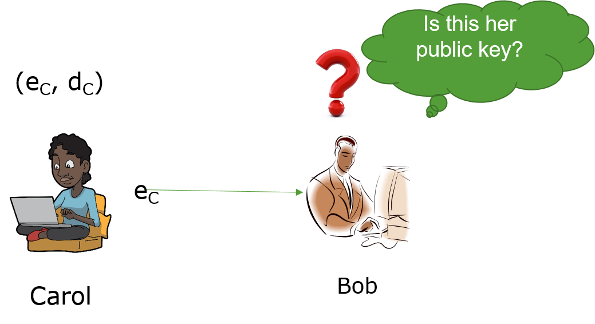

# Digital Siganture

To to editted!

We are going to first talk about what is the real digital signature you are using every day when
you use browse websites, many of which use the https protocol.
We will then discuss what is a certificate.
At last we'll talk about the hands-on.

## Introduction to real-world digital signature

Let's first look at a conventional signature.
I think you know we are implementing the conventional signature in a weird way.
Do we really actually check the signature?
If we do, we just use eyes to look at the signature and see if it is right. That is not really scientific.

The digital siganture can be verified in a scientific way using the properties of public key crypto below.

e<sub>B</sub>(d<sub>B</sub>(m))  = m = d<sub>B</sub>(e<sub>B</sub>(m)) 

The right part of the formular: When you send a message m to Bob with the public and private key pair (e<sub>B</sub>, d<sub>B</sub>), use his public key to encrypt the message e<sub>B</sub>(m). Bob can use his private key to decrypt the message d<sub>B</sub>(e<sub>B</sub>(m)) = m. 

The left part of the formular is used by digital signature. Bob can encrypt a message m with his private key d<sub>B</sub>(m). So the signing 
Everybody can use Bob's public key to decrypt such encrypted message e<sub>B</sub>(d<sub>B</sub>(m))  = m.

In the naive digital signature, we use signing a contract as the example.
Bob publishes the contract this way in two parts.
The first part is the contract m, 
and the second part is the encrypted contract by Bob's private key d<sub>B</sub>(m), which is the naive digital siganture.
Everybody knows Bob's public key.
To verify the digital signature, you decrypt the naive digital siganture with Bob's public key,
e<sub>B</sub>(d<sub>B</sub>(m))  = m. If the decrypted m is the same as the published m, 
it must be Bob who signs the contract because only Bob's public key can decrypt the naive digital signature right.

What is the problem of this naive digital signature?
It's too long. An encrypted contract by Bob's private key is at least as long as the contract itself.
The naive digital signature has too much overhead.

Let's now look at the real-world digital signature, which uses hash.
Bob first hashes the contract H(m), and then encrypts the hash with his private key d<sub>B</sub>(H(m)), which is the digital signature.
So now Bob publishes m, d<sub>B</sub>(H(m)).



How can somebody verify the digital signature? Carol in the figure below can verify it this way.
She first hashes the published contract H(m), and then decrypts the digital signature e<sub>B</sub>(d<sub>B</sub>(H(m)))=h(m). 


Now she compares the decrypted version of
the contract hash with her newly computed message hash.
If they are equal, it is Bob who signs the contract because Bob's public key can decrypt
the digital signature right. 

## Introduction to certificate

We always assume we know somebody's public key so far.
But how do you know you get somebody's public key right?
Anybody can pretend to be sombody else on the Internet.
Se have to think about a way to reliably deliver our public keys.

So this is the question: We need somebody's public key for verifying her signature and need her public key.
In the picture below, Carol wants to give Bob the public key over the Internet.
How can Bob be sure the public key that is sent over to him is really Carol's public key?



We can use a digital certificate to solve the problem. it's actually the concept
How can Carol get a certificate for herslef?
- Carol generates her key pair (e<sub>C</sub>, d<sub>C</sub>)
- She goes to a Certificate Authority (CA) face-to-face. A CA can be a trusted company.
- CA verifies her information, denoted as m, which includes name, identity, address and others, and obtains her public key e<sub>C</sub>.
- CA issues Carol a certificate, which contains two parts, m and signature over m.
  - m contains Carol’s name, identity, address and others as stated above, and her public key e<sub>C</sub>
  - the signature is d<sub>CA</sub>(H(m))


so we have carrot here right and then you basically carrot will get the certificate for
her identity and her poverty how do we do that
what kerry will do is apparel can generate her public and private key pair you
you guys said that before you can use rc the open ssl to generator to general key
right so you generally then you go to [Music]
certainly authority they have a building order and for example there's an older
company called the very start of a new new name of the company but anyway you are still using very soft so there are
companies so you need to quickly go over there present your
identity your other emails many other things information and
your public so you present all the information identity particular
identity and your public key to the ca
ca is going through the verification they physically check your residence and doing other things they make sure okay
this camera is not actually pretended camera right and uh
it's not a clown on the internet so they physically check everything after everything is verified
they are going to give you a certificate what does that mean so what is a certificate
a certificate is actually signed information
what is the information so basically in a certificate
the message like the identity public key resident information and
other things so we should use those information to you can define
china and also tell us publicly the whole thing here becomes the message
and then the ce has its own property and private key pairs
right this connection user is a property to
sign [Music] all the information here including identity
and publicly this will create the signature for all the information
carrier supplements to the ck so basically all the information here
and the thing together is called the certificate which is a file on a
computer you can use okay that's called a certificate okay so
okay and then what is the point of a specification
let's see okay how do you verify a certificate let's see you know
paris uh you know let's do that okay so
let's see here we care what is going to
uh travel only gets a little bit from the authority right
and then so carol is going to stand up
carol wants to use this certificate to communicate with
the computer and this computer actually won't verify
if this is clear or not okay and uh so this is our problem the assumption is
maybe something you don't know every computer you are using
in windows mac they all shoot with uh
the least of a series publication so basically for example if
you got your certificate from very sign okay then when you science publicly is
actually on your computer when windows deliver that windows to you right when you buy
the computer from any vendor the cvs public keys
are already open it's also in the format of a certificate but really
you just assume you already have any series publicly
saved on your computer okay so now
let's see you know travis identity for example
right and so then camera actually suddenly
this one submitted to this computer the computer knows i'm going to check
this camera at a gmail.com certificate if it is a third certificate now i know
yes this is the per publication right so in this way we know
yes we get the right presence publicly because the carrier
a carrier doctor clara bill.com is the identity of account right because
everybody has a unique gmail account is that right
so now my question here is okay let's see this camera
how can the computer here verify
this certificate
verify means everything is right
so quick number id camera about the camera at rather than just other achievement.com
by this topic right and then the signature is like the x so the signature is a
it's an improved version of what the youtube version of cache of everything
it's the same as a what we have discussed here
it's same as this one okay because you have the computer has
sales public key right stored on the computer
so now the question is the question is
how can you verify the information here is correct
i'll give you one minute talking with your group
ah
[Music] want to give a try i thought you guys were discussing
it same as this one this is exact same
okay right and so it's here so basically i said
to this part right this information this message is a crazy information right
and well that's a kind of so
any any uh uh anyone any group wants to do a try
go ahead equip with the save the key which is
stored on the computer right then you got this equipped version of a
patch of iv other information in a publication then
the information in the certificate right hash this chart because this part
is a basically id other information and uh
easy right and then so this is the id right let me make this clear
let's make it they are the same other info
oh sorry and also the ec right
now i make it easier nowhere
up here
okay so now it's better all right so this is the id
other info easy right signature so can you see it again
uh so you you you use the says public key click this one you got
there then then you hash
id so you have this one this one this one together right
yeah okay now you compare the newly computed patch with decreased version of the hash
if that's equal basically it means this certificate is generated by the certificate authority
every information in this file in this certificate is correct and
because here the id is idscaro gmail.com and you know you try to get a travel
entertainment.com property key everything here is right
that means easy is carrier at gmail.com
is that right correct right okay any question here
any question here good okay and uh so this is called a certificate and uh
if you still have kind of a dot that's okay because when i learned this thing myself i
remember i spent like two years learning this you guys are learning this like in
two days right and uh good and also let's look at a few terms and we are
almost done here and so basically you know each certificate has an owner the
owner is called a subject when we talk about the certificate so a subject may
have a company that's the id okay other kind of information and uh so
that's uh some terms when we talk about the solution is when you actually read the articles you finally talk about the
subject subject is the owner of the certificate a subject can have many different properties such as a common
name which is the id and maybe residence phone number right other information
okay maybe also the address of the owner and uh yeah
so you may think okay you tell me and uh you tell me
a computer actually stores all these public keys where are they
so you can use uh this command right push the windows uh icon right search and enter
this one it will show you actually all the certificates which is which are
saved in a database so if you click here then you will find there's a publication so you click here
for example here it's called what so the salty primary route this one is
the actual uh authority okay and you can see many others there are so many different
things right and if you click the one right you can
see here some specific information here and uh
[Music]
[Music] basically the public key
but the media friendly trust the public key of this city is correct okay
and uh because we just assume okay here the information here is all right
because it comes from the vendor okay
so here is the details and you can see here signature somewhere down here is actually the
you can see here right and uh there are missing virgin serial numbers feature algorithm java are they finished
algorithm issued by this guy from the different stage
[Music]
so if you click here i remember this one you click here you will see actually the password
okay but something here you can see here
other information here that's the id and although we don't use uh
the email but anyway so that's the description of a subject
and also as i said every computer has that certificate store
and you just trust them right because it ships from the vendor and uh for example
i didn't follow
certificate store okay good any questions so far
clear okay and uh so the hands-on here is uh you can do it as much as you can
and uh so you can contact the certificate store of windows
with the hands-on one so i give you all the detailed instructions over there right
and you can also generate a public private keeper you already did it okay and uh
remember here when you use the basic command ssl it generates
the key pair and this file contains both public key and privacy
you use this approach to speak the publicly out right and that's what we said before
and now let's see you understand
so here is the file i'm using this file called chip clone but really you can use any file here but make sure okay
when you use this command right the file is in a statement folder where you have the command okay you can
use a like a text editor to create a file and uh and put a message over there
any name okay so here what we do here is that we are using openness
the digital signature and uh user change because we attached
to the message right and uh 256 and we are going to use this privacy
[Music]
and this is the file you want to actually create the signature so i know many people are still not so
familiar with the command line and me right but then it's time for
that for this one we are doing the decoding
because we are going to send this feature actually to [Music]
the china server right and that's why we do the basic before
then you can verify it you can verify so in this case okay
and uh basically this is the decoding right and but really we don't need it if we're just
playing everything yourself if you don't stand there things over chat server you don't need the
encoding and decoding guitar so let's look at the signature part so in this case you can see again
we are verifying the signature one is option parameter
and uh so the public key is image file and the
signature is in this file this is the original part so you are
checking if this signature is for this fact
or if if you know it is called this signature
is the signature of this file and you are checking if the file is changed or not or it's
suspended by the guy who actually signs the file
right and but this is your part you you name it okay and uh
some trans parameters are fixed
this isn't your own file of your
so this is the game right read it so once one person sent out
actually the message whatever and uh and you can follow the steps
the hand down you can discuss right if for example the file is changed
then when you try to verify the signature you can see here
right you'll need to actually provide the change in the file and also
the original signature there will be no match right
and uh i guess uh basically this is uh
the end of our lecture and any questions
any questions good good okay so we have 30 minutes 25 minutes and then you can just do as
many as much as you can okay and then we'll start uh the the last game of this
program i'll get the teeth out okay
ask them this is your last chance talking with them
[Music] okay please go out help them this last
last 25 minutes
using my github repository okay and uh lecture 10
so over there there is detailed description of the hands-on
so i'm going to be busy with your problems
you


## Hands-on
Although the hands-on lab can be done by one person, we highly recommend one student as Sender signs the message, and another student as Recevier verifies the signature.

### Hands-on 1: Windows 10 Certificate Store
- Please click on the Windows *Start* icon. In *Type here to search*, type and search *certmgr.msc*, which is the Windows 10 certificate store
- All people check content of a certificate from Trusted Root Certificate Authorities
- Discussion: why are these certificates needed?

### Hands-on 2: Sender: Generate Public and Private Key Pair
From now on, two students are needed, one as Sender and the other as Receiver.

- If done before, no need 
- Generate public and private key pair
```
openssl genpkey -out privkey.pem -algorithm rsa
```
Note: privkey.pem can be used as the private key although it contains the public key.

- Extract the public key from privkey.pem
```
openssl rsa -in privkey.pem -outform PEM -pubout -out pubkey.pem
```

- Publish your pubkey.pem, e.g. via our chat server
- Never share privkey.pem

### Hands-on 3: One student as Sender: Sign a file
- Put a message in a file and sign the file. Note: replace *your-file* in the command below with your chosen file.
```
openssl dgst -sha256 -sign privkey.pem -out sign.sha256 your-file
```

The output sign.sha256 is binary

- Encode the binary signature with base64
```
openssl enc -base64 -in sign.sha256 -out sign.sha256.base64
```
Not really needed. It is needed here since we can send the base64 encoded message over our chat server

- Send both message and base64 encoded signature over our chat server

### Hands-on 4: Another Student as Receiver: Verify the Signature
- Save received signature into a file, e.g., called sign.sha256.base64

- Decode sign.sha256.base64 and get the binary signature
```
openssl enc -base64 -d -in sign.sha256.base64 -out sign.sha256
```

- Verify the signature with the public key
```
openssl dgst -sha256 -verify pubkey.pem -signature sign.sha256 changelog
```

### Hands-on 5: Discussion: Message under MITM
No need to do it although you can do it.
- Assume  the message is changed by MITM.
That is, hahaha… is added to the received message
- Repeat the same procedure above
- Will the verification ne ok this time?
