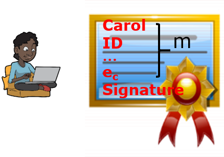
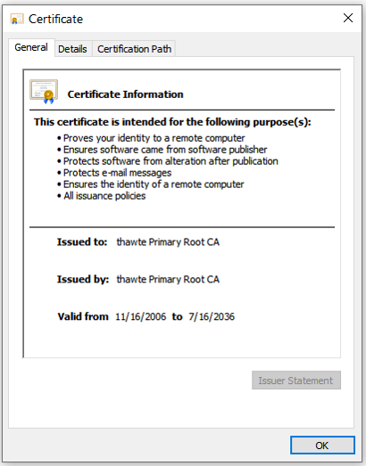
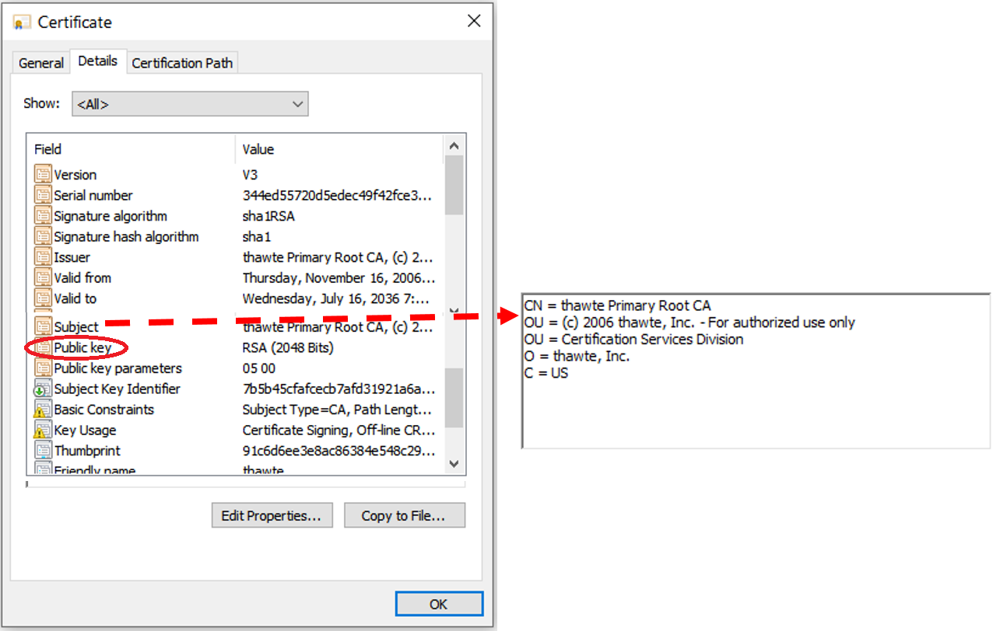

# Digital Siganture

To to editted!

We are going to first talk about what is the real digital signature you are using every day when
you use browse websites, many of which use the https protocol.
We will then discuss what is a certificate.
At last we'll talk about the hands-on.

## Introduction to real-world digital signature

Let's first look at a conventional signature.
I think you know we are implementing the conventional signature in a weird way.
Do we really actually check the signature?
If we do, we just use eyes to look at the signature and see if it is right. That is not really scientific.

The digital siganture can be verified in a scientific way using the properties of public key crypto below.

e<sub>B</sub>(d<sub>B</sub>(m))  = m = d<sub>B</sub>(e<sub>B</sub>(m)) 

The right part of the formular: When you send a message m to Bob with the public and private key pair (e<sub>B</sub>, d<sub>B</sub>), use his public key to encrypt the message e<sub>B</sub>(m). Bob can use his private key to decrypt the message d<sub>B</sub>(e<sub>B</sub>(m)) = m. 

The left part of the formular is used by digital signature. Bob can encrypt a message m with his private key d<sub>B</sub>(m). So the signing 
Everybody can use Bob's public key to decrypt such encrypted message e<sub>B</sub>(d<sub>B</sub>(m))  = m.

In the naive digital signature, we use signing a contract as the example.
Bob publishes the contract this way in two parts.
The first part is the contract m, 
and the second part is the encrypted contract by Bob's private key d<sub>B</sub>(m), which is the naive digital siganture.
Everybody knows Bob's public key.
To verify the digital signature, you decrypt the naive digital siganture with Bob's public key,
e<sub>B</sub>(d<sub>B</sub>(m))  = m. If the decrypted m is the same as the published m, 
it must be Bob who signs the contract because only Bob's public key can decrypt the naive digital signature right.

What is the problem of this naive digital signature?
It's too long. An encrypted contract by Bob's private key is at least as long as the contract itself.
The naive digital signature has too much overhead.

Let's now look at the real-world digital signature, which uses hash.
Bob first hashes the contract H(m), and then encrypts the hash with his private key d<sub>B</sub>(H(m)), which is the digital signature.
So now Bob publishes m, d<sub>B</sub>(H(m)).


How can somebody verify the digital signature? Carol in the figure below can verify it this way.
She first hashes the published contract H(m), and then decrypts the digital signature e<sub>B</sub>(d<sub>B</sub>(H(m)))=h(m). 


Now she compares the decrypted version of
the contract hash with her newly computed message hash.
If they are equal, it is Bob who signs the contract because Bob's public key can decrypt
the digital signature right. 

## Introduction to certificate

We always assume we know somebody's public key so far.
But how do you know you get somebody's public key right?
Anybody can pretend to be sombody else on the Internet.
Se have to think about a way to reliably deliver our public keys.

So this is the question: We need somebody's public key for verifying her signature and need her public key.
In the picture below, Carol wants to give Bob the public key over the Internet.
How can Bob be sure the public key that is sent over to him is really Carol's public key?


We can use a digital certificate to solve the problem.

### Generating a certificate by CA

How can Carol get a certificate for herslef?
- Carol generates her key pair (e<sub>C</sub>, d<sub>C</sub>)
- She goes to a Certificate Authority (CA) face-to-face. A CA can be a trusted company has a public and private key pair (e<sub>CA</sub>, d<sub>CA</sub>)
- CA verifies her information, denoted as m, which includes name, identity, and others, and obtains her public key e<sub>C</sub>.
- CA issues Carol a certificate, which contains two parts, m and signature over m.
  - m contains Carol’s name, identity, and others as stated above, and her public key e<sub>C</sub>
  - the signature is d<sub>CA</sub>(H(m))



### Verifying a certificate

How do you verify a certificate?
If a certificate can be verified as genuine,
then we know the ID specified in the certificate has the public key in the certifiate.
Let's see the example in the picture below.
Carol wants to use this certificate to communicate with the computer.
The computer wants to verify her certificate so as to obtain her public key, which can be used later, for example, for key exchange.
Every computer is actually shipped with public keys of CAs within its Operating System like Windows, MacOS, and Linux.
That is, in this case, the computer has the public key (e<sub>CA</sub>) of Carol's certificate.
The CA's pubic key is actually saved in the format of a certificate issused by the CA itself.
How can the computer here verify this certificate d<sub>CA</sub>(H(m))?
We actually have discussed the verification.
The computer use the CA's to decrypt the digital siganture and get the decrypted version of the hash of Carol's informaton contained in the certificate.
The computer also hashes Carol's informaton contained in the certificate directly.
If the newly computed information hash is the same as the decrypted version, the certificate belongs to the ID contained in the certificate, which is Carol in this case.


Let's look at a few terms for certificates.
The owner of a certificate is called a subject.
CommonName is the identity of the owner.
A subject’s CommonName can be an explicit name, e.g. cs.uml.edu and email or a name with a wildcard character, e.g. \*.uml.edu.
A certicate contains related information of the subject.

### Windows 10 Certificate Store
We can find certificates of CAs in an operating system's certificate store. Within Windows, press the Windows logo icon, and type to search for certmgr.msc to run it.


Click an entry which corresponds to one CA.



Click the tab of Details within the CA's information Window and see detailed info.



## Hands-on
Although the hands-on lab can be done by one person, we highly recommend one student as Sender signs the message, and another student as Recevier verifies the signature.

### Hands-on 1: Windows 10 Certificate Store
- Please click on the Windows *Start* icon. In *Type here to search*, type and search *certmgr.msc*, which is the Windows 10 certificate store
- All people check content of a certificate from Trusted Root Certificate Authorities
- Discussion: why are these certificates needed?

### Hands-on 2: Sender: Generate Public and Private Key Pair
From now on, two students are needed, one as Sender and the other as Receiver.

- If done before, no need 
- Generate public and private key pair
```
openssl genpkey -out privkey.pem -algorithm rsa
```
Note: privkey.pem can be used as the private key although it contains the public key.

- Extract the public key from privkey.pem
```
openssl rsa -in privkey.pem -outform PEM -pubout -out pubkey.pem
```

- Publish your pubkey.pem, e.g. via our chat server
- Never share privkey.pem

### Hands-on 3: One student as Sender: Sign a file
- Put a message in a file and sign the file. Note: replace *your-file* in the command below with your chosen file.
```
openssl dgst -sha256 -sign privkey.pem -out sign.sha256 your-file
```

The output sign.sha256 is binary

- Encode the binary signature with base64
```
openssl enc -base64 -in sign.sha256 -out sign.sha256.base64
```
Not really needed. It is needed here since we can send the base64 encoded message over our chat server

- Send both message and base64 encoded signature over our chat server

### Hands-on 4: Another Student as Receiver: Verify the Signature
- Save received signature into a file, e.g., called sign.sha256.base64

- Decode sign.sha256.base64 and get the binary signature
```
openssl enc -base64 -d -in sign.sha256.base64 -out sign.sha256
```

- Verify the signature with the public key
```
openssl dgst -sha256 -verify pubkey.pem -signature sign.sha256 changelog
```

### Hands-on 5: Discussion: Message under MITM
No need to do it although you can do it.
- Assume  the message is changed by MITM.
That is, hahaha… is added to the received message
- Repeat the same procedure above
- Will the verification ne ok this time?
