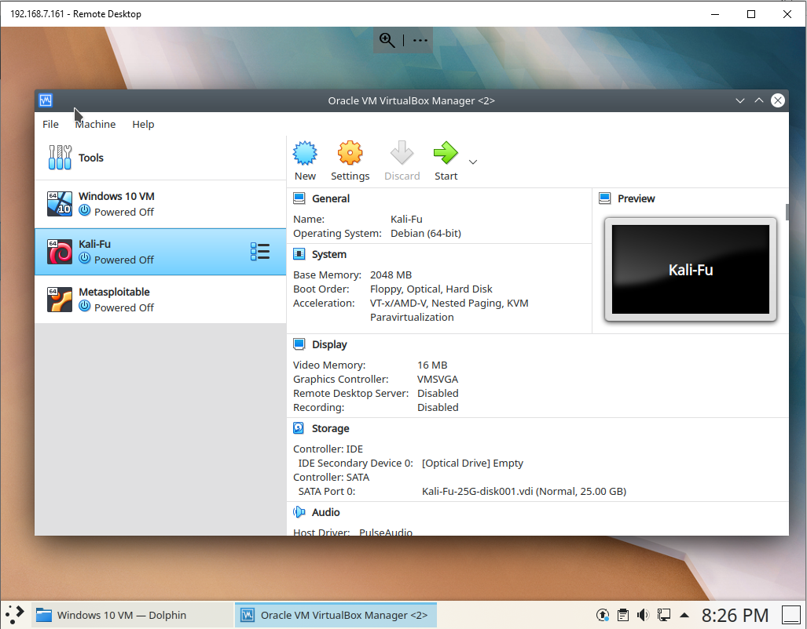

1. Log into a Cyber Range PC with the username *cyberadmin* and provided password
2. Click Application Launcher 

3. Click *Search...*, type "Virtual" and Click "VirtualBox" in the search results

4. *Oracle VM VirtualBox Manager* now shows up. 
   - Click to select the virtual machine *Kali-Fu* and then click "Start" to start the Kali Linux virtual machine.
   - Click to select the virtual machine *Metasploitable* and then click "Start" to start the Metasploitable Linux virtual machine.

