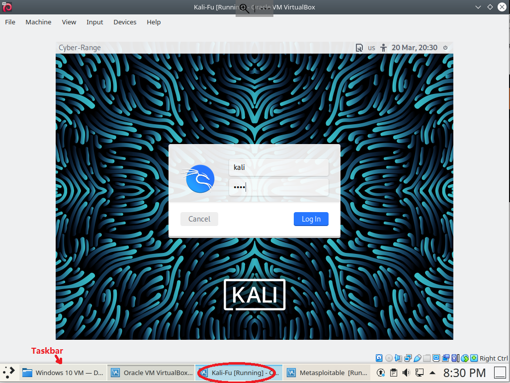

1. Log into a Cyber Range PC with the username *cyberadmin* and provided password
2. Click Application Launcher 

3. Click *Search...*, type "Virtual" and Click "VirtualBox" in the search results

4. *Oracle VM VirtualBox Manager* now shows up. 
   - Click to select the virtual machine *Kali-Fu* and then click "Start" to start the Kali Linux virtual machine.
   - Click to select the virtual machine *Metasploitable* and then click "Start" to start the Metasploitable Linux virtual machine.

5. Log into the Kali Linux with the following credentials. 
   - Username: kali
   - Password: kali
   - Note: Click Kali on the taskbar if you cannot find it

6. Log into the Metasploitable Linux with the following credentials
   - Username: msfadmin
   - Password: msfadmin
   - Note: Click Metasploitable on the taskbar if you cannot find it

7. Within the Metasploitable console, enter the command *ifconfig" and *Enter* to find the IP address of the Metasploitable VM

