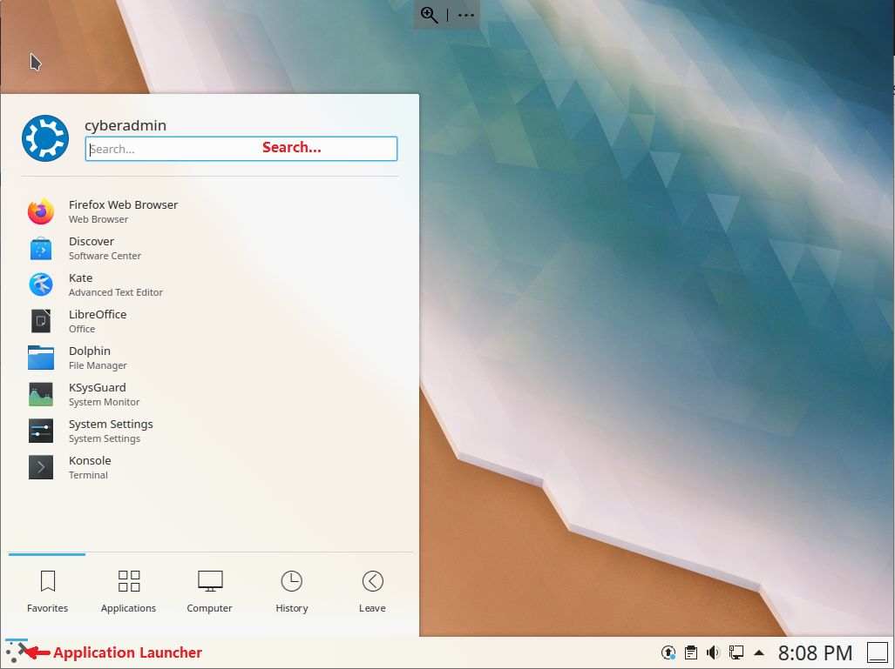
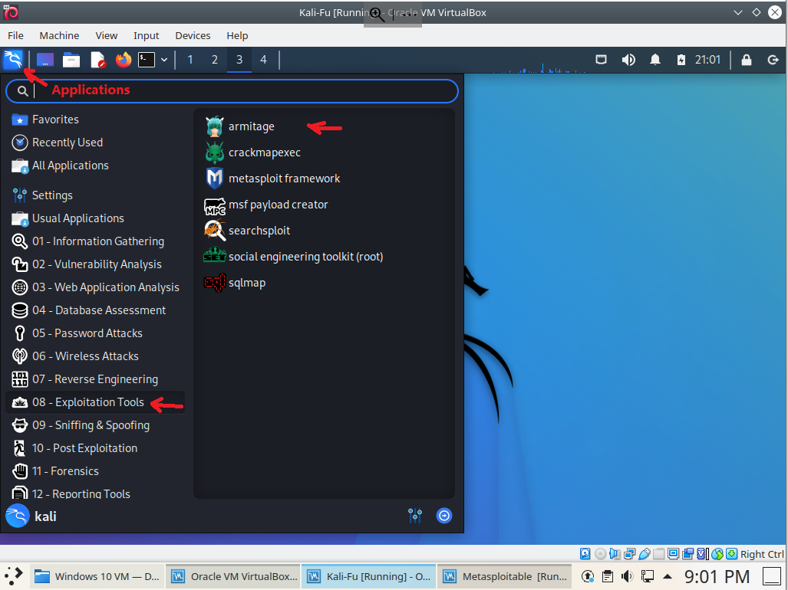
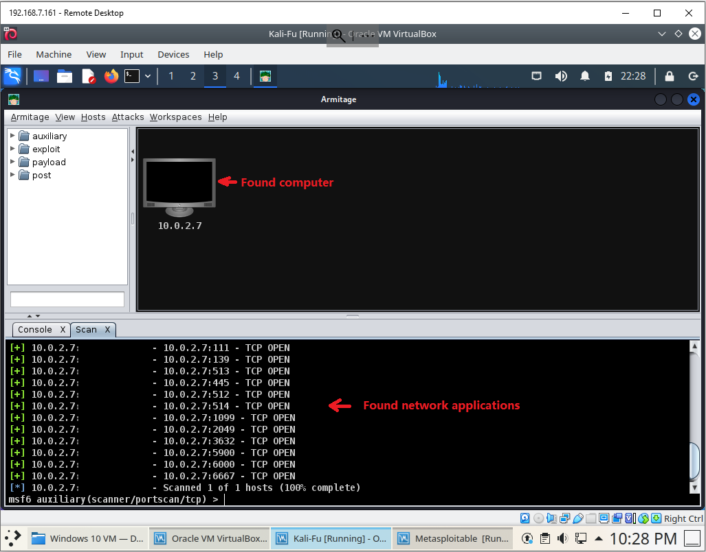

# Penetration Testing

In penetration testing, an ehtical hacker (or security consultant) hacks computers per the request of the owner of the computers. The goal is to find vulnerabilities of the target computers so that the owner can perform remedies, for example, patching the software of interest and enhancing network security.

Penetration testing has three phases
- **Information collecting**. Find the information of the target computers, e.g., IP addresses of those computers.
- **Exploitation**. Exploit the computers and find real vulnerabilities
- **Post exploitation**. Perform post exploitation of the compromised computers, e.g. collecting passwords to show evidences of vulnerabilities.

Below is a video demo. I did this demo by remotely loggng into computers. Except the computer login process, other operations are exactly the same as working at a physical computer.

[](https://youtu.be/flM_0TKfIIc)


# Field Trip

In this field trip, students will use a tool called *Armitage* to perform the three phases of penetration testing. Our lab is set up as follows. 
- We use two virtual machines (VMs), *Kali-Fu* (Kali Linux) and *Metasploitable* (Linux full of vulnerabilities), managed by *Oracle VM VirtualBox Manager*. Virutal machines work like real computers, but they are not physical computers and run on a real physical computer. For example, in our setup, a computer running the Kubuntu Linux actually hosts and runs Kali-Fu and Metasploitable.
- Kali-Fu will be the attacking computer and Metasploitable will be the target.
- Armitage is launched from Kali-Fu and exploits a vulnerability in Metasploitable.

## Setting Up the Lab: Start Kali-Fu and Metasploitable on Host Computer
The host computer (i.e., the physical computer) runs the [operating system](https://en.wikipedia.org/wiki/Operating_system) called [Kubuntu](https://en.wikipedia.org/wiki/Kubuntu). Kali-Fu runs [Kali Linux](https://en.wikipedia.org/wiki/Kali_Linux), a version of Debian Linux. [Metasploitable](https://docs.rapid7.com/metasploit/metasploitable-2-exploitability-guide/) is a version of Ubuntu Linux and intentionally made vulnerable. Ubuntu is also based on Debian.

1. Log into a Cyber Range PC with the **provided username and password**.

2. Click *Application Launcher*.



3. Click *Search...*, type "Virtual" and Click "VirtualBox" in the search results to launch *Oracle VM VirtualBox Manager*.


4. *Oracle VM VirtualBox Manager* now shows up. 
   - Click to select the virtual machine *Kali-Fu* and then click "Start" to start the Kali Linux virtual machine.
   - Click to select the virtual machine *Metasploitable* and then click "Start" to start the Metasploitable Linux virtual machine.


5. Log into the Kali Linux with the following credentials. 
   - Username: kali
   - Password: kali
   - Note: Click Kali on the taskbar if you cannot find it


Question: 
- How can you find the IP address of Kali? Start a *Terminal Emulator* and type the command *ifconfig* and then enter.
- What is the IP address of the Kali VM?

## Collecting Information about Windows VM

6. Log into the Windows VM. Click C:\Tools\vchat\Server\vchat.exe and run the chat server
7. Disable Windows Real-time protection against virus & threat:
   - Enter *Exploit* in *Type here to search* at the left bottom of the Windows desktop. 
   - Click *Exploit protection* system settings in found items. 
   - In the *Windows Security* window, click *Virus & threat protection* -> *Virus & threat protection settings* -> *Manage settings*
   - In the window of *Virus & threat protection settings*, turn off *Real-time protection* 
   - If the windows of *User account control* pops up, click *Yes*

7. Within the Kali GUI (Graphical User Interface), click *Applications*, then *08 - Exploitation Tools*, and then *Armitage* to start the software *Armitage*. We are going to use Armitage to find what networking services/applications are running on Metasploitable.



8. A few dialog windows show up one by one
   - In the dialog window *Authentication is needed ...*, enter the password *kali*
   - In the dialog window "Connect...", click the "Connect" button
   - In the dialog window "Start Metasploit?", click the "Yes" button
   - Wait for the "Progress..." to disappear and Armitage window to show up

9. If there are previous results showing computer icons, click *Host* -> *Clear Database* for cleanup.

10. Within the Armitage window, click *Hosts* and then *MSF Scans...*


11. In the dialog window *Input*, enter 10.0.2.0/24 and click the *Ok* button. 10.0.2.0/24 represents the IPv4 addresses from 10.0.2.0 to 10.0.2.255. That is, Armitage will check all those IP addresses and see which one is active.

Armitage shows the found computer icon (with the IP address of Metasploitable) and what network applications/services (programs that can accept messages from the Internet/network) are running.



Question: Which found IP belongs to the Windows VM?
- Click a found IP, perform *Hosts* -> *Nmap Scan* -> *Quick Scan (OS detect)*

## Exploitation

vchat.exe on Windows VM has a vulnerability. We will exploit it so as to log into the Windows VM.

12. Click the Windows VM icon within Armitage. Click *Attacks* -> *Find Attacks*. Wait for the dialog window *Progress...* to disappear. A dialog Window *Message* shows up then. Click *Ok*.


13. Right click the found computer icon, Click *Attack* -> *vchat* -> *knock*

14. In the dialog window *vulnserver Buffer Overflow-KNOCK command*, click *launch*

If things go well, a lighting icon shows on the found computer icon and it means the found computer is compromsied.


## Post Exploitation

The Metasploitable VM is now compromised. We can log into Metasploitable and do a lot of things. For example, we can list what contents the computer has. Even worse, we can fetch the password file although we do not do it in this hands-on exercise.

15. Right click the found computer icon, then click *Shell 1* -> *Interact*

 

A *Shell 1* console appears

 

16. Within the *Shell 1* console, type the following command. The purpose is to show we can list the content of a folder in the compromised computer.
```
ls /home/msfadmin
```

What is the output of this command?
