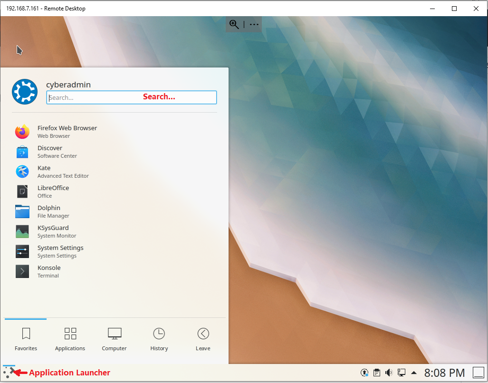
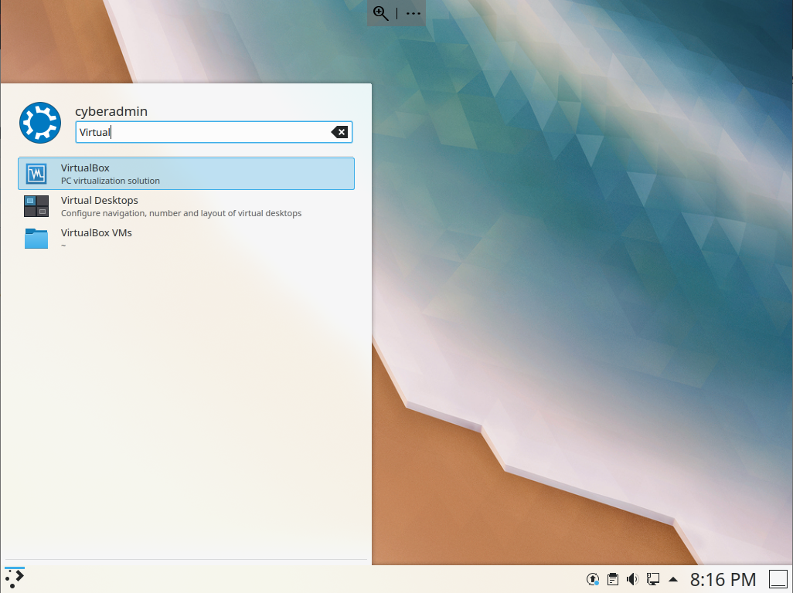
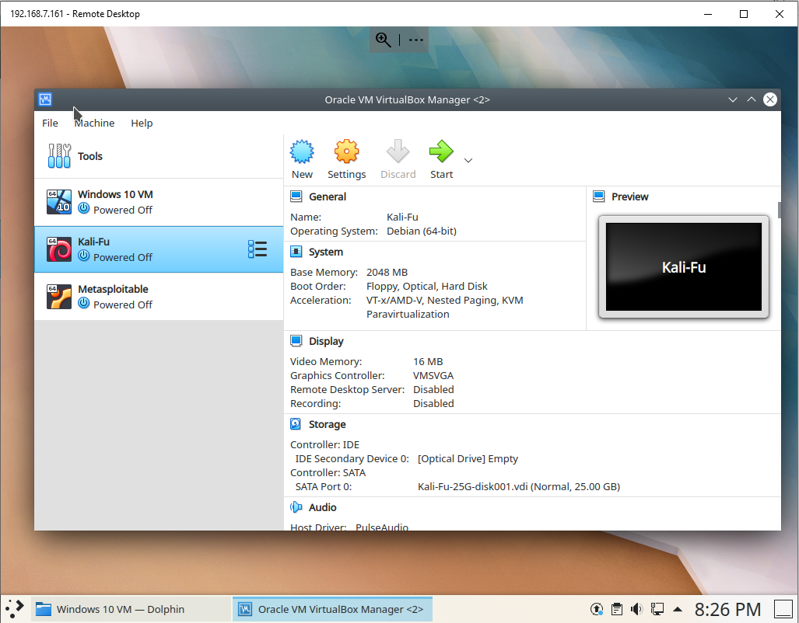
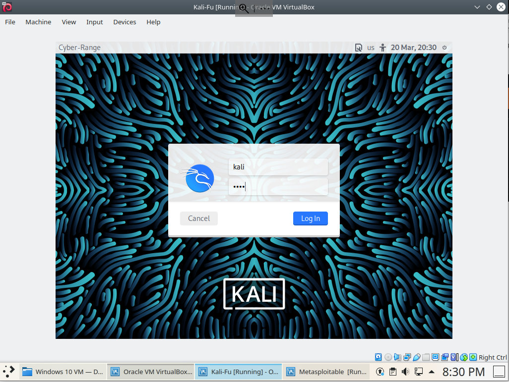
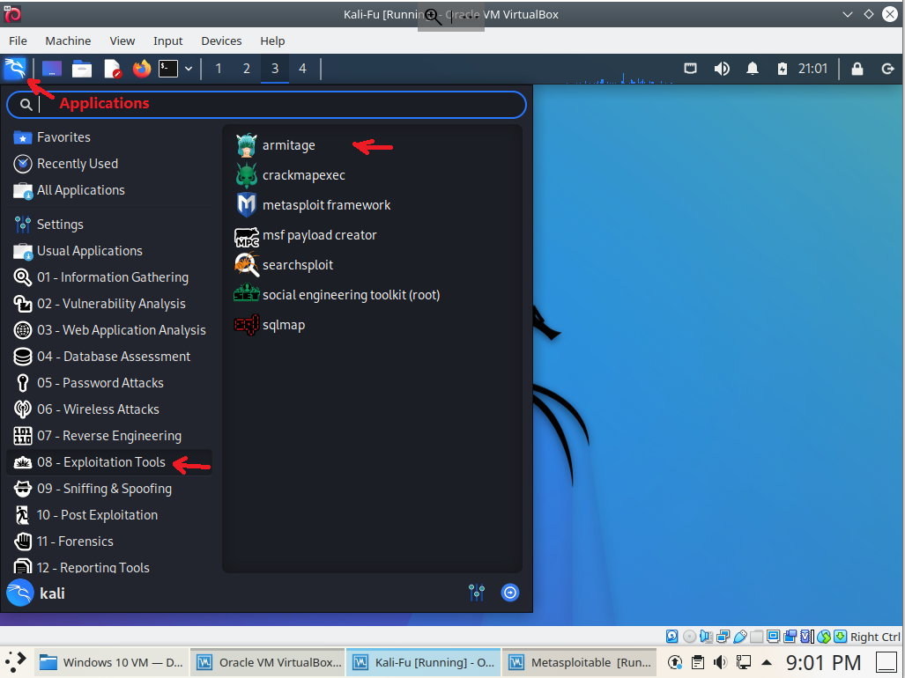
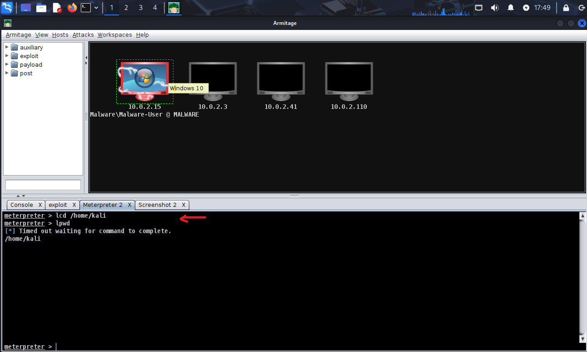
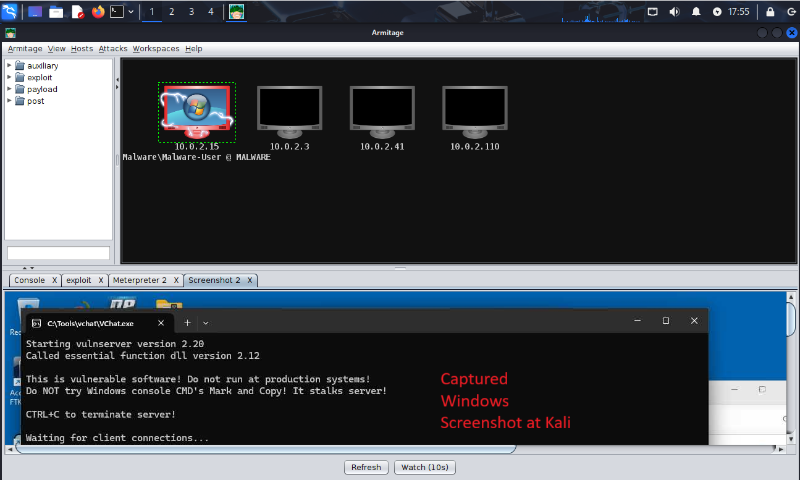

# Penetration Testing

In penetration testing, an ehtical hacker (or security consultant) hacks computers per the request of the owner of the computers. The goal is to find vulnerabilities of the target computers so that the owner can perform remedies, for example, patching the software of interest and enhancing network security.

Penetration testing has three phases
- **Information collecting**. Find the information of the target computers, e.g., IP addresses of those computers.
- **Exploitation**. Exploit the computers and find real vulnerabilities
- **Post exploitation**. Perform post exploitation of the compromised computers, e.g. viewing contents of files and collecting passwords to show evidences of vulnerabilities.

Below is a video demo showing how to use a Kali VM to attack a Windows VM, which runs a vulnerbale chat server (vchat).

[](https://youtu.be/TJX__HPo9jQ)


# Lab Goal

In this lab, students will use a tool called *Armitage* to perform the three phases of penetration testing. Our lab is set up as follows. 
- We use two virtual machines (VMs), *Kali* (Kali Linux) and *Windows 10*, managed by *Oracle VM VirtualBox Manager*. Virutal machines work like real computers, but they are not physical computers and run on a real physical computer. For example, in our setup, a computer running the Kubuntu Linux actually hosts and runs Kali and Windows VMs.
- Kali will be the attacking computer and Windows will be the target.
- Armitage is launched from Kali and exploits a vulnerability in a chat server called vchat.exe.
- **Note**: If needed, watch [video demo](https://youtu.be/eRkYky-CnoU) on setting Up NAT, NAT Network, Bridged Adaptor, Host-Only Adaptor and Internal Network in VirtualBox.

# Setting Up the Lab: Start Kali and Windows VMs on Host Computer
The host computer (i.e., the physical computer) runs the [operating system](https://en.wikipedia.org/wiki/Operating_system) called [Kubuntu](https://en.wikipedia.org/wiki/Kubuntu). Kali runs [Kali Linux](https://en.wikipedia.org/wiki/Kali_Linux), a version of Debian Linux.

1. Log into a Cyber Range PC with the **provided username and password**.

2. Click *Application Launcher*.



3. Click *Search...*, type "Virtual" and Click "VirtualBox" in the search results to launch *Oracle VM VirtualBox Manager*.



4. *Oracle VM VirtualBox Manager* now shows up. 
   - Click to select the virtual machine *Kali* and then click "Start" to start the Kali Linux virtual machine.
   - Click to select the virtual machine *Windows* and then click "Start" to start the Widnows VM.



5. Log into the Kali Linux with the following credentials. 
   - Username: kali
   - Password: kali
   - Note: Click Kali on the taskbar if you cannot find it



**Question**: 
- How can you find the IP address of Kali? 
  - Answer: Start a *Terminal Emulator* and type the command *ifconfig* and then enter.
- What is the IP address of the Kali VM?

# Add TRUN Metasploit Module into Armitage/Metasploit
Refer to [TRUN Metasploit Module](https://github.com/xinwenfu/VChat_TRUN/tree/main/Metasploit).

# Collecting Information about Windows VM

6. Log into the Windows VM with provided password and then run the chat server
   - Click C:\Tools\vchat\vchat.exe and run the chat server

8. Disable Windows *Real-time protection* against virus & threat:
   - Enter *Exploit* in *Type here to search* at the bottom left of the Windows desktop. 
   - Click *Exploit protection* system settings in found items. 
   - In the *Windows Security* window, click *Virus & threat protection* &rarr; *Virus & threat protection settings* &rarr; *Manage settings*
   - In the window of *Virus & threat protection settings*, turn off *Real-time protection* 
   - If the window of *User account control* pops up, click *Yes*

9. Within the Kali GUI (Graphical User Interface), click *Applications* &rarr; *08 - Exploitation Tools* &rarr; *Armitage* to start the software *Armitage*. We are going to use Armitage to find what networking services/applications are running on Metasploitable.



10. A few dialog windows show up one by one
   - In the dialog window *Authentication is needed ...*, enter the password *kali*
   - In the dialog window "Connect...", click the "Connect" button
   - In the dialog window "Start Metasploit?", click the "Yes" button
   - Wait for the "Progress..." to disappear and Armitage window to show up

11. If there are previous results showing computer icons within Armitage, click *Hosts* &rarr; *Clear Database* for cleanup.

12. Within the Armitage window, click *Hosts* &rarr; *MSF Scans...*

13. In the dialog window titled *Input*, enter 10.0.2.0/24 or the target IP and click the *Ok* button
    - 10.0.2.0/24 represents the IPv4 addresses from 10.0.2.0 to 10.0.2.255. That is, Armitage will check all those IP addresses and see which one is active.

Armitage shows the found computer icon (with the IP address of Metasploitable) and what network applications/services (programs that can accept messages from the Internet/network) are running.


**Question**: Which found IP belongs to the Windows VM?
- Click a found IP, perform *Hosts* &rarr; *Nmap Scan* &rarr; *Quick Scan (OS detect)* to find the OS running at an IP.


## Chatting via vchat
Assume vchat is running. On Kali, there is a chat client called *client.py* in */home/kali/GenCyber/vchat/Client*. Start a terminal and run *client.py* 
```
cd /home/kali/GenCyber/vchat/Client
./client.py
```

In the client's dialog window, enter *Your Name* and Server *IP* and then click *Continue*.
Start a another terminal and run *client.py* to test if the two clients to chat with each other.


# Exploitation

vchat.exe on Windows VM has a vulnerability. We will exploit it so as to log into the Windows VM.

14. Click the Windows VM icon within Armitage. Click *Attacks* &rarr; *Find Attacks*. Wait for the dialog window *Progress...* to disappear. A dialog Window *Message* shows up then. Click *Ok*.

15. Right click the found computer icon, Click *Attack* &rarr; *vchat* &rarr; *TRUN*

**Note**: if "vchat" cannot be found on the *Attack* menu, refer to [TRUN Metasploit Module](github.com/xinwenfu/VChat_TRUN/blob/main/Metasploit/README.md). Exit armitage, add the TRUN attack module into Armitage/Metasploit and restart Armitage.

16. In the dialog *attack* window, click *launch*

If things go well, a lighting icon shows on the found computer icon and it means the found computer is compromsied.


**Note**: If the attack does not work, just try *launch* a number of times (e.g., 10 times), it will work.

# Post Exploitation

The Windows VM is now compromised. We can log into Windows VM and do a lot of things. We will just look at some files.

## Take a screenshot of the target (Windows) desktop
17. Within Meterpreter shell console, type the following command to change meterprester's local working directory. We started armitage with no root priviledge. Changing the working folder allows us to create files correctly.
```
lcd /home/kali
```



18. Type the following command to take a screenshot of the target (Windows) desktop. **Note**: this may take a long time for the screenshot to show up at Kali. Wait after typing the command ...
```
screenshot
```


## Persistence
### Windows UAC
Windows UAC (User Account Control) is a security feature in Microsoft Windows that helps prevent unauthorized changes to the operating system. It limits application software to standard user privileges until an administrator authorizes an increase in privilege (called elevation). When a program tries to make system-level changes—like installing software, modifying system files, or changing Windows settings—UAC pops up a dialog asking for permission.
* If you’re logged in as a standard user, it will ask for an administrator password.
* If you’re logged in as an administrator, it will ask you to confirm the action.

By default in modern Windows (Vista and later), every program you start runs with standard user privileges, even if you are logged in as an administrator.
This reduces the risk of malware or accidental changes damaging the system, since even if malicious software runs, it cannot silently make high-level changes without triggering a UAC prompt.

For example, even if you’re logged in as an administrator in Windows, programs (including CMD) do not automatically start with full administrative rights.
* When you open CMD normally (just by clicking it), it runs with standard user privileges. This means it cannot modify protected system files, registry hives, or system services.
* To get full administrator rights, you must explicitly start CMD with elevation:
  * Right-click Command Prompt → “Run as administrator”, or
  * Launch it from a shortcut that’s configured to always run elevated.

In our case, when you click *vchat.exe*, it runs with standard user privileges. If you right-click vchat.exe and “Run as administrator”, it runs with full administrative rights. In the later case, when vhcat is compromised, the attacker has full administrative rights. In the former case, when vhcat is compromised, the attacker has only standard user privileges.

### Move malware into startup folder
The user startup folder does not need the Admin priviledge. Refer to [Deploying persistent backdoor](https://github.com/xinwenfu/GenCyber/tree/main/SoftwareSecurity#hands-on-5-deploying-persistent-backdoor)

### Add malware to Run key of Registry
To add malware to the Run key of Windows Registry, the user must have the Admin priviledge. 
```
reg add "HKLM\Software\Microsoft\Windows\CurrentVersion\Run" /v bindshell /t REG_SZ /d "C:\Workshop\SimpleBindShell\bindshell.exe" /f
```
# References
[1]	[Meterpreter Basics](https://www.offsec.com/metasploit-unleashed/meterpreter-basics/), accessed on 9/19/25

[2]	[Manage Meterpreter and Shell Sessions](https://docs.rapid7.com/metasploit/manage-meterpreter-and-shell-sessions/), accessed on 9/19/25

