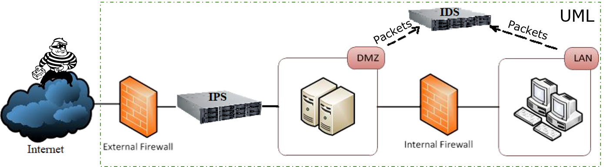
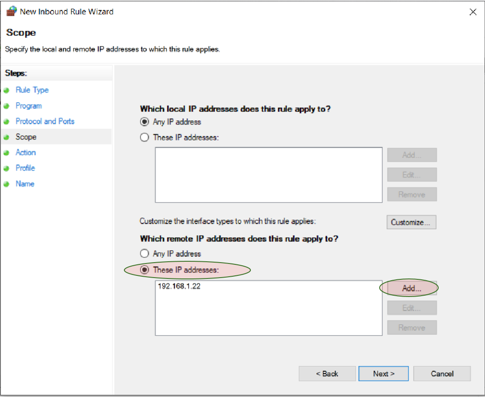

# Introduction to Firewalls
We are going to introduce the firewall.
We first look at the concept of *defense in depth* and why we need the firewalls.
Once we understand the usage of the firewall, we will introduce firewall rules, which are used to block and allow certain network traffic.
Network traffic refers to network packets or messages.
As a concrete example firewall, we are going to introduce the Windows firewall called Windows Defenser Firewall.
We will talk about how to block and allow *ping*, which is a network applciation testing if a computer with an IP is online or offline.
We will also show how to define firewall rules to block IP addresses on Windows. 
At last we are going to introduce the hands-on labs so that you can get some practice of using the firewall.

## Overview of Defense in Depth
Let's first look at the big picture about how cyber defense works.
You can see in this picture below on the left we have the Internet.
The internet is the wild west. There are attackers and hackers.
There are all kinds of weird things going on on the Internet.
In the picture, you can see we have the external firewall, something called DMZ, internal firewall and LAN.
A school or a company often have all those things.



To understand the defense in depth, let's firs clarify a few terms.
The first term is the Internet. We know the Internet contains networks of computers.
The Internet is a network of networks.
A school like UMass Lowell has a big network.
For such a large network, we often divide it into smaller network segments, called subnets.
Why do we need subnets?
The reason is that UMass Lowell has many departments.
We can put different departments into different subnets so that it is easier to manage all the computers in individual departments,
networking devices like routers and switches and their security.
Another benefit is with diffrent departments in different subnets, messages generated within one department will stay in that department,
not going through the networking devices of other departments. This will reduce network traffic congestion and improve speed.

The **DMZ** is the **demilitarized zone**. It is a subnet. What is in this DMZ subnet?
We often put web, email and other servers within the DMZ subnet.
What is the common property of those servers?
Those servers can be reached from the Internet directly.
For example, users as well as attackers can send a browsing request to the web server and get the web page.
You can imagine because they can be reached from the Internet directly, the attackers can attack those computers directly.
That's why we put them together in one subnet and use the external firewall to protect them.

The purpose of the internal firewall is protect other parts of the campus nerwork and computers.
We want to protect our assetts and don't want the attackers to reach most of our computers directly so as to reduce the risk.
Most computers behind the internal firewall cannot be reached by attackers directly
although these computers can still use the Internet.
For example, attackers may not even know how many computers behind the internal firewall.
This is also the case of home network.
Attackers cannot easily know how many computers are in the home network because of the WiFi router.
Attackers cannot initiate a connection to home computers.
The firewalls and other networking mechanims such as Network Address Translation (NAT) make such practice feasible.

There is another defense component called **IDS**, which refers to **intrusion detection system**.
The purpose of the IDS is collect network packets and messages, denoted network
traffic, and analyzes the network traffic for abnormalities.
This process is called intrusion detection.

What is the benefit of defense in depth?
Let's assume the web server and the email server have vulnerabilities and they are compromised.
However, we still have the internal firewall blocking
the attackers from using the compromised servers to attack other computers behind the internal firewall in the LAN.
So you can see it's very important to have this kind of defense architecyure, DMZ between two firewalls and LAN behind the internal firewall.

## Types of Firewalls
What are firewalls?
Firewalls are hardware devices or software
applications which are used to protect our systemm, inspecting and filtering unwanted netwrok traffic.

### Categorizing Firewalls based on Firewall Mechanisms 

Let's look at at different firewalls so we have a better
understanding of what firewalls are doing.
We can classify them into three categories based on
how a firewall works internally.

#### Packet filters

The first type of firewall is called packet filters.
On the Internet when you send messages,
your messages are put into packets, which are data formatted based on the Internet standard and protocol.
Packets are sent from a sender to a receiver.
As we learned in computer networking, when you want to send a packet to
a receiver, you need to specify the destination IP address in the packet.
You may also need to specify the port at which a server of interest works on.
For example if it's for the web, the port number will be 80 (http) or 443 (https).
A packet also contains your IP address as the source IP address.
A packet filter checks the packet header which contains the IPs, ports, and other information like flags.

Let's see we want to block traffic from known bad actors on the Internet.
There are known bad actors and we actually know their IP addresses and want to block them.
A packet filter can do it based on packet header information including IP addresses, port numbers and protocols.

#### Session-Layer Proxies 

The second type of firewall is related to a concept called <a href="https://en.wikipedia.org/wiki/Session_layer">session layer</a>.
What is a session? When you browse a webpage, it is a session of accessing that webpage.
In a web browsing session, the network protocol such as the TCP protcol makes sure the web content is sent to the browser in order and correctly.
Session-layer proxies check whether a session follows the specific protocol or not.
Sometimes a bad guy may try to manipualte the session and do something bad such as changing the webpage being downloaded on the fly. One such attack is the <a href="https://owasp.org/www-community/attacks/Session_hijacking_attack">session hijacking attack</a>. 

#### Application Proxies
The application proxy is another kind of firewall.
Here are some example network applications, FTP (File Transfer Protocol), SMTP (Simple Mail Transfer Protocol) and SSH (Secure Shell Protocol).
Application proxies check if your application data is normal or not.
If the attacker actually changes application data,
an application proxy checks if the application protocol is followed and may find such abnormalities. 

So we have introdcued three type of firewalls based on how the firewalls actually inspect
network traffic and data.
After the inspection, the firewalls decide what to do, for example dropping (discarding) the messages or letting them pass. If the messages from particular IPs are dropped, basically we say we block the IPs.

### Categorizing Firewalls based on Users 

There are other ways of categorizing firewalls.
We now categorie firewalls based on the users of the firewalls.
Again we have three types of firewalls, enterprise class firewalls, consumer class firewalls and roll-your-own firewalls.

The enterprise class firewalls are normally expensive and advanced.
They are often integrated with enterprise routers, switches or many other kinds
of network devices.
Such appliance may perform inspection, filtering and even intrusion detection.

The consumer class firewalls can be one integrated into your home WiFi routers.
Did you actually ever try to log into your WiFi router and configure it?
If you ever did that, then you know actually you can change
your router settings and may be able to set up firewall rules to block network traffic.
For example if you don't want messages from an IP address, you can configure the WiFi router and block it.
Consumer class firewalls are often not that expensive and do basic things.
For example, they are not designed to process high speed and large volume network traffic.

Roll-your-own firewalls are commercial or open-source software firewall applications.
They are often used by researchers and people seeking low-cost options for firewalls.
Linux has a firewall application called *iptables*. 
It can be used to configure complex firewall rules.

## Firewall rules
### Identifying Networking Components and Dependencies

To make firewalls work, we need firewall rules, which make the decision of blocking and allowing network traffic.
What are firewall rules?
They are configurations to specify what to allow and what to deny.
The first step in firewall rule creation is to identify which components on your computer are network-facing.
A network-facing component sends/receives network traffic (using <a href="https://beej.us/guide/bgnet/">network sockets</a>).

We need to identify network facing applications such as messengers
and email software. Those applications often have interfaces so that users can interact with them doing things like sending messages and emails.

The second kind of network facing components are called services.
For example, you can install the <a href="https://httpd.apache.org/">Apache web server</a> on your computer,
which then becomes a web server.
However, you will not be able to see a graphical interface of the Apache web server, which is running in the background.

The third type of network facing components is network facing drivers.
For example when you install a network printer, you need to install the network printer driver,
which sends your documents to the printer, e.g., through WiFi.

Next step of creating firewall rules is find out the dependencies between networking facing applications, services and drivers.
Creating firewall rules can be a very complex procedure.
One network facing component may need other network facing applications, services and drivers to work.
If you don't identify the dependencies carefully and block one component,
it may affect other components. 

### Rule Authoring
Once you are clear about network facing applications, services, derivers and their dependencies,
you will start to write your rules.
Of course the firewall program has the mechanism, allowing you to define the rules, e.g., specifying IPs to block.
You may want to define rules for different scenarios.
At least you shall define rules for your core scenario.
What is a scenario? A scanario is where you use your computer.
For example you have your laptop,
and may use it at home, school or Dunkin'.
At home, you are protected by your WiFi router. You may not need to define many firewall rules on the laptop.
At school you may be protected by your school's defense mechanisms. So maybe again you do not need to define many firewall rules on the laptop.
But at Dunkin', your laptop is open to attacks since there may be no security mechnism implemented over there,
Your laptop could be even under attack from other customers of Dunkin'.

In different scenarios you are protected differently. So you want to set up
different firewall rules for different scenarios for your computer.
Sometimes, too much security brings inconvenience. That is another reason why we need different firewall rules for different scenarios.
For example at home you may just feel relaxed given the protection by the WiFi router.
You are also not afraid your family members may attack your computer.
Therefore, maybe you can relax firewall rules too, allowing all the computers at home to share and communicate with each other freely.

We may also want to focus on inbound rules.
So what does inbound mean?
Inbound traffic is messages and packets coming into your computer.
Outbound traffic is messages and packets going out of your computer.
Apparently inbound traffic may contain messages and packets sent by attackers. That is why we shall focus on inbound traffic.

Firewall rules can be very complex.
A firewall on a computer protects networking components like applications, services and drivers.
A firewall on a campus is set to protect the entire network and computers on campus.
Given the complexity, if you have a lot of rules, those rules can be wrong or have conflicts, preventing them from working properly.
That's why you have to test and make sure everything works as expected and
you do not accidentally block anything.

## Windows Firewall
Now Let's look at a particular Firewall example, the Windows firewall.
The Windows firewall is part of the Windows operating system.
It follows everything we just discussed above.
We will see two examples of firewall rules after introduction to the Windows firewall. 


### Windows Firewall Profiles
The Windows firewall offers three firewall profiles, *private*, *public*, and *domain* for different scenarios.
The private profile means when you are at home or a private place. 
You can enable the private profile when you are at home.
The public profile means you are at a public place like Dunkin'.
The domain profile means you are at a school or companies which employ the concept of *domain* to authenticate people using school/company resources.
For different scenarios you have different rules because you are protected at a different level.
The default profile is a public profile because normally you define the strongest
firewall rules for the public profile.
If your computer is in a public network, anybody can attack you.
That's why normally your public profile shall have the strongest firewall rules.

The best practice of profiles is you only enable the firewall rule group on the profiles that suit your scenarios.
You know, firewall rules can be very different for different profiles.
So you want to just enable the one that actually really protects you in the particular kind of scenario.

### Windows Defender Firewall

The Windows firewall is called *Windows Defender Firewall* as the picture below shows.
How can you find, open the firewall application and configure it?
You can actually search for it.
You can click the Windows *Start* button and then type *Windows Defender Firewall* to find it.
Actually you can use this approach to search for any program installed on Windows.


On the left of the Windows Defender Firewall interface, you can manually turn the firewall on or off.
If you turn it off, your computer has no protection at all.
There are many other settings.
For our Windows virtual machine, we actually have the firewall disabled for the purpose of easy demonstration of various attacks.
Both private profile and public profile are disabled. I don't have the domain profile for the VM because we don't use this VM in the university network.

### Allow and Block ping
When you set up your computers and play games with friends, you have a bunch of computers.
But you got some networking problem and one computer cannot be reached joining the game.
You want to test if the network is set up right or not.
In such a scenarion, people often use a program called *ping* to test if that computer in trouble is in the network or not.
*ping* is available on Linux, Windows and MacOS.
It is used to test if an IP address is active. If the computer does not have an active IP address, we say it is offline.
Otherwise, it is online. Here is a ping example: we ping the Windows VM with the IP of 192.168.1.19 from Kali VM.
```
ping 192.168.1.19
```


Here is a simple description of the ping process .
*ping* uses an Internet protocol called ICMP.
It sends out particular *echo request* messages to an IP.
This is analogous to one person shouting "Are you there?"
If the IP is active, the computer with the ip sends back *echo reply* messages. 
This is analogous to the other person shouting back "Yes, I'm here."
If the IP is not active, error messages are displayed by ping.

We have a question here. Shall we block the ping (echo request) messages sent from other computers to our computer?
You know ping is a very useful.
Why should we sometimes block ping messages?
It is because we may want to hide ourselves from the attackers.
We may not want them to find our computers using ping so easily.
That's why we may want to block ping messages.
But please note: they are other ways such as port scanning identifying active IPs as we discussed in the cyber attack cycle.

If Windows Defender Firewall is disabled, all rules are disabled and ping works.
Assume Windows Defender Firewall is enabled. ping reply is disabled by detault settings as shown below.


Here is how we enable ping reply.
A detailed tutorial can be found at <a href="https://www.faqforge.com/windows/windows-10/how-to-allow-ping-trough-the-firewall-in-windows-10/">here</a>.
1. Search for Windows Defender Firewall, and click to open it
2. Click Advanced Settings on the left
3. From left pane of the resulting window, click Inbound Rules
4. In the right pane, find the rules titled File and Printer Sharing (Echo Request - ICMPv4-In)
5. Right-click each such rule and choose *Enable Rule*

Now ping reply is enabled.


### Block IPs

Let's see an example. In your dorm. there is a troublemaker, which always tries to mess up other people's computers.
You want to block his IP and get rid of the annoyance. 
Let's assume you know the guy's IP and want to block it.

Here are steps to do it.
A detailed tutorial can be found at <a href="https://help.liquidweb.com/s/article/Blocking-IP-Addresses-Using-Windows-Firewall">here</a>.
1. Start Windows Defender Firewall with Advanced Security
2. Click on Inbound Rules
3. Click on New Rule
4. Select Custom and then click Next
5. Select All programs and click Next
6. Use default settings (Protocol type: Any) and click Next
7. For Which remote IP addresses does this rule apply to, click These IP addresses and then Add



8. Click Next after adding the IPs to block
9. Choose Block the connection and click Next
10. Check Domain, Private, and Public
11. Name the rule and click Finish

## Hands-on labs

Find answers from the section of Windows Firewall.

### Hands-on 1 Enable Windows firewall

Read <a href="https://github.com/xinwenfu/GenCyber/blob/main/Firewall/README.md#windows-defender-firewall">Windows Defender Firewall</a>

- Enable Windows Firewall
- Can you ping Windows VM from Kali VM now?

### Hands-on 2 Configure firewall to allow ping
- Configure Windows Defender Firewall with Advanced Security to allow ping
- Can you ping Windows VM from Kali VM now?

### Hands-on 3 Configure firewall to block IP
- Configure Windows Defender Firewall to block the IP of Kali VM
- Can you ping Windows VM from Kali VM now?
