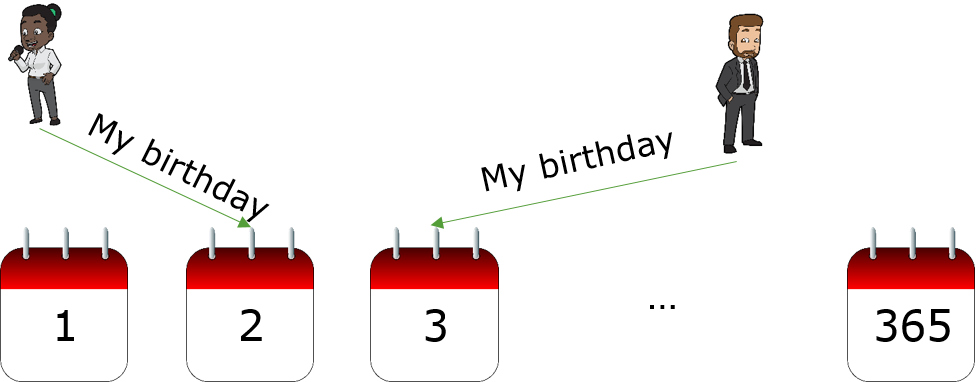
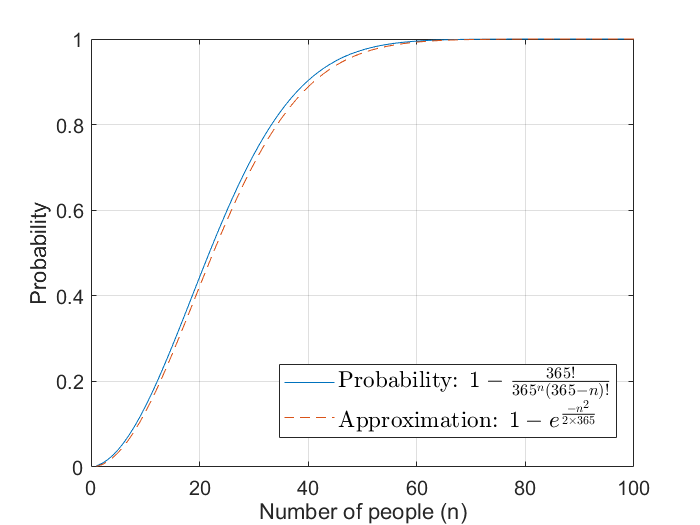
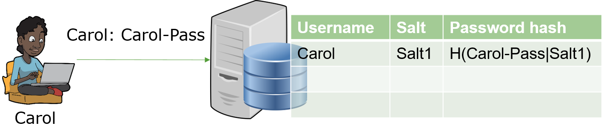
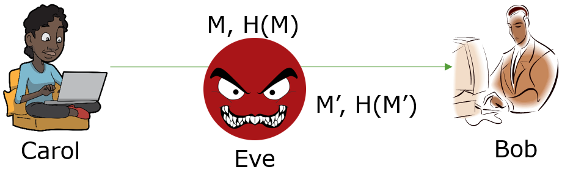

# Hash and Checksum

We are going to first look at what is a checksum and what is hash algorithm.
Next we are going to talk about the hash function applications.
At last we will discuss hands-on.

## Hash Algorithm

The goal of a hash algorithm is pretty straightforward.
Given a message of whatever the length,
when this message goes through the hash function/algorithm, the output is always of fixed length.
For example there is a hash algorithm called md5.
Its output is always a 128 bits, which are 16 bytes.
Since there are unlimited number of messages in the world and the output of a hash function is of fixed length,
multiple messages can be mapped to one possible hash.


The hash algorithm has a few other names
- Message digest. Apparently after the hash algorithm, the message is condensed. It is like potatoes are made into hash browns. Hash browns do not look like potatoes at all.
- One-way transformation/One-way function. It's called a one-way transformation or function because you can easily produce the message hash from a message. But from the message hash, you cannot recover the original message. So it's one way. 

Length of message hash H(m) is generally much shorter than length of message m. A message hash is usually of fixed lengths. For example, MD5 hash is 128 bit (16 bytes) and SHA1 hash is 160 bits (20 bytes).

### Example Application: Hash as Message/File Identity

People may hash a file and use the file hash as the identity of the file.
But apparently there is confusion issue here since we said multiple messages/files can be hashed into the same hash value.
However people are still doing this. Why?
So the question is what is the chance that multiple files have the same hash?
You may have many files on your disk. If you use MD5 to hash each file, what is the probability that two files have the same hash?

### Birthday Problem

Given a message, a good hash algorithm may produce a rather random hash value.
We can assume the hash value is randomly generated by a good hash algorithm.
Then the problem that two files have the same hash is similar to the birthday problem.
The birthday problem is: What is the probability that in a set of n randomly chosen people, at least one pair of them will have the same birthday?



Assume a year has 365 days.
Now let's calculate the probability that all n people have different birthdays. 
We first answer this question: How many combinations of putting n people into 365 days/slots with no two people in the same slot?
We first pick up one person: she could be put into any of the 365 days.
We also know given her birthday, the second person can be put into 365-1=364 days.
We can deal with other people similarly. Therefore, the number of combinations of n people in different slots is 365 &times; 364 &times; … &times; (365-n+1).

We now answer the second question: How many combinations of putting n people into 365 slots? In this case, we do not care about if two people may have the same birthday. Every person can be put into one of 365 days. Therefore, the number of combinations of putting n people into 365 slots is
365<sup>n</sup>.

Now we can answer:
What is the chance that n people all have different birthdays? It can be calcualted as follows

P=365 &times; 364 &times; … &times; (365−n+1) / 365<sup>n</sup> 

Now we can answer:
What is the chance that at least two people out of n people have the same birthday assuming a year has 365 days? It can be calculated as follows

1-P = 1-365 &times; 364 &times; … &times; (365−n+1) / 365<sup>n</sup> 

The figure belows shows the computed probability of at least two people sharing a birthday versus the number of people.



Now let's look at the probability that two files on a hard disk having the same hash. 
The MD5 hash algorithm has 2<sup>128</sup> possible hash values. That is about 3.4 &times 10<sup>38</sup>.
My hard disk has 152,094 files.
What is the probability that at least two of 152,094 files have the same hash value out of 3.4 &times 10<sup>38</sup> possible hash values? Apparently it is extremely small. That is why the file hash can be used as the identify of the file.

### Desirable properties of hash functions

Here are desirable properties of hash functions
- Performance: It shall be easy to compute message hash H(m)
- One-way property: Given message hash H(m), it’s difficult to find the original message m

For the one way property, there are two different levels of difficulity
- Weak collision free: Given H(m), it’s difficult to find a message m' such that H(m') = H(m).
- Strong collision free: It's computationally infeasible to find two messages m1 and m2 such that H(m1) = H(m2)

### Discussion

- Can you design a hash algorithm?

- Can you design a good hash algorithm?

### Internet checksum

People use something called Internet checksum for integrity to check the packets are corrupted during transmission.
We are still using this today  for various reasons whenever you send out Internet packets.
Internet checksum has some properties of hash function:
- produces fixed length digest of message
- is many-to-one

But given a message with a given checksum value, it is easy to find another message with the same checksum value.
The critical step of calculating the Internet checksum is add each 16 bit value (2 characters/bytes) of the data in hexdecial together.
This step allows collision. For example
The message "I O U 1" corresponds to the hexdecimals "49 4F 55 31". When we compute the checksum, we get the following
```
  I O              49 4F
  U 1              55 31
+ -----  ==     + ------
                   AE 80
```
However, if we switch the first fow and second row, we will still get the same checksum. Collision happens easily.

```
  U 1              55 31
  I O              49 4F
+ -----  ==     + ------
                   AE 80
````

so Internet checksum is not very good. It's not a cryptographically hash function.

## Hash applications
Let's look at the applications of hash algorithms.

### Password hashing
The first application we will discuss is password hashing.
When you use your computer,
you can actually enter your password and log into your computer.
How are passwords stored on a computer?
The computer must have your password so that when you enter your password the computer will actually check your
password and see if the entered password is right by checking the saved password.

How does a computer store your password? In plaintext or some format else?
This is the procedure.
Let's see an example. Here Carol wants to log into the computer.
She will provide her username and password to the computer.
The computer actually has a database, which could be implemented as a file.
A person's password is actually stored in the following format
```
username, salt (for extra security), H(password|salt)
```



Why are passwords not saved in plaintext? It is because a computer may have vulerabilities like our vulnerable chat server.
Hackers can get into the computer exploiting the vulnerabilities.
Then they may steal your database of passwords.
If passwords are in plaintext, hackers can actually obtain them immediately.
That's too dangerous.

Did you hear about password cracking?
It is actually possible to crack password hashes and obtain the original plaintext passwords.
For example, iPad unlock screen passcode allows six digits.
Each digit can be 0 to 9.
How many possible passcodes can you have on iPad? 10<sup>6</sup>.
Let's assume the attacker gets your passcode hashes stored on your iPad.
How can the attacker crack passcode hashes to get your original passcode?
The attacker can just hash all possible passcodes and see which one is the same as the one stored on iPad.
Then the attacker gets your passcode.
That's called a brute force attack.

Normally attackers don't do the brute force attack first.
They use a password list which has popular passwords around the world.
Such a popular password list can be obtained from the Internet black market.
The attackers will try passwords in the password list first and see which one produces the same password hash.
This is called dictionary attack, which is often fast and can be done in seconds if not less.
If the attacker cannot get the password ith the dictionary attack,
they will just try to enumerate all possible passwords (given the password generation rule) and see
which one actually produces the same hash.
A complex and good password may require months of time cracking.
This is why we want to use good passwords.

### Message integrity code
We want to use hash in the message integrity code given the small size of the hash.
In the figure below, when Carol sends out a message to Bob,
she sends out two parts, (message, message hash H(M)).
When Bob receives it, he can compute the hash of the received message
and compare the newly consumed message hash with the transmitted one.
If they are equal, the message is not changed, right?
Is this a good approach? 



Let's see now we have an attacker Eve in the middle, who can intercept the message.
He can then change the message and send the new message and
new message hash to Bob. 
Bob hashes this new message and compares the newly computed message hash with the trasmitted one.
Of course, they are equal.
Bob has no way to tell the message is changed.

This is why we need keyed hash. Carol and Bob first agree on a secret key k.
Carol computes keyed hash H(M|k), which is the message authentication code (MAC), and send it with M to Bob, (M, H(M|k)).
Since Bob has the key, he can grab the transmitted message M and use the shared key k to compute 
H(M|k), which shall be the same as the transmitted MAC.
Since the attacker does not have the shared key k, the attacker will not be able to fabricate the MAC correctly.

### Base64 Encoding

Sometimes, we want to convert binary data into printable letters.
For example, after encoding encrypted encrypted data with the BASE64 encoding method,
we can send the encoded data over over our chat server.
So the question here is how we convert any binary data into printable letters?
Base64 encoding is one approach.
Base64 converts every 6 bits (64 possibilities) of a message into one character (8 bits) in a 64-character alphabet.
- Example 64-character alphabet: ABCDEFGHIJKLMNOPQRSTUVWXYZabcdefghijklmnopqrstuvwxyz0123456789+/
- = may be used to indicate padding if the binary data is not integer number of 6 bits.

Here is a public key encoded with BASE64

```
-----BEGIN PUBLIC KEY-----
MIIBIjANBgkqhkiG9w0BAQEFAAOCAQ8AMIIBCgKCAQEAwiC7M2YPYEI2R47Ozlu4
olZ2XtCGtt+i2UHUtjig2gKTRwxsjct3ZYRKawuYGGGaBQAcrqlZV3AJAwit9f+F
+zEWrGGyEEFypWdpOb3arNB0XJLxNsRNwSv09idSJ3o/rRfZMV0DR/dJcDznYnvt
/JSzckSktuwocspYa5QVEgMd6/SrW4ZyzK3OqoBW9ktzjTDP13uol/Lnv4Ts+hPE
lzkG9y+XZ3oa0vqd2oFjWU/13tif/1TrAqUE/Ph/4rHl0EwRCenrH1lceL9PnywF
L+GN2Iz1P1oG8n0d18BGn7XkejGPxjrarqpzEToKlLXAxp+i8iXypTSSRsYsj0Vo
PwIDAQAB
-----END PUBLIC KEY-----
```

### Base16 Encoding
Base16 encoding is another way of encoding binary data into printable characters.
It converts every 4 bits (16 possibilities) of binary data into one character in a 16-character alphabet of
0 to 9, and "A"–"F" (or "a"–"f").

## Hands-on

### Hands-on 1: MD5 Hash

#### One student as Sender
- Compute hash of a *message* you choose
```
echo -n "message" | md5sum
```
- Send message and its hash via chat server in the format of message>>>hash or chosen format to ensure you can tell which part is message and which part is hash.

#### Another student as Receiver
- Compute hash of received message locally (md5sum)
```
echo -n "received-message" | md5sum
```
Replace *received-message* with the actual message that was sent over
- Compare newly computed hash with the hash sent over
- Discuss why hash only is not good for message integrity verification

### Hands-on 2: HMAC
#### One student as Sender
- Share a secret key (a string) with Receiver offline (e.g., Discord private chat)
- Compute hmac of a message
```
echo -n "message" | openssl sha1 -hmac "key"
```
*sha1* refers to the sha1 hash algorithm; *key* is the chosen key.
- Send the message and hmac via the chat server in the format of message>>>hmac or your chosen format 

#### Another student with the key as Receiver
- Compute hmac of received message locally
```
echo -n "received-message" | openssl sha1 -hmac "key"
```
- Compare newly computed hmac with the received hmac

## Hands-on 3: Password Cracking
John the ripper---password cracking tool. Refer to <a href="https://www.openwall.com/john/doc/EXAMPLES.shtml">Example use</a>

Run the following command, where */home/kali/GenCyber/john/mypasswd* is the password hash file in the required format, to crack password hashes and obtain original password.
```
john mypasswd
```
Note: This command will try the *single crack* mode first, then use a wordlist (i.e. a dictionary of password; default password list at /usr/share/john/password.lst), and finally go for "incremental" mode
Please refer to MODES for more information on these modes.

If you ran the command before and got some passwords cracked, use the following command to show cracked passwords
```
john --show mypasswd
```
- Cracked passwords are stored in $JOHN/john.pot (~/.john/john.pot in kali) in a specific format.
- Delete john.pot in order to crack again
```
rm ~/.john/john.pot
```

### Hands-on 4: Cracking your own password
- Test security of your own password
Create your password hash by replacing abc123 below with your own password
```
openssl passwd -1 -salt RnYtvEVV abc123
```
*-1* specifies password hash format. 

This command will create something like the following: $1$xyz$X5pC0RUqKE5mOgXcDDgFk0.
Replace the corresponding part of one user password hash data in *mypasswd* using the result and run the following command again.
```
john mypasswd
```
