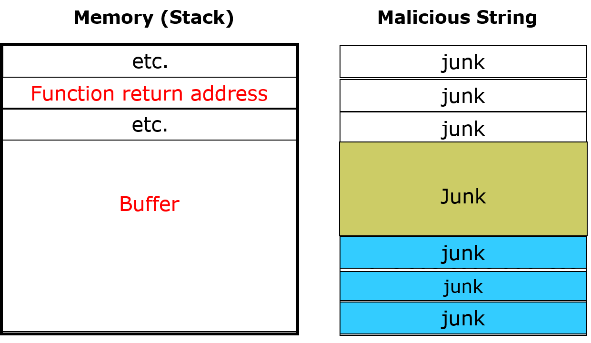

# Motivating Games 

## Denial of service (DoS)

### Overview
In our lecture on <a href="https://github.com/xinwenfu/GenCyber/tree/main/SoftwareSecurity">Penetration Testing and Software Security</a>, we have exploited the vulnerable chat server (vchat) and deployed the buffer overflow attack against vchat. We were able to hack into the Windows VM through vchat.

The same vulnerability can be exploited for a denial of service (DoS) attack. In the DoS attack, the attacker sends a long message with garbage content, which overwrites the buffer and contents above the buffer as shown in the figure below. This messes up the function return address with garbage data. Now when the function returns, it returns to nowhere and *vchat* actually crashes because of this. The chat service is lost and access to the service is denied.



### DoS game

1. The instructor or a volunteer starts a vulnerable chat server C:\Tools\vchat\Server\vchat.exe on a Windows VM
   - Announce the IP of Windows VM running *vchat*
2. Everybody runs /home/kali/GenCyber/vchat/Client/client.py to chat with each other
   - Wait for everybody to send at least one message
3. Do not proceed further without the instructor's permission
4. Now anybody can deploy the DoS attack
   - Use armitage to scan the target Windows VM and find attacks
   - Click the found Windows VM (IP)
   - Deploy auxillary/dos/vchat/DoS

## Planting backdoor

### Overview

We want to understand the danger of getting exploited. If a backdoor is planted on a compromised computer, the attacker will be able to log into the compromised computer anytime later if the compromised computer is not fixed. 

### Backdoor game

1. Refer to Hands-on 2 of <a href="https://github.com/xinwenfu/GenCyber/tree/main/SoftwareSecurity">Lecture 2 Penetration Testing and Software Security</a>. Yoiu hack into the instructor's Windows VM.
   - The instructor will show the IP of his Windows VM (192.168.0.87)
2. Once the instructor's VM is compromised, you start a Meterpreter shell. 
   - The Meterpreter shell can be used to upload a malware program from the attacker's computer to the victim computer. Let's assume the attacker already uploaded the malware, which is C:\Workshop\MalwareSamples\Backdoors\SimpleBindBackdoor\nice3.exe
   - The Meterpreter shell can also be used to <a href="https://pentestwiki.org/metasploit-meterpreter-cheat-sheet/">execute the uploaded malware</a>. Run the following command within the Meterprester shell to run the backdoor
```
execute -f C:\\Workshop\\MalwareSamples\\Backdoors\\SimpleBindBackdoor\\nice3.exe
```
3. Start a terminal on your Kali VM and run the following command to log into the backdoor running on the instructor's Window VM. 
```
nc 192.168.0.87 8080
``

Here is an example of a succesful login
```
$ nc 192.168.0.87 8080
Microsoft Windows [Version 10.0.19044.1826]
(c) Microsoft Corporation. All rights reserved.

C:\Tools\vchat\Server>
```

Run a *dir* command within the Windows console. What do you see?

4. Tell the instructor once you can get into the backdoor. 
5. Other students can try to log into the backdoor similarly and notify the instructor if they can do it
