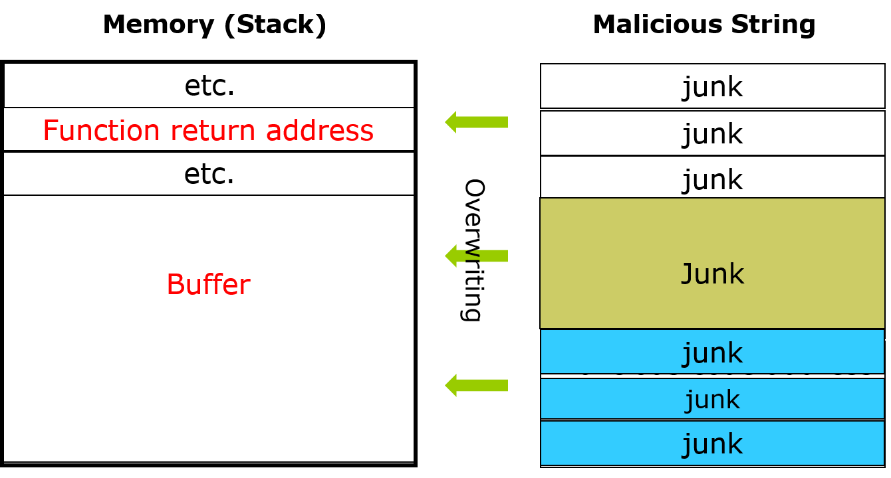

## Motivating game - Denial of service (DoS)

In our lecture on <a href="https://github.com/xinwenfu/GenCyber/tree/main/SoftwareSecurity">Penetration Testing and Software Security</a>, we have exploited the vulnerable chat server (vchat) and deployed the buffer overflow attack against vchat. We were able to hack into the Windows VM through vchat.

The same vulnerability can be exploited for denial of service (DoS) attack. In the DoS attack, the attacker sends a long message with garbage content, which overwrites the buffer and contents above the buffer as shown in the figure below. This messes up the function return address with garbage data. Now when the function returns, it returns to nowhere and vchat actually crashes because of this.   

Play the DoS game

1. The instructor or volunteer starts a vulnerable chat server C:\Tools\vchat\Server\vchat.exe
   - Tell people your Windows VM's IP
2. Run /home/kali/GenCyber/vchat/Client/client.py to chat with each other
3. Use armitage to scan Windows VM and find attacks
4. Click the found Windows VM (IP)
5. Deploy auxillary/dos/vchat/DoS
