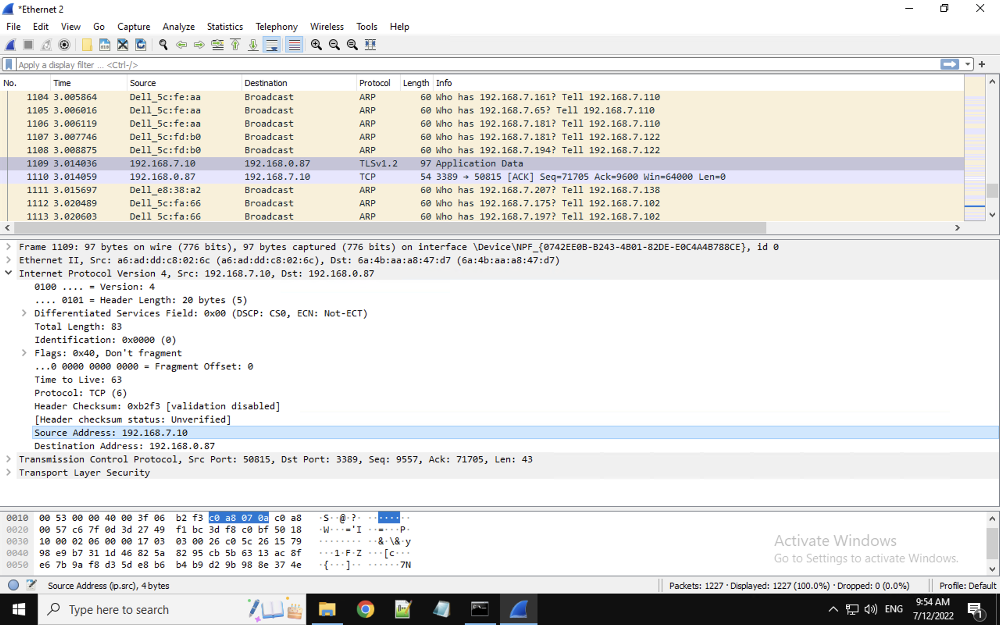

# Networking

We are going to look at what is the Internet  and different views of networks. Then we are going to
check the network data encapsulation, that is, how your messages are put into network packets.

## What is the Internet?

### IP address and port number
The internet is a network of networks.
When we use the Internet, how can you communicate with a remote computer?
For example, if you want to browse a web server running on a remote computer,
how do you know where the web server is?
To access a web server, you have to know the IP address of the web server.

However on one IP address, there may be multiple servers.
Recall servers are software programs.
A web server uses a web server program.
An email server uses an email server program.
If we run multiple servers on one IP, when you want to communicate with a particular server,
how can you differentiate different servers on one IP?
We use port numbers.
The tuple (IP, port) uniquely identified a server on a computer.

Please note here *server* is a very confusing term.
Sometimes, we use *server* to refer to a software program such as the Apache HTTP Server, which is a web server program.
Sometimes, we use *server* to refere to a computer that runs a particular server software program.
But most of the time, it shall be clear from the context and sometimes it does not matter.

### Network Protocols

We can send a message to a server.
How can the server understand our message?
This is a where the network protocols play their roles.
To talk with a server, our computer and the server must have a common language.
The common language is the protocol, which defines the rules, the procedures of the communication and the
format of the data.

For example, here is an example HTTP request message sent by a web browser to a web server (www.aol.com).
```
GET / HTTP/1.1
host: www.aol.com
```
The first part of the message is the request line, containing:
* A method (HTTP command) such as *GET*, which requests data such a web page
* A document address such as /, which indicates the root folder
* A HTTP version number such as HTTP/1.1
The second part of the message is the optional information.
In this example, *host* indicates the server to which the request is being sent.
It can be observed the HTTP request message has a well defined format. Therefore, the server will be able to understand the the request and send back the requested web page. The response from the web server also follows a well defined format.

The TCP/IP protocol suite is the protocol architecture of the Internet.
It has four layers: Application, Transport, Network, and Data Link Layer as shown in the figure below.
Protocols on each layer do particular things and will be explained later.
Details of implementation of lower layers are hidden from upper layers.


## Different views of networks

### Application View of Networking

Based on the protocols, we actually have different views of a network. 
We discussed web browsing, which is implemented on the application layer. When we try to access a web server, we need to know the IP address (corresponding to url) and the port
number. That's basically the view of the web browsing application. Other applicatons have a similar view.

You may question: I never used an IP address, only web url/link like http://www.cs.uml.edu/~xinwenfu/index.html. Actually the web url/link corresponds to the IP address.
Before your web browser sends out a web request, it contacts another Internet server, DNS server, asking the IP address of the web url (called domain name too).

You may alo question: I never used a port number during web browing. The reason you never specified the port number for web browsing is
if you don't specify the port number, the web browser assumes you use the default port number for that service.
For example, for the unsecure version of web browsing using *http* like http://www.cs.uml.edu/~xinwenfu/index.html, the default port number is 80. For the secure version of web browsing like https://www.cs.uml.edu/~xinwenfu/index.html, the default port number is 443.


### Transport View of Networking

On the Internet, data may get lost during transmission. A web browser at a sender computer can send a reqeust to a web server. The request may transmit across a lot of cables, maybe air if wireless is used, and network work equipment like routers. On the Internet, there are a lot of routers, which are responsible for relayings user data to the destination. The data may corrupt during the transmission. For example, a router may get very busy and drop the data. So we got a problem. How can the sender computer know the data got dropped? What shall the sender computer do if the data got dropped?

A sender such as the web browser relies on the transport layer, particularly the TCP protocol of the transport layer, to deliver the data reliably to the receiver. 
The TCP protocol adds a TCP header to the application data and form the TCP segment that contains the TCP header and application data.
The TCP header contains a sequene number for the data.
When the receiver's transport layer receives the TCP segment, it shall acknowledge the arrival of the TCP segment by sending the sender an acknowledgement.
If the sender's transport layer does not receive the acknowledgment after some time, the sender's transport layer decides the TCP segment is lost. The original TCP segment isactually buffered at the transport layer of the sender. If the TCP segment is lost, the sender's transport layer retransmits the TCP segment until it receives the acknowlegement.

From the perspective of the transport layer, TCP segments are exchanged between two IP addresses. The transport layer does not differentiate the applications data. It assumes the TCP segment may get lost, and thus buffers the data and retranmits the data if needed.

### Network View of Internet

We now know the TCP protocol at the transport layer can ensure TCP segments are delivered to the destination correctly. 
However, the sender and receiver may be far away from each other. There are a lot of routers, thus a lot of routes, between the sender and the receiver.
When the network layer of the sender receives the TCP segment from the transport layer, it adds a network header, called IP header too, to the TCP segment and form the packet, which contains the network header and TCP segment.
The network header contains the source IP address (sender's IP) and destination IP address (receiver's IP). The sender computer is configuired with a default gateway (i.e., router). Therefore, the packet will be delivered across the local network to the sender's default router, which works with other routers to find the best path (e.g., shorted path) to the receiver.
So the routers connect different networks of computers together.

The network view of the Internet is routers form routes between computers.
Routers run routing protocols and find the best routes between computers.
Routers forwards a packet based on the destination IP address of the packet to other routers until it reaches the receiver.


### Data Link Layer View of Internet

We now know the network protocols find the best route through routers to deliver network packets to the destination.
However, we still have the task of delivering the data from a computer to its default router.
Local computers such as those in a home and their router can form a local network and exchange data bewteen them.
We will look at a popular technology, Ethernet, that can connect local computers including the router together.
A home network is an example of local area network.

Ethernet can use shared medium like Ethernet cables connecting all computers together.
We've got a problem.
Since it is a shared medium, at any time one computer can send data to the shared media to the receiver.
Otherwise, if multiple computers send data at the same time, those data override each other and all will get corrupt. This is called collision.
So which computer should send first and which should send second?
One critical functionality of the data linker is to addres the collision problem.
Ethernet uses the carrier-sense multiple access with collision detection (CSMA/CD) scheme to solve the collision problem.

For Ethernet, when the data linker layer of the sender receives the network packet,
it adds the Ethernet header to the packet and form an Ethernet frame.
The Ethernet header contains the Ethernet address of next hop (e.g., router) as the destination Ethernet address.
In this way, when the router receives the Ethernet frame, it knows it is the receiver for that frame.
It then finds the destination IP address from the network header within the Ethernet frame and performs the routing.

The data link layer's view of the Internet is there are computers competing to send data out to the transmission media. One critical function of the data link layer is to coordiante and make sure every computer has a chance to send its data and there is no collision.

### Putting Everything Together

Below is a big picture of different views and layers of protocols using the example of web browing.
For two computers communicating with each other, it appears the corresponding layers on the computers talk with each other.
When you use HTTP for web browsing, you do not really need to care about how the TCP is implemented although you need to program the web browisng application with TCP APIs (which are the interface between HTTP and TCP) so as to ask the TCP to deliver the HTTP messages.
The implementation of TCP is independent from HTTP, which is the protocl between the web client (browser) and web server.

We said one purpose of the TCP of the transporter layer is to deliver data reliably .
You may have different ideas to implement that reliable delivery.
You can implement, try them and see which one works better.
But if the TCP APIs for the application are not changed, the application will still work.
The TCP layers at the sender and receiver work together to ensure the data is correctly delivered.
You also don't need to care about how the data will be routed to the destination.

The network layer, i.e., the IP layer receives the data from the transport layer through a programming interface, which shall be well defined.
Then you may implement different routing protocols at the network layer. 
So it appears the network layers of different routers work together to find the best routes.
The network layer also does not need to care how its data will be sent to the local media, e.g., Ethernet cables.

Ethernet ensures every local computer has the chance to send their data and there will be no collision.


The picture below is a partial list of protocols on each layer of the TCP/IP protocol suite.


## Network data encapsulation

You can see we have different layers in the TCP/IP protocol suite. We also discussed each layer adds a header to implement its functionalities.
On the application layer, the application defines its own protocol and data format.
One the transport layer, for the TCP, the TCP protcol adds the TCP header to the application data and forms the TCP segment.
On the network layer, the IP header is added to the TCP segment and we have the IP packet.
On the data link layer, for Ethernet, the Ethernet header is added to the IP packet and we have the Ehternet frame.


The picture below shows the data fields of an IP packet.


Wireshark is a very important tool to analyze network data and understand the protocol.
It is a protocol analysis tool you can use to capture Ethernet frames to and from your
network card on your computer.
The figure below is one example.
I captured some Ethernet frames at my computer with Wireshark.
You can see the top panel of Wireshark shows the metadata of the Ethernet frames.
If you click one entry, the middle panel shows you the details of the Ethernet frame.
You see different headers and data.
You can click the plus sign to see the internals of one entry of data.
The bottom panel shows the binary version of the same data you are looking at.
Recall on computers and the Internet, all data is actually in the binary format.


## Hands-on

### Hands-on 1: Common Linux command line terminal commands
Many Linux applications may not have graphical user interfaces. You may have to run them within a terminal.
Refer to <a href="https://linuxconfig.org/linux-commands-cheat-sheet">Linux commands cheat sheet</a>. Try the following Linux command line terminal commands and understand what they do. *Terminal Emulator* is Kali Linux's terminal program. 
- Click the dragon icon at the top left corner of of Kali Linux desktop to show applications


1. <a href="https://man7.org/linux/man-pages/man1/touch.1.html">touch</a>: change file timestamps or create a new file
```
touch test1 # create an empty file called test1
```
2. <a href="https://man7.org/linux/man-pages/man1/ls.1.html">ls</a>: list files in a folder; current folder by default
```
ls # show files in current workng folder
```
where # indicates a comment and does not need to be entered

3. <a href="https://man7.org/linux/man-pages/man1/pwd.1.html">pwd</a>: print full path name of current working folder
```
pwd # show the name of current working folder 
```
4. <a href="https://man7.org/linux/man-pages/man1/cd.1p.html">cd</a>: change the working folder to another folder
```
cd .. # go to parent folder of current working folder
cd GenCyber # go to the GenCyber folder, which is a sub-folder of current working folder
cd /home/kali # go to folder /home/kali, which is a full path name
```
5. <a href="https://man7.org/linux/man-pages/man1/mkdir.1.html">mkdir</a>: create folders
```
mkdir mine # create a folder called mine in the current working folder
```
6. <a href="https://man7.org/linux/man-pages/man1/rm.1.html">rm</a>: remove files
```
rm test # remove a file called test
rm -r mine # remove a folder called mine and all its subfolders in the current working folder
```
7. <a href="https://linux.die.net/man/1/mv">mv</a>: move files or folders
```
mv test1 tset2 # move test1 to test2; no test1 any more
```
8. <a href="https://man7.org/linux/man-pages/man1/cp.1.html">cp</a>: copy files or folders
```
cp test2 test3 # copy test2 to test3; test2 still exists
```
9. <a href="https://man7.org/linux/man-pages/man8/ifconfig.8.html">ifconfig</a>: configure or show info of a network interface
```
ifconfig # show information of network interfaces; what is ip address of your Kali VM?
```
10. <a href="https://man7.org/linux/man-pages/man1/less.1.html">less</a>: Show content of a file
```
less encrypt.txt # show content of encrypt.txt; press q to quit
```
11. <a href="https://linux.die.net/man/8/ping">ping</a>:	ping IP addresses and see if they are active
```
ping 192.168.1.19 # ping ip address of 192.168.1.19
```

### Hands-on 2: Common Windows console commands
Most operations of Windows console commands can be completed with *File Explorer* of Windows. However, knowing Windows console (cmd) commands is still useful in some cases. For examples, commands applications are written for Windows console. Running console applications within a console may be more convenient even if you can still run them with File Explorer.

Press the Windows *Start* icon and search cmd.
Click *Command Prompt* to start Windows console. 
Refer to <a href="https://www.thomas-krenn.com/en/wiki/Cmd_commands_under_Windows">Cmd commands under Windows</a>.
No comment is allowed to follow commands immediately within Windows console.


1. dir: list folder content
```
dir 
```
Show content of current working folder.

2. cd:	change directory
```
cd c:\Tools 
```
Change working folder to c:\Tools.

3. ipconfig: show network interface settings 
```
ipconfig 
```
Show all network interface settings.

4. ping: ping IP addresses and see if they are active
```
ping 192.168.1.22 
```
ping ip address of 192.168.1.22

5. type:	show content of text files
```
type victim.c
```
Show the content of victim.c

### Hands-on 3: Run chat server and client from terminal
1. Please run the chat server (located in the folder of C:\Tools\vchat\Server) on Windows VM from Windows console 
2. Please run the chat client (located in the folder of /home/kali/GenCyber/vchat/Client) on Kali VM from terminal
3. Chat with another student

### Hands-on 4: Use Wireshark to check packet contents
1. Read the short <a href="https://github.com/xinwenfu/GenCyber/tree/main/IntrusionDetection#wireshark">introduction to Wireshark</a>. Search for "Wireshark" in the page if you cannot find it.
2. Use Wireshark to check packet content. Can you find source IP address and destination IP address shown in the IP header figure below in Wireshark?

The picture below shows the structure of the Internet packet IP header.


The picture below show the IP header and other packet contents in Wireshark. Pay attention to the highlighted part.


