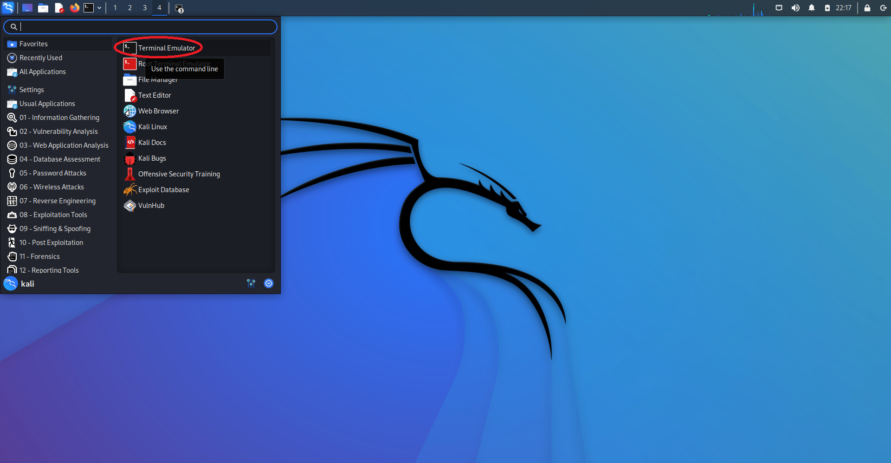
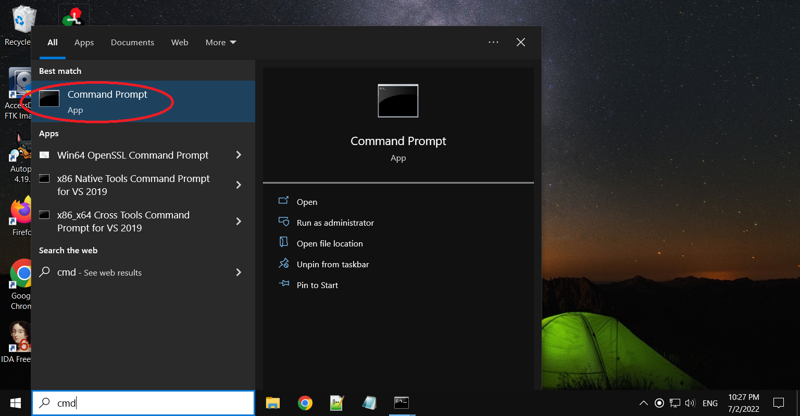
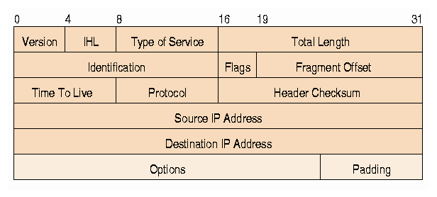

## Hands-on

### Hands-on 1: Common Linux command line terminal commands
Many Linux applications may not have graphical user interfaces. You may have to run them within a terminal.
Refer to <a href="https://linuxconfig.org/linux-commands-cheat-sheet">Linux commands cheat sheet</a>. Try the following Linux command line terminal commands and understand what they do. *Terminal Emulator* is Kali Linux's terminal program. 
- Click the dragon icon at the top left cornor of Kali Linux desktop to show applications



1. <a href="https://man7.org/linux/man-pages/man1/touch.1.html">touch</a>: change file timestamps or create a new file
```
touch test1 # create an empty file called test1
```
2. <a href="https://man7.org/linux/man-pages/man1/ls.1.html">ls</a>: list files in a folder; current folder by default
```
ls # show files in current workng folder
```
where # indicates a comment and does not need to be entered
2. <a href="https://man7.org/linux/man-pages/man1/pwd.1.html">pwd</a>: print full path name of current working folder
```
pwd # show the name of current working folder 
```
3. <a href="https://man7.org/linux/man-pages/man1/cd.1p.html">cd</a>: change the working folder to another folder
```
cd .. # go to parent folder of current working folder
cd GenCyber # go to the GenCyber folder, which is a sub-folder of current working folder
cd /home/kali # go to folder /home/kali, which is a full path name
```
4. <a href="https://man7.org/linux/man-pages/man1/mkdir.1.html">mkdir</a>: create folders
```
mkdir mine # create a folder called mine in the current working folder
```
5. <a href="https://man7.org/linux/man-pages/man1/rm.1.html">rm</a>: remove files
```
rm test # remove a file called test
rm -r mine # remove a folder called mine and all its subfolders in the current working folder
```
6. <a href="https://linux.die.net/man/1/mv">mv</a>: move files or folders
```
mv test1 tset2 # move test1 to test2; no test1 any more
```
7. <a href="https://man7.org/linux/man-pages/man1/cp.1.html">cp</a>: copy files or folders
```
cp test2 test3 # copy test2 to test3; test2 still exists
```
8. <a href="https://man7.org/linux/man-pages/man8/ifconfig.8.html">ifconfig</a>: configure or show info of a network interface
```
ifconfig # show information of network interfaces; what is ip address of your Kali VM?
```
9. <a href="https://man7.org/linux/man-pages/man1/less.1.html">less</a>: Show content of a file
```
less encrypt.txt # show content of encrypt.txt; press q to quit
```
10. <a href="https://linux.die.net/man/8/ping">ping</a>:	ping IP addresses and see if they are active
```
ping 192.168.1.19 # ping ip address of 192.168.1.19
```

### Hands-on 2: Common Windows console commands
Most operations of Windows console commands can be completed with *File Explorer* of Windows. However, knowing Windows console (cmd) commands are still useful in some cases. For examples, commands applications are written for Windows console. Running console applications within a console may be more convenient even if you can still run them with File Explorer.
Press the Windows *Start* icon and search cmd. Click *Command Prompt* to start Windows console. 
Refer to <a href="https://www.thomas-krenn.com/en/wiki/Cmd_commands_under_Windows">Cmd commands under Windows</a>. No comment is allowed to follow commands immediatly within Windows console.

1. dir: list folder content
```
dir 
```
Show content of current working folder.

2. cd:	change directory
```
cd c:\Tools 
```
Change working folder to c:\Tools.

3. ipconfig: show network interface settings 
```
ipconfig 
```
Show all network interface settings.

4. ping: ping IP addresses and see if they are active
```
ping 192.168.1.22 
```
ping ip address of 192.168.1.22

5. type:	show content of text files
```
type victim.c
```
Show the content of victim.c

### Hands-on 3: Run chat server and client from terminal
1. Please run the chat server (located in the folder of C:\Tools\vchat\Server) on Windows VM from Windows console 
2. Please run the chat client (located in the folder of /home/kali/GenCyber/vchat/Client) on Kali VM from terminal
3. Chat with another student

### Hands-on 4: Use Wireshark to check packet contents
1. Read the short <a href="https://github.com/xinwenfu/GenCyber/tree/main/IntrusionDetection#wireshark">introduction to Wireshark</a>.
2. Use Wireshark to check packet content.


