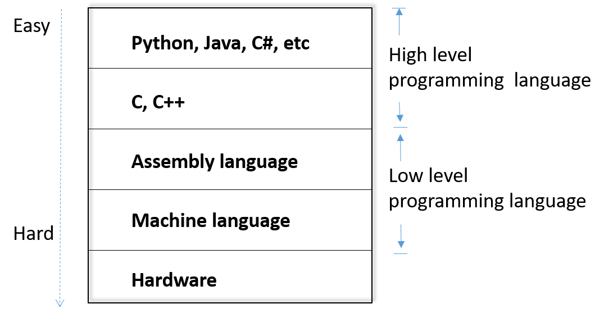

# Introduction to Python
This is a brief introduction to the Python programming language. We still have a lot of things to cover. We will have an overview, how to run python, how you can do debugging, naming of variables, functions and other things, assignment statement, loop statement, data structures such as tuples and the strings, how you define a function, exception and class.

Here is brief history of Python. Guido van Rossum invented Python in early 90s. Google actually chose Python as one of its primary programming languages
from when Google was founded. 

## Overview

### Levels of programming languages
What is a programming language? Why do we need it? A computer has accessaries such as printers and monitors. One purpose of a programming languages is to control those hardware. For example we want to draw beautiful pictures on a display. We want to print something on a printer. The code in a program can do those things. We may want to perform complex computing and a program can be written so that the a core chip called CPU (central processing unit) can be instructed to perform the computation and the program can also show the results on the display. So programs can control the hardware and perform computing. 



Because of its construction principles, the hardware and CPU can only accept binary commands and data in zeros and ones. Therefore, the very low level programming language is a machine language. Apparently machine language is too hard for everybody because it is hard to remember commands in zeros and ones. 

That's why people invented the assembly language, which is much simpler than machinen code. In assembly language, meaningful names called mnemonics are given to commands so that they are easy to remember. Since the hardware and CPU can only understand machine lanauage, a program in assembly language has to be translated into machine language by software called assembler before they are actually run. 
However, assembly language is still super hard for general person since you need to understand a lot of hardware details to really use it. But if our goal of programming is to process data and do computation, why should you understand hardware so as to compute? 

That's why people invented high level programming languages like C, C++, C#, Java and Python. High level programming laanguages are more like natural languages we speak so that they are more intuitive. High lelvel programming languages often hide hardware details so that you can focus on your tasks. Of course, C and C++ still involve some details like pointers, which refer to memory locations where data are saved. Language like Python and Java remove all such concepts. Although languages like Python and Java cannot be used to write programs controlling hardware directly, they are easy to learn and can deal with a lot of things like data processing. One statement or instruction in a high level programming langauge is often equivalent to many statements or instructions in a low level programming language. Because they are easy to learn, many people learn them and develop a lot of code libraroies, which contain code that can do various tasks. For example, you can use the code to draw a circle at a particular location on the display. 

### Python
A python program is Python code in a file with the file extension .py, for example, basics.py below. 
```
#! /usr/bin/python
# Pythin script file name: basics.py
# Normally, "#" indicates a single line comment
# Method 1 running basics.py: 
# 1. Open a terminal within Linux like Kali
# 2. Type: python basics.py

# "#!" on the first line starts a so-called shebang (hashbang) line and
# specifies which command should be used to run the scrip
# when the script has execution permission and runs at the command line
# Method 2 running basics.py: 
# 1. Add execution permission to basics.py: chmod u+x basics.py
# 2. Type: ./basics.py
    
x = 34 - 23             # Assign 34-23 to x   
y = 'Hello'             # Assign 'Hello' to y  
z = 3.45                # Assign 3.45 to z
if z == 3.45 or y == "Hello":   # if statement
    x = x + 1           # Block structure indicated by indentation
    y = y + " World"    # y + " World" is string concatenation
print(x)                # print x
print(y)                # print y

# Use the keyword "def" to define a function
# A function (e.g., circleArea) is a block of code
# It runs when it is explicitly called (e.g., circleArea(5))
# Data as parameters (e.g., r) can be passed into a function
# Use the return statement (e.g., return area) to return a value
def circleArea(r):
    PI = 3.14
    area = PI * r * r
    return area

radius=5
area=circleArea(radius)
# String modulo operator (%) to format outputs of print
print("Circle radius=%.2f, Area=%.2f" %(radius, area))
```

Sometimes we also call python program as a script. How do you run a Python program? Whatever ways you choose to run a Python program, it is the *python*
software, also called Python interpreter, which shall be installed on your computer and = actually runs the python code line by line. For example, within a Linux terminal, you can run the basics.py below
```
python basics.py
```
## Running Python
People invented different ways to run Python programs so that you can choose the one you like. We talk about the three ways running a Python program
- Using software called *IDLE* (integrated developer environment)
- Using *python* at the command line
- Running the Python program directly at the command line so you don't need to enter the python command in the second approach
 
###  Running Python Program with IDLE
When we write a Python program, the first thing you have to do is to write the code and put the code in a file and save it in a folder on a computer. IDLE is a software program, which provides you all the things you need. It has a text editor so that you can enter your code into a file.
You can actually run the code within IDLE. You just just click a few buttons. 

IDLE also has an integrated debugger. So what is a debugger and why do we need a debugger? We often make errors when we program. How can you find logical errors of your code? Reading the whole code is one way. But it is boring and can be very challenging if the code is a lot. With a debugger, we can run the code statement by statement and see what is going on over there and if the program runs as expected. A debugger helps you understand the code and pinpoint the error.

IDLE is installed on our Kali virtual machine. Click the dragon like *Application* icon and search IDLE. You just click IDLE there and open the IDLE shell window.


In the IDLE shell window,  you can see the Python interpreter is running. So basically IDLE
integrates Python into itself. It runs the Python interpreter automatically when you start IDLE. Within the Python shell, you can enter code and run it.


We want to use IDLE to open a Python file. Here is how we do this. With the IDLE shell window, click the memu *File* then *Open*. Within the opened file dialog window, navigate to the file, click the file to and then *Open*. 
Once you open the file, it's in another window. The figure below is a basically you can see the editor window. 


You can just click the menu called *Run* then you *Run Module* within the editor window to run the Python program in the file. Below shows the running results.


####  Sample Code Explanation

Now we plain *basics.py* above. I give a lot of comments here.
Normally this hash sign *#* starts a comment.
The first line is very special and is called the shibang line.
When we try to run this program, we are going to use the Python interpreter. But where is the Python interpreter? 
The shebang line specifies the location, i.e., */usr/bin/python*. 

##### x = 34 - 23
This is called assignment statement. Here we assign the expression of 34 minus 23 to x, which is an integer.

##### y = 'Hello'
We assign a string *'Hello'*, which is just a sequence of characters,  to y. y is a string variable.

##### z = 3.45
We assign 3.45 to z, which is a float number.

Why do we have different variable types such as integers, strings and floats? In computers, different types of variables are saved in the memory
in a different way. That's why we differentiate different types of variables.

##### *if* statement
Next line is an *if* statement. It says if the listed condition *z == 3.45 or y == "Hello"* is met,
then we are going to run the next block of code. The condition means if z
is equal to 3.45 or y is equal to 'Hello'.
The colon *:* indicates a new block pursues.
We use indentation to specify a new block.
The three assignments above and the *if* statement have the same indentation.
They belong to the same block. The two assignments *x = x + 1* and *y = y + " World"* in the body of the *if* statement have the same identation. 
When we run this *if* statement and the condition is met, we're going to
run the body of the *if* statement. If the condition is not met, we move on without running the body of the *if* statement.

In the body of the *if* statement, the original value of x plus 1 is assigned to x in *x = x + 1*.
x has the old value plus one. *y = y + " World"* concatenates the original string referred to by *y* with *" World"* and assign the new string to *y* back.

##### print(x) 
##### print(y)
We then use the function *print* provided by Python to print x and y.

##### def circleArea(r):
We just mentioned *print* is a function. We can actually define our own function.
In basics.py, we use the keyword *def* to define our own function called *circleArea* to compute the area of a circle with the parameter denoted as *r*, i.e., radius.
Why do we need a function?
When we want to calculate the area of a circle repeatedly within a program, we don't want to write the piece
of code every time and everywhere we want to perform the calculaton. We define a function to this end so that every time you
want to use it we just actually call the function providing the radius parameter.
In the example, we use indentation to indicate the function body, i.e. the code block that calculates the area of a circle.
In the function code blck, we first assign 3.14 to variable *PI* and then calculate the arrea, PI times r
times r. Finally the function returns the calcualted *area*.

##### area=circleArea(radius)
Let's look at how we use this function.
At line *radius=5*, we assign 5 to the variable radius. 
At line *area=circleArea(radius)*, we call the defined function *circleArea* and pass *radius* as the function's parameter. The function's variable *r* now has the value of *radius*. The function code uses this *r* to calcualte the area of the circle.
So basically the function is used to do the computation given *r*.
The calculation result is returned and assigned to *area*.

##### print("Circle radius=%.2f, Area=%.2f" %(radius, area))
After we get returned *area*, at *print("Circle radius=%.2f, Area=%.2f" %(radius, area))*, we print out the result.
We use the *%* operator to format the output.
*%.2f* means when we print a number, we want 2 digit precision and print only two decimal places.

### Which code runs first?
We still have one problem left. When we run the given program, what is the first piece of code to run?
To answer this question, we have to understand indentation.
Indentation refers to the spaces at the start of a code line. 
Python uses indentation to make blocks of code.
The code block with least indentation runs first.
Wherever a new block of code starts, four spaces are recommended.
The first line of a Python program can't have indentation.
The Python interpreter checks each line and decides what to do, e.g. running the line of code.

In the example basics.py, the Python interpreter cehck the code line by line.
It ignores the comments at the start of the program and runs the three assignments since they have zero indentation.
When it runs the *if* statement, it checks the condition. If the condition is met, the body of the *if* statement at more indentation runs, and then execution moves forward after the *if* statement.
If the condition is not met, the body of the *if* statement is ignored and execution moves directly after the *if* statement.
The two statements for printing with zero indentation run then.

Now the function is defined in the programn. When a function is defined, the Python interpreseter will not run the code, but it remembers the defined
function. A function has to be first defined before it is used. 

So basically we run the code based on the
blocks logically. The grammar is similar to human languages.
Let's ahve a look at some printout from the code. We can see the printout of 12 in the IDLE shell window.
That is the output of *print(x)*. Originally x is assigned 11. Then we assign x+1 to x to get 12.
The output "Hello World" is the result of *print(y)* because we concatenat "Hello" and " World" together and assign the concatenated strings to y.

In many other programming lanuages, the is a *main* function, which is the entry point of the program.
That is, every time when we run the program, the function called main runs first.
Python does not have the main function. Code with least indentation runs first.

###  Running Python Program via Python Interpreter at Command Line
Here you have to actually use the application called *Terminal*.
In Kali VM, the program *Terminal Emulator* can be used as *Terminal*.
Find it within *Applications*. Click to start a terminal within which various Linux commands can be entered.


To run basics.py, we first use the Linux *cd* to change the directory to where basics.py is saved.
Then the following command can be used to run basics.py.

```
python basics.py
```

###  Running Python Program Directly at Command Line
The third way is to run the Python script, i.e., the file, directly at the command line.
Sometimes, we want this method since we may run a Python script very often and entering *python* every time is cumbersome.

- We need to make sure the first line of the Python file must have the shebang line
```
#!/usr/bin/python
```
- We need to go into the folder where the script file is saved and make the Python file executable using the following command
```
chmod u+x basics.py
```
- Now we can run the file from command line directly
```
./basics.py
```
where *./* refers to the current folder. That is, the path of the script has to be specified to run the script directly. A full path name can also be used to run the script.


## Debugging
Why do we need debugging a program?
When you write a long program and run it, you find there are errors, but you don't know where the errors are.
Of course, you can read the source code. But it's very hard if the code is long.
In debugging, you can actually run the code instruction by instruction or statement by statement and 
see if the code works as expected.
In this way you can find the errors of your code okay.
That's basically uh why we need debugging.

### Enabling Debugging
To enable debugging, we need to do two things
- First within the IDLE shell window, we need to click the menu *Debug* then
check the *Debugger* option. The *Debug Control* window shows up.
- Now within the code editor window, *Run Module* and debugging starts. The code stops at the first line of code of the program.

### Debug Control
Now we check the *Debug Control* window.
- *Step*. The step button runs the code step by step, that is, statement by statement.
- *Source*. If we check the *Source* option, IDLE shows which line of source code you are trying to run when you do step debugging. 
- *Go*. When the button *Go* is pushed, the program runs. If there is no breakpoint, the programs runs to the end.
- *Over*. When we perform *step* debugging to the line *print(x)*, if we click *Step* again, which statement runs next? Actually the code of the *print* function runs. However, sometimes we do not really to debug the function code. When we run to the line *print(x)* and push the *Over* button, we run the function as one statement, basically stepping over the function. Of course, if we want to debug the function, we use *Step*.
- *Out*. During debugging, let's say you are in a function and want to get out of the function.  *Out* will get you out of function and run to the next instruction.
- *Stack*. The *Stack* option shows you what other functions you have called to get where you are in terms
of the functions
- *Locals*. A function may have its own variable such as PI in the function *CircleArea*. We call those variables local variables. When local variables are
used within a function, they are only valid in the function.
- *Globals*. Globals variables are different. We can access global variables anywhere in the program, even within functions. 

### Breakpoint
Breakpoint is a very important technique. At a line in source code, right click and it will show you a popup memu.
On the popup memu, choose *Set Breakpoint*, this line will be highlighted.
What does a breakpoint do? For example sometimes you
don't want to actually do the step-by-step debugging.
We want the program to run to a line and stop so that we can check the program status at that line.
We can just set a breakpoint at that line, press *Go* in *Debug Control* to achieve this functionality.
Breakpoints are convenient for us to ignore some part of the code which we are not interested in
so that it will be faster for debugging.

## Basics & Names & Assignment & Loop
We now know a basic idea of Python.
Let's look at some details about the python programs.

### Naming rules
Naming rules are used to have consistent styles of naming things in Python.
Names are case sensitive and cannot start with a number.

Names can contain letters, numbers, and underscores, for examples, *bob*, *Bob*, *_bob*, *_2_bob_*, *bob_2*, *BoB*.

There are reserved words designating special language functionalities, for example, 
*and*, *assert*, *break*, *class*, *continue*, *def*, *del*, *elif*, *else*, *except*, *exec*, *finally*, *for*, *from*, *global*, *if*, *import*, *in*, *is*, *lambda*, *not*, *or*, *pass*, *print*, *raise*, *return*, *try*, *while*.
Let's see an example why you should not use the reversed words as variables. In our basics.py, we have the *if* statement and *of* is a reserved word.
If you name a variable as *if*, then you can see here the python interpreter will be confused about the word *if*.
IDLE tells you if a word is reserved using colors.

When we name functions, variables, classes (which will be discussed later) and other things, we want to be consistent.
This is called naming convention.
- *joined_lower* for functions, methods and, attributes
- *joined_lower* or *ALL_CAPS* for constants
- *StudlyCaps* for classes, e.g., BackColor
- *camelCase* is only used to conform to pre-existing conventions for backward compatibility. For example, if *backColor* is used in an existing library, we just use it in its own format.

### Basic datatypes
You know in computers different types of data are stored in a different way. That's why we have different data types like integers, strings and floats.

Integers are default types for numbers. For example, z = 5 / 2, where 6 and 2 are integers. / refers to integer division, in which the fractional part (remainder) is discarded. So the answer is 2.

An example float assignment x = 3.456.

Strings are be specified with double quotes "" or single quotes ''. For example, "abc" == 'abc‘ are the same string.
Unmatched quote can occur within the string, e.g., "matt's".

### Some Basics
White space is meaningful in Python.
We use white spaces (4 as recommended) to indicate the indentation and a new block.
Use consistent indentation to indicate the blocks of code. The tab is not recommended. Even if you use it, do not mix tabs and white spaces together.

We use a newline to end a line of code with “Enter” key. 

If we have a very long kind of a line, we can use the backslash *\\* symbol at the end of a premature line to indicate we are not done yet,
and the next line shall be combined with the the previous line.

A single line comment is indicated by the hashtag *#*.
If you have multiple lines of comments in yoir file, you can use triple quotes *"""Comment""""*.
We can use triple quotes to mark multi-line comments to describe what a function does as the first line of the function.

### Assignment
An assignment statement sets a name, i.e. variable, to hold a reference to some object.
When we create a name the first time, it appears on the left side of an assignment expression, e.g., *x = 3*.
Accessing a name before it’s been properly created raises an error.

We can assign to multiple names at the same time 
```
x,y=2,3
x,y=y,x # swap value
```

Assignments can be chained
```
a=b=x=2
```

### for loop
Python's *for* statement iterates over the items of any sequence (a list or a string)
in the order that they appear in the sequence. For example,
```
words=['cat', 'dog', 'fish']
for w in words:
    print(w, len(w))
```

## Sequences types: Lists, Tuples, and Strings

### Access, Slicing
Tuple is a simple immutable (cannot be changed) ordered sequence of items, e.g., ('john', 32). Items of a tuple can be of mixed types. Define tuples using parentheses and commas. 

A string is a sequence of characters and is immutable, e.g., "John Smith". Define lists using square brackets and commas.

A list is a mutable ordered sequence of items of mixed types, e.g., [1, 2, 'john', ('up', 'down')]. Define strings using quotes (", ', or """).

We access individual members of a tuple, list, or string using the square bracket "array" notation. The index is 0 based. 
```
>>> tu = (23, 'abc', 4.56, (2,3), 'def')
>>> tu[1]     # Second item in the tuple.
 'abc'
>>> li = ["abc", 34, 4.34, 23] 
>>> li[1]      # Second item in the list.
 34
>>> st = "Hello World"
>>> st[1]   # Second character in string.
'e'
```

Indices can be positive and negative. A positive index counts from the left, starting with 0. A negative index counts from right, starting with –1.
```
>>> t = (23, 'abc', 4.56, (2,3), 'def')
>>> t[1] 
'abc'
>>> t[-3] 
4.56
```

We can slice lists, tuples, and strings to return a copy of the container with a subset of the original members. We can start copy at the first index, and stop copying before second as follows. Note: Index starts at 0
```
>>> t = (23, 'abc', 4.56, (2,3), 'def')
>>> t[1:4]	# Ends at 4th element, not including it
('abc', 4.56, (2,3))
>>> t[1:-1] # Negative indices count from end
('abc', 4.56, (2,3))
>>> t[:2] # Omit first index to make copy starting from beginning of the container
	(23, ‘abc’)
>>> t[2:] # Omit second index to make copy starting at first index and going to end
	(4.56, (2,3), ‘def’)
>>> t[:] # [ : ] makes a copy of an entire sequence
	(23, ‘abc’, 4.56, (2,3), ‘def’)
>>> l2 = l1 # Both refer to 1 ref, changing one affects both
>>> l2 = l1[:] # Independent copies, two refs
```

### The 'in' operator
The 'in' operator is a boolean test on whether a value is inside a container. Be careful: the in keyword is also used in the syntax of for loops and list comprehensions.

```
>>> t = [1, 2, 4, 5]
>>> 3 in t
False
>>> 4 in t
True
>>> 4 not in t
False

>>> a = 'abcde'
>>> 'c' in a
True
>>> 'cd' in a
True
>>> 'ac' in a
False
```

### The + operator
The + operator produces a new tuple, list, or string whose value is the concatenation of its arguments.
```
>>> (1, 2, 3) + (4, 5, 6)
 (1, 2, 3, 4, 5, 6)
>>> [1, 2, 3] + [4, 5, 6]
 [1, 2, 3, 4, 5, 6]
>>> "Hello" + " " + "World"
 'Hello World'
```

### The * operator
The * operator produces a new tuple, list, or string that “repeats” the original content
```
>>> (1, 2, 3) * 3
(1, 2, 3, 1, 2, 3, 1, 2, 3)

>>> [1, 2, 3] * 3
[1, 2, 3, 1, 2, 3, 1, 2, 3]

>>> "Hello" * 3
‘HelloHelloHello’
```

### Mutability

We can change lists in place.
```
>>> li = ['abc', 23, 4.34, 23]
>>> li[1] = 45 
>>> li
['abc', 45, 4.34, 23]
```
Name *li* still points to the same memory reference when we're done.
Here are operations on lists only.
```
>>> li = [1, 11, 3, 4, 5]
>>> li.append('a')	# Note the method syntax
>>> li
[1, 11, 3, 4, 5, 'a']
>>> li.insert(2, 'i')
>>>li
[1, 11, 'i', 3, 4, 5, 'a']
>>> li = ['a', 'b', 'c', 'b']
>>> li.index('b')  # index of 1st occurrence
1
>>> li.count('b')  # number of occurrences
2
>>> li.remove('b') # remove 1st occurrence
>>> li
  ['a', 'c', 'b']
>>> li = [5, 2, 6, 8]

>>> li.reverse()    # reverse the list *in place*
>>> li
  [8, 6, 2, 5]

>>> li.sort()       # sort the list *in place*
>>> li
  [2, 5, 6, 8]

>>> li.sort(some_function)  # sort in place using user-defined comparison
```


You can’t change a tuple or string.
```
>>> t = (23, 'abc', 4.56, (2,3), 'abc')
>>> t[2] = 3.14

Traceback (most recent call last):
  File "<pyshell#75>", line 1, in -toplevel-
    tu[2] = 3.14
TypeError: object doesn't support item assignment
```
You can make a fresh tuple and assign its reference to a previously used name.
```
>>> t = (23, ‘abc’, 3.14, (2,3), 'def')
```

The *+* oeprator creates a fresh list with a new memory reference. 
T*extend* operates on list in place.
```
>>> li.extend([9, 8, 7])           
>>> li
[1, 2, 'i', 3, 4, 5, 'a', 9, 8, 7]
>>> li.append([10, 11, 12]) # append takes a singleton as an argument
>>> li
[1, 2, 'i', 3, 4, 5, 'a', 9, 8, 7, [10, 11, 12]]
```

## Function
All functions must be defined before use.
However, the functions can be defined in any order, as long as all are defined before any executable code uses a function.

```
"""ex.py: factorial done recursively and iteratively"""

def fact1(n):
    ans = 1
    for i in range(2,n):
        ans = ans * n
    return ans

def fact2(n):
    if n < 1:
        return 1
    else:
        return n * fact2(n - 1)
```

Let's see how we use functions in ex.py. Basically we need to import ex.py into our code and then we can use the two defined functions.
```
>>> import os # import the class os 
>>> os.getcwd() # use the function getcwd() of os to get the current work folder
'/home/kali'
>>> os.chdir("/home/kali/GenCyber/PythonExampleCode") # ex.py is not in '/home/kali'. Change to its folder
>>> import ex # import ex.py
>>> ex.fact1(6)
```

## Exceptions

Exceptions are errors udring execution. 
```
>>> while True:
...     try:
...         x = int(input("Please enter a number: "))
...         break
...     except ValueError:
...         print("Oops!  That was no valid number.  Try again...")
...
...         
Please enter a number: a
Oops!  That was no valid number.  Try again...
Please enter a number: 1
>>> x
1
```
In the code, let's look at the x. The code asks the user to enter a number.
If the user enters a character, there is an error. The *int* function here cannot change that the character into
an integer. So there will be errors okay.
When errors happen what do you do?
You have to process the error.
That's why we use this *try* *except* statement.
We put the action that may incur errors in the *try* block of code.
Error processing code is put in the *except* block.
We can put the error type such as *ValueError* after *except* to process a particular type of error.

So basically this is how exceptions are handled.
First, the try clause (the statement(s) between the try and except keywords) is executed.
If no exception occurs, the except clause is skipped and execution of the try statement is finished.
If an exception occurs during execution of the try clause, the rest of the clause is skipped.
Then if its type matches the exception named after the except keyword, the except clause is executed, and then execution continues after the try statement.
If an exception occurs which does not match the exception named in the except clause, it is passed on to outer try statements.
if no handler is found, it is an unhandled exception and execution stops with a message.


## Class

Classes provide a means of bundling data and functionality together.
Creating a new class creates a new type of object, allowing new instances of that type to be made.
Each class/instance can have attributes for maintaining its state.
Class/instances can also have methods (i.e. functions) for modifying its state and performing operations.

A class must be defined first the following format so that it can be used later. A class creates new namespace, where all names within a class are only valid within the scope of the class. Therefore, even if twe classes have methods or attributes of the same names, there are no conflicts.
```
Class ClassName:
  <statement-1>
  ...
  <statement-N>
```

```
>>> class MyClass:
...   """ A simple example class"""
...   i = 123
...   def f(self):
...     return 'hello world'

>>> MyClass.i # i is integer object of MyClass
123
>>> MyClass.f
<function MyClass.f at 0x7fcfbca1a170>
```

Class instantiation: x is an instance of MyClass. For example, MyClass can be a template for classes students register. x is an actual class.
```
>>> x = MyClass()
>>> x.f()
```
\__init\__() special method for initialization of object
```
def __init__(self,realpart,imagpart):
	self.r = realpart
	self.i = imagpart
```
