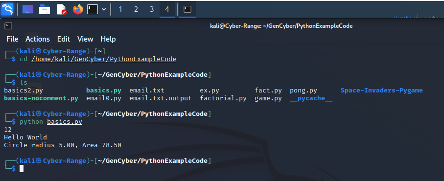

# Introduction to Python
This is a brief introduction to the Python programming language. We still have a lot of things to cover. We will have an overview, how to run python, how you can do debugging, naming of variables, functions and other things, assignment statement, loop statement, data structures such as tuples and the strings, how you define a function, exception and class.

Here is brief history of Python. Guido van Rossum invented Python in early 90s. Google actually chose Python as one of its primary programming languages
from when Google was founded. 

## Overview

### Levels of programming languages
What is a programming language? Why do we need it? A computer has accessaries such as printers and monitors. One purpose of a programming languages is to control those hardware. For example we want to draw beautiful pictures on a display. We want to print something on a printer. The code in a program can do those things. We may want to perform complex computing and a program can be written so that the a core chip called CPU (central processing unit) can be instructed to perform the computation and the program can also show the results on the display. So programs can control the hardware and perform computing. 


Because of its construction principles, the hardware and CPU can only accept binary commands and data in zeros and ones. Therefore, the very low level programming language is a machine language. Apparently machine language is too hard for everybody because it is hard to remember commands in zeros and ones. 

That's why people invented the assembly language, which is much simpler than machinen code. In assembly language, meaningful names called mnemonics are given to commands so that they are easy to remember. Since the hardware and CPU can only understand machine lanauage, a program in assembly language has to be translated into machine language by software called assembler before they are actually run. 
However, assembly language is still super hard for general person since you need to understand a lot of hardware details to really use it. But if our goal of programming is to process data and do computation, why should you understand hardware so as to compute? 

That's why people invented high level programming languages like C, C++, C#, Java and Python. High level programming laanguages are more like natural languages we speak so that they are more intuitive. High lelvel programming languages often hide hardware details so that you can focus on your tasks. Of course, C and C++ still involve some details like pointers, which refer to memory locations where data are saved. Language like Python and Java remove all such concepts. Although languages like Python and Java cannot be used to write programs controlling hardware directly, they are easy to learn and can deal with a lot of things like data processing. One statement or instruction in a high level programming langauge is often equivalent to many statements or instructions in a low level programming language. Because they are easy to learn, many people learn them and develop a lot of code libraroies, which contain code that can do various tasks. For example, you can use the code to draw a circle at a particular location on the display. 

### Python
A python program is Python code in a file with the file extension .py, for example, basics.py below. 
```
#! /usr/bin/python
# Pythin script file name: basics.py
# Normally, "#" indicates a single line comment
# Method 1 running basics.py: 
# 1. Open a terminal within Linux like Kali
# 2. Type: python basics.py

# "#!" on the first line starts a so-called shebang (hashbang) line and
# specifies which command should be used to run the scrip
# when the script has execution permission and runs at the command line
# Method 2 running basics.py: 
# 1. Add execution permission to basics.py: chmod u+x basics.py
# 2. Type: ./basics.py
    
x = 34 - 23             # Assign 34-23 to x   
y = 'Hello'             # Assign 'Hello' to y  
z = 3.45                # Assign 3.45 to z
if z == 3.45 or y == "Hello":   # if statement
    x = x + 1           # Block structure indicated by indentation
    y = y + " World"    # y + " World" is string concatenation
print(x)                # print x
print(y)                # print y

# Use the keyword "def" to define a function
# A function (e.g., circleArea) is a block of code
# It runs when it is explicitly called (e.g., circleArea(5))
# Data as parameters (e.g., r) can be passed into a function
# Use the return statement (e.g., return area) to return a value
def circleArea(r):
    PI = 3.14
    area = PI * r * r
    return area

radius=5
area=circleArea(radius)
# String modulo operator (%) to format outputs of print
print("Circle radius=%.2f, Area=%.2f" %(radius, area))
```

Sometimes we also call python program as a script. How do you run a Python program? Whatever ways you choose to run a Python program, it is the *python*
software, also called Python interpreter, which shall be installed on your computer and = actually runs the python code line by line. For example, within a Linux terminal, you can run the basics.py below
```
python basics.py
```
## Running Python
People invented different ways to run Python programs so that you can choose the one you like. We talk about the three ways running a Python program
- Using software called *IDLE* (integrated developer environment)
- Using *python* at the command line
- Running the Python program directly at the command line so you don't need to enter the python command in the second approach
 
###  Running Python Program with IDLE
When we write a Python program, the first thing you have to do is to write the code and put the code in a file and save it in a folder on a computer. IDLE is a software program, which provides you all the things you need. It has a text editor so that you can enter your code into a file.
You can actually run the code within IDLE. You just just click a few buttons. 

IDLE also has an integrated debugger. So what is a debugger and why do we need a debugger? We often make errors when we program. How can you find logical errors of your code? Reading the whole code is one way. But it is boring and can be very challenging if the code is a lot. With a debugger, we can run the code statement by statement and see what is going on over there and if the program runs as expected. A debugger helps you understand the code and pinpoint the error.

IDLE is installed on our Kali virtual machine. Click the dragon like *Application* icon and search IDLE. You just click IDLE there and open the IDLE shell window.


In the IDLE shell window,  you can see the Python interpreter is running. So basically IDLE
integrates Python into itself. It runs the Python interpreter automatically when you start IDLE. Within the Python shell, you can enter code and run it.


We want to use IDLE to open a Python file. Here is how we do this. With the IDLE shell window, click the memu *File* then *Open*. Within the opened file dialog window, navigate to the file, click the file to and then *Open*. 
Once you open the file, it's in another window. The figure below is a basically you can see the editor window. 


You can just click the menu called *Run* then you *Run Module* within the editor window to run the Python program in the file. Below shows the running results.


####  Sample Code Explanation

Now we plain *basics.py* above. I give a lot of comments here.
Normally this hash sign *#* starts a comment.
The first line is very special and is called the shibang line.
When we try to run this program, we are going to use the Python interpreter. But where is the Python interpreter? 
The shebang line specifies the location, i.e., */usr/bin/python*. 

##### x = 34 - 23
This is called assignment statement. Here we assign the expression of 34 minus 23 to x, which is an integer.

##### y = 'Hello'
We assign a string *'Hello'*, which is just a sequence of characters,  to y. y is a string variable.

##### z = 3.45
We assign 3.45 to z, which is a float number.

Why do we have different variable types such as integers, strings and floats? In computers, different types of variables are saved in the memory
in a different way. That's why we differentiate different types of variables.

##### *if* statement
Next line is an *if* statement. It says if the listed condition *z == 3.45 or y == "Hello"* is met,
then we are going to run the next block of code. The condition means if z
is equal to 3.45 or y is equal to 'Hello'.
The colon *:* indicates a new block pursues.
We use indentation to specify a new block.
The three assignments above and the *if* statement have the same indentation.
They belong to the same block. The two assignments *x = x + 1* and *y = y + " World"* in the body of the *if* statement have the same identation. 
When we run this *if* statement and the condition is met, we're going to
run the body of the *if* statement. If the condition is not met, we move on without running the body of the *if* statement.

In the body of the *if* statement, the original value of x plus 1 is assigned to x in *x = x + 1*.
x has the old value plus one. *y = y + " World"* concatenates the original string referred to by *y* with *" World"* and assign the new string to *y* back.

##### print(x) 
##### print(y)
We then use the function *print* provided by Python to print x and y.

##### def circleArea(r):
We just mentioned *print* is a function. We can actually define our own function.
In basics.py, we use the keyword *def* to define our own function called *circleArea* to compute the area of a circle with the parameter denoted as *r*, i.e., radius.
Why do we need a function?
When we want to calculate the area of a circle repeatedly within a program, we don't want to write the piece
of code every time and everywhere we want to perform the calculaton. We define a function to this end so that every time you
want to use it we just actually call the function providing the radius parameter.
In the example, we use indentation to indicate the function body, i.e. the code block that calculates the area of a circle.
In the function code blck, we first assign 3.14 to variable *PI* and then calculate the arrea, PI times r
times r. Finally the function returns the calcualted *area*.

##### area=circleArea(radius)
Let's look at how we use this function.
At line *radius=5*, we assign 5 to the variable radius. 
At line *area=circleArea(radius)*, we call the defined function *circleArea* and pass *radius* as the function's parameter. The function's variable *r* now has the value of *radius*. The function code uses this *r* to calcualte the area of the circle.
So basically the function is used to do the computation given *r*.
The calculation result is returned and assigned to *area*.

##### print("Circle radius=%.2f, Area=%.2f" %(radius, area))
After we get returned *area*, at *print("Circle radius=%.2f, Area=%.2f" %(radius, area))*, we print out the result.
We use the *%* operator to format the output.
*%.2f* means when we print a number, we want 2 digit precision and print only two decimal places.

### Which code runs first?
We still have one problem left. When we run the given program, what is the first piece of code to run?
To answer this question, we have to understand indentation.
Indentation refers to the spaces at the start of a code line. 
Python uses indentation to make blocks of code.
The code block with least indentation runs first.
Wherever a new block of code starts, four spaces are recommended.
The first line of a Python program can't have indentation.
The Python interpreter checks each line and decides what to do, e.g. running the line of code.

In the example basics.py, the Python interpreter cehck the code line by line.
It ignores the comments at the start of the program and runs the three assignments since they have zero indentation.
When it runs the *if* statement, it checks the condition. If the condition is met, the body of the *if* statement at more indentation runs, and then execution moves forward after the *if* statement.
If the condition is not met, the body of the *if* statement is ignored and execution moves directly after the *if* statement.
The two statements for printing with zero indentation run then.

Now the function is defined in the programn. When a function is defined, the Python interpreseter will not run the code, but it remembers the defined
function. A function has to be first defined before it is used. 

So basically we run the code based on the
blocks logically. The grammar is similar to human languages.
Let's ahve a look at some printout from the code. We can see the printout of 12 in the IDLE shell window.
That is the output of *print(x)*. Originally x is assigned 11. Then we assign x+1 to x to get 12.
The output "Hello World" is the result of *print(y)* because we concatenat "Hello" and " World" together and assign the concatenated strings to y.

In many other programming lanuages, the is a *main* function, which is the entry point of the program.
That is, every time when we run the program, the function called main runs first.
Python does not have the main function. Code with least indentation runs first.

###  Running Python Program via Python Interpreter at Command Line
Here you have to actually use the application called *Terminal*.
In Kali VM, the program *Terminal Emulator* can be used as *Terminal*.
Find it within *Applications*. Click to start a terminal within which various Linux commands can be entered.



To run basics.py, we first use the Linux *cd* to change the directory to where basics.py is saved.
Then the following command can be used to run basics.py.

```
python basics.py
```

###  Running Python Program Directly at Command Line
The third way is to run the Python script, i.e., the file, directly at the command line.
Sometimes, we want this method since we may run a Python script very often and entering *python* every time is cumbersome.

- We need to make sure the first line of the Python file must have the shebang line
```
#!/usr/bin/python
```
- We need to go into the folder where the script file is saved and make the Python file executable using the following command
```
chmod u+x basics.py
```
- Now we can run the file from command line directly
```
./basics.py
```
where *./* refers to the current folder. That is, the path of the script has to be specified to run the script directly. A full path name can also be used to run the script.


## Debugging
Why do we need debugging a program?
When you write a long program and run it, you find there are errors, but you don't know where the errors are.
Of course, you can read the source code. But it's very hard if the code is long.
In debugging, you can actually run the code instruction by instruction or statement by statement and 
see if the code works as expected.
In this way you can find the errors of your code okay.
That's basically uh why we need debugging.

### Enabling Debugging
To enable debugging, we need to do two things
- First within the IDLE shell window, we need to click the menu *Debug* then
check the *Debugger* option. The *Debug Control* window shows up.
- Now within the code editor window, *Run Module* and debugging starts. The code stops at the first line of code of the program.

### Debug Control
Now we check the *Debug Control* window.
- *Step*. The step button runs the code step by step, that is, statement by statement.
- *Source*. If we check the *Source* option, IDLE shows which line of source code you are trying to run when you do step debugging. 
- *Go*. When the button *Go* is pushed, the program runs. If there is no breakpoint, the programs runs to the end.
- *Over*. When we perform *step* debugging to the line *print(x)*, if we click *Step* again, which statement runs next? Actually the code of the *print* function runs. However, sometimes we do not really to debug the function code. When we run to the line *print(x)* and push the *Over* button, we run the function as one statement, basically stepping over the function. Of course, if we want to debug the function, we use *Step*.
- *Out*. During debugging, let's say you are in a function and want to get out of the function.  *Out* will get you out of function and run to the next instruction.
- *Stack*. The *Stack* option shows you what other functions you have called to get where you are in terms
of the functions
- *Locals*. A function may have its own variable such as PI in the function *CircleArea*. We call those variables local variables. When local variables are
used within a function, they are only valid in the function.
- *Globals*. Globals variables are different. We can access global variables anywhere in the program, even within functions. 

### Breakpoint
Breakpoint is a very important technique. At a line in source code, right click and it will show you a popup memu.
When you choose *Set Breakpoint*, this line will be highlighted.
What does a breakpoint do? For example sometimes you
don't want to actually do the step-by-step debugging.
We want the program to run to a line and stop so that we can check the program status at that line.
We can just set a breakpoint at that line, press *Go* in *Debug Control* to achieve this functionality.
Breakpoints are convenient for us to ignore some part of the code which we are not interested in
so that it will be faster for debugging.

## Basics & Names & Assignment & Loop
We now know a basic idea of Python.
Let's look at some details about the python programs.

### Naming rules
Naming rules are used to have consistent styles of naming things in Python.
Names are case sensitive and cannot start with a number.

Names can contain letters, numbers, and underscores, for examples, *bob*, *Bob*, *_bob*, *_2_bob_*, *bob_2*, *BoB*.

There are reserved words designating special language functionalities, for example, 
*and*, *assert*, *break*, *class*, *continue*, *def*, *del*, *elif*, *else*, *except*, *exec*, *finally*, *for*, *from*, *global*, *if*, *import*, *in*, *is*, *lambda*, *not*, *or*, *pass*, *print*, *raise*, *return*, *try*, *while*.
Let's see an example why you should not use the reversed words as variables. In our basics.py, we have the *if* statement and *of* is a reserved word.
If you name a variable as *if*, then you can see here the python interpreter will be confused about the word *if*.
IDLE tells you if a word is reserved using colors.

When we name functions, variables, classes (which will be discussed later) and other things, we want to be consistent.
This is called naming convention.
- *joined_lower* for functions, methods and, attributes
- *joined_lower* or *ALL_CAPS* for constants
- *StudlyCaps* for classes, e.g., BackColor
- *camelCase* is only used to conform to pre-existing conventions for backward compatibility. For example, if *backColor* is used in an existing library, we just use it in its own format.

### Basic datatypes
You know in computers different types of data are stored in a different way. That's why we have different data types like integers, strings and floats.

Integers are default types for numbers. For example, z = 5 / 2, where 6 and 2 are integers. / refers to integer division, in which the fractional part (remainder) is discarded. So the answer is 2.

An example float assignment x = 3.456.

Strings are be specified with double quotes "" or single quotes ''. For example, "abc" == 'abc‘ are the same string.
Unmatched quote can occur within the string, e.g., "matt's".

okay so so this is integer right this integer division this means that we want to get
the quotient uh yes we want to get a quotient and this flows right means that we have the
decimal point here we have strings right and the strings can be uh
can you can use either this double quotes or single quote to indicate you have a string and so the uh
the same thing and the white space and as we mentioned white space is a
meaningful in python we use what spaces to indicate the indentation
and so it indicates the starting point of the block so it's very
important and so
so when we enter the code right we we so you enter uh the code online that you can use the
enter key to start a new line and if you have a very long kind of a line and um so you
can use this uh backslash here to indicate you you're you you are not done yet you so
i mean the next line actually should be combined with the the previous line okay
and uh so so that's about that and so when you actually uh talk about when we talk
about the indentation so uh when we talk about the function of block of code you want to use a consistent
indentation to indicate the blocks of code okay and so that's about the workspace
comments as i mentioned normally we use a the hashmark to
indicate one line of comment but if you have multiple lines you can use these uh
triple quotes to indicate this is a the comments normally we use uh
the triple quotes multiple marker multi-line comments
to describe what a function does
so okay and so this is a one way to introduce what
the function is about okay so assignment where we're needed so basically you will you can just give a
number of whatever you want to give to a variable right and and then and
sometimes we call this a reference and you don't need to see x is actually an integer or
string so when you do this so python will know x is an integer okay
so you can see there are different ways to do the assignment you can do you can actually put
multiple names and the same line you then you assign
multiple numbers to those different variables and you can see here in this way we can
you can use this trick to exchange the values of x y
and uh so also assignment can be chained means okay you when you try to ascend 2
to a b x you can use this approach okay and uh so why do i put a here so when uh
within the python shell right and uh so uh the present shell basically you can
you can do some kind of interactive programming so for example here's a the first line right that i
just assigned 2 to x to b to a and the second line here i just put a here then i enter
so python shall the python within the idle then you'll see the press on shell window right it will show
you the value of a
okay and uh so if you use a name which is not actually defined
okay then there will be an error okay and for example we're using c but c is
never actually assigned or defined or whatever and so you can see there's an error
so now let's look at a a a for loop something like a caller fold what's the loop
so let's see here we have a list right we have a list of words words chat window defense
what the first i think i read this one demonstrate whatever it is i don't know
and uh so so this is called a list okay
and we want to actually print all the words one by one how do we do
that you can use a loop okay so here is a
the format of a for loop and you can see four w in words so this
means for each word in words right in this list
okay we call that as w then we can with them okay we call that w and then for
each one we do the print okay w and then learn
length w so we first print out uh the word
then we print out the lens so in this way right you can see and then you can do
something repeatedly right and then this is the one case that's this usable for loop
okay so now actually i think pretty much you already know uh what what what to do
with the python and but uh let's quickly go over a few data types because uh kind of data structure here these tuples
strings so what is so here are the this couple so tuple
is defined by these uh parentheses okay and uh you can see here
and a tuple can have evidence of mixed tabs it can
be a string can be integer okay and the one thing is that once you define this
tuple you cannot change it okay okay and then also this is a second kind of a
date tab we want to introduce the stream so again when you actually
already defined this junk me this string you could now change it and you will see i want to change it
okay so then you need to use this so the list
is a uh done by with a this is a square
bracket right and so you can see it's very similar to a tuple but you know
again you cannot change trouble you can change the list so we'll see and uh so
the key difference between these three tabs is a couple strings are not changeable but these can be changed
okay and so let's look at some auto operations okay and uh so here right so this is how we
define the tempo this is how we define the list this is how we define the string
and you can see here you can even use the triple quotes
to define a multi-line string here okay you can see i'm using backslash here to tell
i want to actually write a other things at a new line okay so
that's okay and now you can see if i want to see what is the save the answer st
and you can see this is basically what uh it looks like right
although it's a murder line but it's the same kind of a string here and so here
you can see this is how you access uh uh this uh different
data so for this uh tuple right if you want to access
abc you should use tu1 because the index starts with zero so this is a
zero position zero position one present two percent three prong four also tu1 right
and down here so this is a list so same thing right this is a string same thing so
in terms of string we print out the second character in string if you're trying to
find out what is the value for st1 right
and uh so also presents a positive positive and negative indexes
right and we know this right this is a this is a tuple and but you can also do this a
negative index and so in this case this is a minus one minus two minus three so this t minus
three means okay we counted from the end minus one minus two minus ministry so that's why we print out for data 56
and uh so string has some special kind of uh operation
sometimes you want to get a subset of the strings right and uh
oh i'm sorry this is not string uh slicing okay if you want to get a copy of the subset of a double
other things so this is let's see this is a tuple so okay
and uh so basically when you use uh those uh tricks right
to get a a new kind of uh
data okay and this is new data okay it's different from t here okay for example
here uh we use t the index is one two four
and so because you know index starts at zero one is abc
and uh so so you can see here so these are one
right two three and uh
stop copy before second so it says so we copy at the first index but we stop
copying before second before the second index here so we are not going to copy
df although we put one two four here right it's a one two three but uh we stopped
problem before the second index here okay and then so the negative one here again
same thing right and the next thing that indexes count from end so one again
from here and uh so then second one here same way because
again we stop copy before second so minus one is this one so we don't
actually include this one in the result of this
format here so this is a
some other examples uh so some other tricks
and uh you can see here again we have the tuple here and here we
made the first index here to make a copy starting from beginning of the container means okay and uh we are going to copy
what from first one we stop before the second index so we just
copied this one and this one okay that's why it results like this so we made the second index to make copy
starting at the first index going to the end so this time we are going to go into the end
so we start at 2 2 is here that's why we have this result right we copy this one
this one this one and that because you know if you omit the second index and uh
now we are going to actually go into the end and uh then you can also copy the whole
whole sequence using this trick okay and uh so that's about it how you do it
so here is something called a yin operator so we want to test if
three this number is in this tuple okay you can use this trick
okay and so you can see when we do three in t here the result is false and it
means we wanna we found a threes not in actually t here so it's a good this is a good way to
find numbers and uh so we can do the same thing for strings right you can see either c is in
a to something like that okay
so the plus sometimes can be used as a concatenation so you can see here when you have this
tuple this tempo you can continue them together if you put a plus over there same thing for the
list same thing for the string okay and then here this is a
uh star operator and uh
it's different from the plus so we this means you want to repeat
the add-ins within this kind of container right this is a
in this case it's tuple you can see right if we do one two three repeat three times we got this seems
like this same thing as this okay so now let's talk about the
mutability and so basically these are mutable means you can change
the adding within the list okay and uh so you can see when you
change the first one that's this one then when you when you print li
you still get the change the list okay
and uh so this is this these are mutable but uh tuples are not
changeable if you want to change it it will tell you there's an error okay and uh
so that's about uh that's about uh uh immutable and uh so here at the operation on this
only here you can append uh some add-ins to an existing list right
when you append a to this one you get this you can also insert at the second position so we put so down the same
presence i okay insert function
and uh then we also have this trick it's called extended method and and that's when you look at what is extended method
here so you can see here when we do uh extend right we extend the list
and so basically we kind of put a pendant 987 to the original list
okay and uh however you know this is called extend right
here there's another configure function called append so append is different from extend
so when we do extend you can see right we put those elements right 987
as a part of the original original list when you use expand
it put the whole 10 11 12
this is a tree this is a is treated as a single thing as a one
data adder so it's the new list it actually adds this new list
into this uh original list
right so these two are different and uh so those are different operations
right you can do uh so we want to find the index of b and that's we want to count the number
for b we want to remove b from the original list and
the reverse you can reverse the order you can sort okay
that's nice so anyway so you know compose versus list you cannot change sample but
you can change this okay so function we already actually talked
about a function so this is how you defined right and how you define the function so you use df to define a function don't forget the
column here and use indentation to indicate the block of code you can see here right so within this function we
have answer uh it's a center one then we have this a four
loop remember okay because of here you have a lot of calling to
indicate okay this is a blog for code for the for loop so you need a more
indentation here to indicate this is a new block for code so they are not at
the same indentation level of answer ends and the return right and uh
so because of this problem code uh depends on the condition here so you
must indeed in the time you must have put the indent before this block of code okay
and uh so this is another function right and uh so here
and uh so here for example here uh i give you some kind of uh so
uh example here so i call this function as a ex dot py
the pay attention you can see this this is actually uh quote is different from the other one
and uh it's because uh you know the slides added this one and then so these are
microsoft and this is wrong actually you have to use this one and the mix of actually they have their own kind of way
of uh code so that but that's not what i want so if you do copy and paste the code
will be wrong okay but anyway i'm going to call this a piece of code
uh and save the this piece of code into a file called the expy
and uh so then here is a
something i'm going to actually i want to actually use these two
functions within the python shell window so what i have to do here is i have to
actually change the folder to uh where the data file exploit is saved
okay so basically i have to import os i how to use some
os functions so i'm going to use os.get.c to show what is the current folder but you can see we are not in the
folder where i save yes.py so i have to change the folder using
os i mean using the python's code called this function called the change dir so
once i change the code and i can import ex so i don't need to put the import.py
here just to import ex so yes is what i already put into the
file right so so then once you import then you can use actually
those functions you can see now within the python shell right now i can use a
function1 and function2 okay and uh so that's about
you can see here so when you actually write a code you can use it in another
file and actually also you can use it and there is a python shell here
okay and uh so you can see here so you must define the function before you
use right that's for sure and uh so that's something you have to remember
so those are actually a functions so now let's look at the exceptions
so exceptions what are exceptions so let's look at example here so in this example we have a something
called a while loop so while true means this will run forever okay
so here let's look at the x is ascend int input something like this so what the input does is
so this will open some kind of interactive window so you have to enter a number
but what if the user enters a character
right so when you when you enter a character now it's not integer here then this
nt function here cannot change that uh character into
an integer so there will be errors okay when errors happen what do you do
right you have to process the error right that's why we use this try class try except class
so those are called exceptions because normally you expect people to enter a
number but you know some people are weird that they enter a character so there are some kind of exceptions here
so how do you process that exception so you use try use exception accept so when
people actually enter like a letter here okay then basically the python will find
oh there's an exception here so it will check this except uh line here if
if it defined order some kind of error here the value is error right it will print something okay so that's called
example let's give you a way to how to process errors
so this is about uh how how exceptions are handled and but anyway so i already told you how to do it
so finally let's look at the classes so i think you all you guys actually
play the games right and we also introduced a few data tabs
like a integer string and other things so we also talked about these right
those are classes and uh so when we talk about the list so when you how for example you give
a few numbers right to the list and you can see you have the data and you can also call the function
to change the data so let's look at the list
so you can see here right so here when we assign a b c b here to li here
we create a list so basically at this point this list
has a attributes a b c b and it has this data
right however when you have the data you also want to process data because
when you cover this basically arbitrary uh you can you can see intuitively
so you have data you also want to process the data right
and uh so basically a class allows you to put the data
and the functions that we use to process the data together as one entity so that's
what we mean by class so it's kind of a class a new class object for example
when you create a list right it's a new class of object which is called a dist
and you can actually assign new kind of data to the list and you can use the uh functions within a
list to actually process the data right in this way everything together is very clear much
better okay and also i guess all you guys play the games and um
and you can see here games you can see different people right so basically you can see
one kind of a person is a class and
the class has data for example what the person looks like
the class has actually functions for example the person can read weapons
for example if the peasant right and if he doesn't have weapons it can only be get killed and uh so the person can walk
so when you walk again you have to indicate you must have data to tell
where the person is located within the map so you can see right so we use a class
to describe a person right and the class has data which can
indicate the location of the person which can also indicate the appearance of a person and it can we can also have
functions for example the guy can walk can build weapons right so basically when you drag
one person onto the map when you create a person on the map right and you create a new instance of another
person so you can see here we have a few instances here and so the blue guy here
it has a few instances right those they belong to the same class of
people maybe present i don't know and maybe this lady here beautiful lady right and
this is a kind of a person right so but you can have multiple instances right so a class defines
okay i want a present okay right so that's called a class it's
a new class of object however when you play the game you want a
multiple patterns on the map we call each uh we call each person over there has one
instance of another class right so that's called class okay
and uh so you can see here each class instance right they can have attributes they have methods to measure the for
example build a weapon or something like that and how strong you are right you all know
that very well and this is how you define the class okay so use this class class name right
and then you can put the attributes functions so all other things are similar like you define a function okay
and uh but remember here we we put the data and uh methods together so we call
actually functions within the class called a method right so it means uh what uh for this person what measures
this person has right this particular wheeled weapon this person can walk something like that and we also have the
data right okay and uh so again when we define class you
must define the first before you use it okay and also
when you create the variables here those variables can only be used by measures within this class they cannot be used by
other people by other deca classes sometimes you can you can do it
okay but normally we call that a new namespace means okay so for example you if you have i here
right define the for this class and outside of class if you use ir game
you need to remember the i within the class is different from i outside of the class so basically you can use the same
i as a different uh kind of a level right and inside the class so
there will be no conflicts okay so that's called the name space right when you create a class you create a new name
space all the names all the variables functions
they have their own scope within this class okay
and uh so in this way we can avoid conflicts in case you know what if other
class has the same kind of names right variables and the same methods
because they are within different classes so they will not cause conflicts because they are in their own new name
space so here so this is python concepts so you define
a function right you define a class right this is your attribute this is your function for this my class and you
can actually invoke this class attribute okay
you can also invoke this class method sometimes we call this object i don't like it but you can call this object you
can call this kind of object i'm okay and uh so this is how you use it right
so you can if you want to use a classic function that's okay so that's uh
normally we do that a lot and uh so of course as i mentioned
so let's say this is a new person on my class right but uh for your class you might have class name
you have other uh you have a like a class homework many other things so we want to
you may have a multiple classes so for your first class you may want to call the x that's why you do this my class
parentheses ascend to x so this is your first class then you can create another
uh instance called y as we showed uh for the game right and you for each
kind of a patent right and that's a kind of called class instant instantiate
instantiation means that you created another patent which belongs to the same class
and also within a class you can use this function to initialize some of the variables okay
and uh some of the since you want to do for example you want uh how tall your patent
right so you can use this in need something to do that okay
and uh so so this is called so you remember we
mentioned uh uh so let's see within this uh uh we already created this instance and
it has a object called counter so we call this as attribute
object okay so we give this as one right and then we can write something like this okay so
this is called the instant object that's called class object right and uh here
so because now you are using the instance of the data
class so we call this attribute right data as a
instant object okay and we also have measured object right
that's the instance method object that's how you you can use that function right and uh
okay and uh so here are some notes which are not so
important and uh so uh one thing here is a
okay and uh you will find out the first argument of the method is usually called the self
self has no special meaning it refers to the instance itself
okay and uh so when you want to use a class for example you remember we used the os
right and uh in our previous example here and you can see we import os so lois is
a class it contains many functions for example gets the current folder that's a
function of the os means operating system okay and anyway so it's just kind of a class so if it defines such kind of
uh uh functions or methods you can actually use the os dot get cwd to get to the
folder and you can use this one to change the change of a kernel folder and then so in this way you can use
all the scenes within this os okay this class
okay i think basically that's all for this simple
did i stop and then i can stop this
