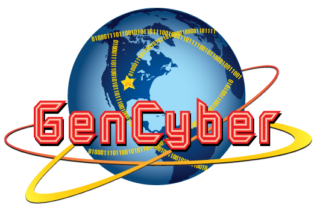

# Introduction to Cyber Attacks and Cyber Security 

We will introduce a wide range of topics, including Python programming, penetration testing and software security, networking, network attacks, firewall, Wireshark and intrusion detection system (IDS), symmetric cryptography, asymmetric cryptography, checksum and hash, and digital signature. Those topics cover 6 cybersecurity concepts including
- *Think like an adversary*. We have to understand attacks so as to find and defend against them.
- *Availability*. We need strategies to ensure resources are available at the time of need.
- *Defense in depth*. Layers of defense are often used to protect an entity's assets.
- *Confidentiality*. This is encryption that keeps our message srecret.
- *Integrity*. We need a way to find if our data is changed without permission or not.
- *Keep it Simple*. A cybersecurity product shall be easy to use and efficiently fullfill a user's goals.

The content targets people who want to understand advanced cyber attacks and cybersecurity at the operation level. The content is not theoretic although we try to explain why and how things work in layman's terms. The labs use latest Linux and Windows so that the danger of cyber attacks can be seen and the need of cyber defense is understood.

We designed the curriculum targeting high school students attending the NSA sponsored GenCyber cybersecurity summer camp with no much programming and cybersecurity background at the University of Massachusetts Lowell, but guess it will benefit anyone who really wants to understand real-world attacks and defense.

## Lab environment
We use VMs for all the labs. All VMs are tested for VirtualBox.

- <a href="https://www.cs.uml.edu/~xinwenfu/VMs/Kali-CR-25G.ova">Customized Kali VM</a>, which incldues customized Armitage and our Metasploit modules against the <a href="https://github.com/xinwenfu/vchat">vulnerable chat server</a>
  - Username: kali
  - Password: kali
  - Sudo password: kali
- <a href="https://www.cs.uml.edu/~xinwenfu/VMs/Metasploitable-CR.ova">Metasploitable 2</a>
  - Username: msfadmin
  - Password: msfadmin
  - Sudo password: msfadmin
- Windows VM cannot be shared. But really only the vulnerable chat server <a href="https://github.com/xinwenfu/vchat">vchat</a> is needed. For demo purpose, Windows defense shall be disabled.
  - Turn off Windows Defenser Firewall
  - Turn off the virus <a href="https://support.microsoft.com/en-us/windows/turn-off-defender-antivirus-protection-in-windows-security-99e6004f-c54c-8509-773c-a4d776b77960">real time protection</a>. The real-time protection is automatically turned on frequently by Windows, for example at a restart or after some time it was turned on.

## Lectures and hands-on 
Here are the lectures and hands-on labs. The hands-on labs are at the end of a lecture. Some lectures are missing although all hands-on labs are over there.
1. <a href="https://github.com/xinwenfu/GenCyber/tree/main/Python">Lecture 1</a> Python programming
2. <a href="https://github.com/xinwenfu/GenCyber/tree/main/SoftwareSecurity">Lecture 2</a> Pentration testing and software security	
3. <a href="https://github.com/xinwenfu/GenCyber/tree/main/Networking">Lecture 3</a> Introduction to networking
4. <a href="https://github.com/xinwenfu/GenCyber/tree/main/NetworkAttacks">Lecture 4</a> Availability
5. <a href="https://github.com/xinwenfu/GenCyber/tree/main/Firewall">Lecture 5</a> Firewall		
6. <a href="https://github.com/xinwenfu/GenCyber/tree/main/IntrusionDetection">Lecture 6</a> Wireshark and Intrusion Detection System (IDS)
7. <a href="https://github.com/xinwenfu/GenCyber/tree/main/SymmetricKeyCrypto">Lecture 7</a> Symmetric cryptography																			
8. <a href="https://github.com/xinwenfu/GenCyber/tree/main/AsymmetricKeyCrypto">Lecture 8</a> Asymmetric cryptography																		
9. <a href="https://github.com/xinwenfu/GenCyber/tree/main/Hash">Lecture 9</a> Checksum and hash																				
10. <a href="https://github.com/xinwenfu/GenCyber/tree/main/DigitalSignature">Lecture 10</a>	Digital signature																		

## Notes
1. Do not turn on firewall if not explicitly instructed
2. Turn off the virus <a href="https://support.microsoft.com/en-us/windows/turn-off-defender-antivirus-protection-in-windows-security-99e6004f-c54c-8509-773c-a4d776b77960">real time protection</a>
3. Do not mess up the host and play with only VMs
4. Meet at the door of the Fox Dining Hall at 1pm going back to Cyber Range

