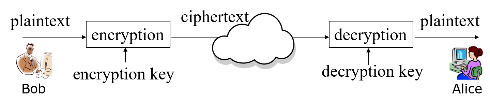
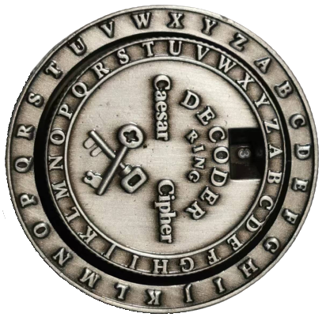
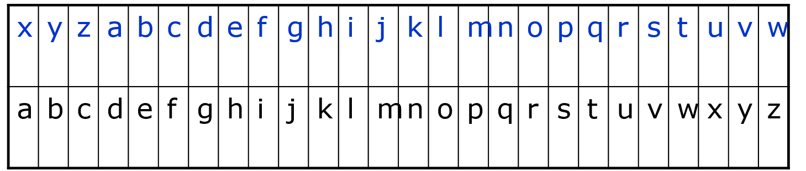
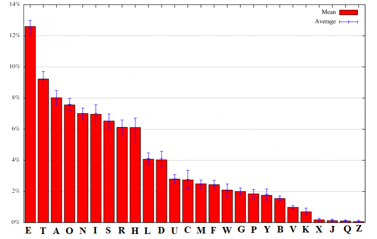
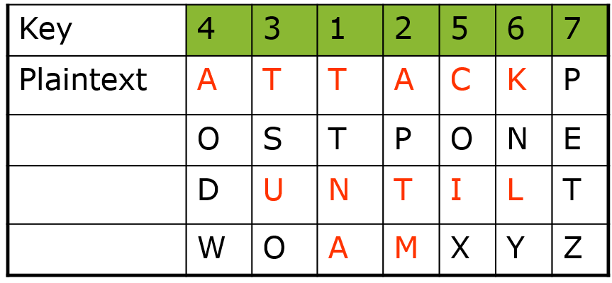
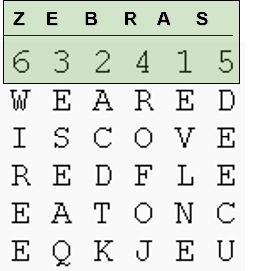
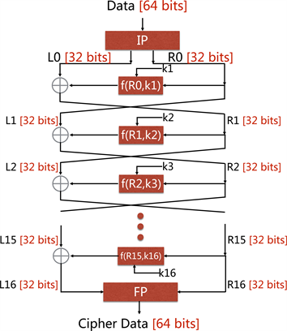
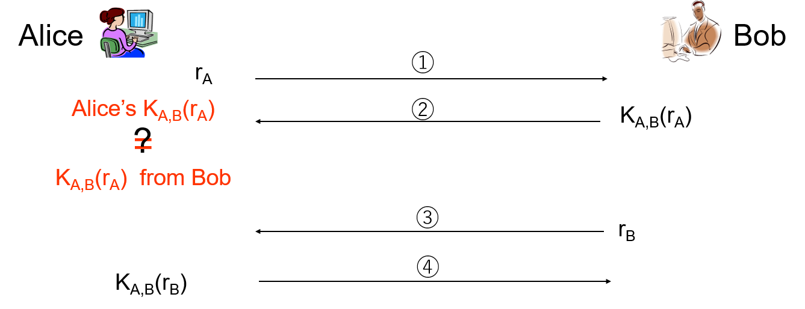

# Introduction to symmetrical key crypto

We will first introduce what is cryptography.
Next introduce some trivial codes such as Caesar cipher and frequency analysis against Caesar cipher.
Then we will introduce the modern secret key cryptography.
At last we are going to introduce hands-on labs.

## Introduction to Cryptography

The original meaning of cryptography is secret writing.
However, secret writing is an art, not really science in terms of security.
You may have played with invisible ink.
If you put the writing in invisible ink under ultraviolet light, you can see it. Otherwise, the writing is intelligible.
But really, the security of secret writing is not so good.
If you know people wrote a message in invisible ink, you can use ultraviolet light too to read it.

Cryptography becomes a science because of the mathematics, for example, number theory and algebra.
Let's see one cryptography example, encryption.
When we encrypt data, we process the data into an intelligible form.
But the encrypted data shall be reversible.
That is, we can decrypt the data and obtain the original data without any data loss.

Below is a big picture of encryption and decryption, which is one critical cryptographic application.
Cryptography is not limited to encryption and decryption.
Hash algorithms are another cryptography application we will discuss in other posts.
We now focus on encryption and decryption.
In the picture below, on the left we have Bob. On the right we have Alice.
Bob has a message, denoted as plaintext, to send to Alice.
He will use an encryption algorithm and an encryption key to encrypt this plaintext.
The output is called ciphertext, which is the encrypted plaintext.
The ciphertext can go through the Internet.
Even if somebody intercepts the ciphertext, we should be confident that our data is secure
and the attacker cannot actually recover the plaintext from the ciphertext.
Let's say the ciphertext arrives at the receiver, Alice.
Alice will use the corresponding decryption algorithm and the corresponding decryption key
to decrypt the ciphertext and obtain the original plaintext.



It can be imagined when we do encryption, the bad guys will try to actually defeat the encryption and obtain the original message.
This process is called cryptanalysis.
In cryptoanalysis, we assume the encryption and decryption algorithms are known. 
The goal of the attacker is to get the keys, which can be used to decrypt any encrypted messages.
There are many different ways of cryptanalysis.
We are going to see one example later.

## Some Trivial Codes
Now let's look at some trivial codes to have a good understanding of encryption and decryption.

### Mono-alphabetic Cipher

The first encryption approach is called mono alphabetical cipher.
With a mono alphabetical cipher, we map one letter in the plaintext to another letter as the ciphertext ketter.
The mapping must be one-to-one for a mono alphabetical cipher.
Otherwise we cannot reverse the mapping procedure and obtain the original plaintext.
The mapping process here is also called substitution.
If we map a sequence of 26 English letters to another sequence of 26 English letters, how may different ways of mappings can we have?
26!

#### Caesar Cipher
One mono alphabetical substitution cipher is Caesar cipher.
In Caesar cipher, we replace each letter in the plaintext with a letter *K* positions down the alphabet.
As shown in the picture below, we map the letters on the inner ring to letters on the outer ring.
If we rotate the inner ring, we get different mappings.
There are 26 possible mappings.
The shift of the inner ring is the key. In the picture below, the shift, i.e., key, is 3.



Let's look at one example of Caesar cipher.
In this example we have a key of 3.
It means we replace each letter with the one three letters down the alphabet.
We replace *a* with *d*. *b* with *e*, etc. 
We use this key of 3 to encrypt a message *hello*.
What is the output?



#### Cryptanalysis against Caesar Cipher

Now let's look at how can we defeat Caesar cipher.
We will use a cryptanalysis approach called frequency analysis.
As you know, Enlish letters have diffrent frequencies in text.
The picture below shows the frequency of English letters.
If a message is long, the frequencies of letters in the message will be similar to frequencies in the picture below.



How do we use the letter frequencies for cryptanalysis against Caesar Cipher?
If we know a message is encrypted with Caesar cipher, but do not know the key,
We can count the frequency of all the letters in the ciphertext.
We can then identify the letter in the ciphertext with the highest frequency.
Then it is highly possible that this ciphertext letter corresponds to the plaintext letter *e*.
Now you align the plaintext letter *e* over this ciphertext letter. In this way, you get the key and the rest of the mapping.
For example, in the Caesar cipher example, if you find h has the highest frequency in the ciphertext, the key (i.e. shift) is 3.

### Poly-alphabetic Ciphers

You can see the mono alphabetical cipher is not that secure.
That's why people invented the poly alphabetical cipher.
In a poly-alphabetic cipher, one letter in the plaintext may be mapped to different letters in the ciphertext.

#### Columnar Transposition Cipher
Columnar transposition cipher is based on permutation.
Let's look at one example in the picture below. 
We have a plaintext message "attack postponed until 2 a.m".
For the columnar transposition cipher, we write the message in rows of fixed length, e.g., 7 in this example.
Then we read column by column in a scrambled order as the ciphertext.
Since the last row misses three letters, we put "x y z" there as padding.
The key is "4 3 1 2 5 6 7". 
When we produce the ciphertext, we read the third column of the plaintext first, the fourth colum second, and so on to obtain the ciphertext.



#### Columnar Transposition Cipher with Keyword
Apparently, a key of "4 3 1 2 5 6 7" is hard to remember.
This example of columnar transposition uses a keyword, "zebras".
The permutation is defined by the alphabetical order of the letters within the keyword.
In "zebras", z'order is 6 within the keyword.
e's order is 3, b's order 2, r's order is 4, and so on.
What is the ciphertext if we use "zebras" to encrypt this message "we are discovered flee at once".
Pay attention to the padding.



## Secret Key Cryptography
Now let's look at the modern secret key crypto.
With secret key crypto, when we use an encryption algorithm to encrypt a message,
the encryption key is the same as the decryption key. 
We have seen this in trivial codes.
In Caesar cipher, the encryption key and drcryption key are the same.
In Columnar transposition cipher, the keyword is the encryption and decryption key.


The basic technique of secret key crypto is to perform multiple applications of interleaved
substitutions and the permutations to scamble the plaintext.
The picture below shows this process.
The plaintext on the left will go through substitution and permutation a lot of rounds.
How to perform substitution or permutation in each round is controlled by the key.
Finally the process produces the ciphertext.
If you don't know the key, you don't how exactly the
substitutions and permutations are performed.
It will be very hard for you to reverse the encryption process and guess the plaintext based on the ciphertext.


### DES
Here is one example symmetric key crypto algorithm, DES, which is a block cipher.
DES processes a block of 64 bits (8 bytes) messsage each time.
The block first goes throughh an initial permutation and then 16 rounds of function application (*f()*), each using different 48 bits of key generated from a master key of 56 bits. The function application involves substitution and permutation.
After final permutation, the ciphertext is produced.
So you can imagine after 16 rounds, the plaintext is really scrambled a lot.




### AES
The problem of DES is its small key size, only 56 bits.
How mamy possible 56-bit keys? 2<sup>56</sup>.
Given today's computer power, that is not a lot.
That's why people invented the advanced encryption standard (AES).
This is the current standard for secret key crypto encryption.
The key size of AES can be 128 192 or 256. It is pretty secure. 
Let's say an attacker tries keys one by one and sees which one produces meaningful output from the cipher text.
When the key size is 128, the attacker may have to try 2<sup>128</sup> different keys.
That is too much even for today's computers.

Here i have a question,
AES can be used as block cipher, encrypting 128 bits of data one time.
How can you encrypt a message longer than 128 bits?
basically if a message is more than like

### Applications of secret key crypto
One critical application is secret data transformation.
When you send a message to your friend,
you can first share a secret key with your friend.
You can use the key to encrypt messages. Your friend can use the key to decrypt messages.

Another application is secure data storage.
You can encrypt the data stored on a hard disk with a secret key.
Nobody but you can decrypt the data with the secret key.

Another application is called integrity check.
Here is a naive message integrity code.
If we use this approach to send a message and the
message is changed by somebody, you will
be able to find it.
Here is how we do it.
When you send a message, you will the message and the encryted message with a shared secret key with the receiver.
The encrypted message serves as the message interity code.
When the receiver receives the message, to check if the message is changed, the receiver can decrypt the message integrity code
and compare the decrypted message with the message.
if they are the same, the message is not changed.
Otherwise, the message is changed.
Of coruse, this message integrity code is not efficient since we use the entire encrypted message as the message integrity code.
When we discuss hash algirithms, we will see the real message integrity code.

The secret key crypto can also be used for authentication.
What is authentication?
The purpose of authentication is ensure we communicate with the right person.
In the figure below, we assume Bob and Alice share a secret key *K<sub>A,B</sub>*. 
Alice wants to check if she's talking with Bob.
She picks up a random number and sends the random number to Bob.
Bob uses the shared key *K<sub>A,B</sub>* to encrypt the random number and sends the enrypted random number back to Alice.
Alice decrypts the ciphertext sent from Bob with *K<sub>A,B</sub>*.
If the decryption produces the original random number she sent,
Alice can be sure she is talking with Bob since only Bob can encrypt the random number right with the shared secret key.
Bob can use the same approach to authenticate Alice.



### OpenSSL
OpenSSL is a crypto library that implements various cryptographic functionalities. 
*openssl* is a command line tool under Linux.
*openssl* uses various cryptography functions of OpenSSL's crypto library and can be used for
- Encryption and Decryption with Ciphers
- Calculation of Message Digests
= Creation and management of private keys, public keys and parameters
- Many oore…

## Hands-on

### Hands-on 1: Decipher Caesor cipher encrypted text

#### Ciphertext
The plaintext is English paragraphs, encrypted with Caesar Cipher of a particular shift. Ciphertext is shown below.
```
Qb qa i xmzqwl wn kqdqt eiza qv bpm oitifg. I jzidm ittqivkm wn cvlmzozwcvl nzmmlwu nqopbmza pia kpittmvoml bpm bgzivvg ivl wxxzmaaqwv wn bpm iemawum OITIKBQK MUXQZM.

Abzqsqvo nzwu i nwzbzmaa pqllmv iuwvo bpm jqttqwv abiza wn bpm oitifg, zmjmt axikmapqxa pidm ewv bpmqz nqzab dqkbwzg qv i jibbtm eqbp bpm xwemznct Quxmzqit Abizntmmb. Bpm MUXQZM nmiza bpib ivwbpmz lmnmib kwctl jzqvo i bpwcaivl uwzm awtiz agabmua qvbw bpm zmjmttqwv, ivl Quxmzqit kwvbzwt wdmz bpm oitifg ewctl jm twab nwzmdmz.

Bw kzcap bpm zmjmttqwv wvkm ivl nwz itt, bpm MUXQZM qa kwvabzckbqvo i aqvqabmz vme jibbtm abibqwv. Xwemznct mvwcop bw lmabzwg iv mvbqzm xtivmb, qba kwuxtmbqwv axmtta kmzbiqv lwwu nwz bpm kpiuxqwva wn nzmmlwu.
```

#### Tools to use for decryption
- <a href="https://www.dcode.fr/frequency-analysis">Frequency analysis</a>
- <a href="https://www.usna.edu/Users/cs/wcbrown/courses/si110AY13S/resources/ceasar-shift/shiftTable.html">Ceasar shift table</a>
- <a href="https://cryptii.com/pipes/caesar-cipher">Caesar cipher tools</a>

What is the plaintext message?

### Hands-on 2: Encryption with AES
Encrypt a message like "OpenSSL"
```
echo "OpenSSL" | openssl enc -iter 1000 -aes-256-cbc -a -k hello
```
- *echo "OpenSSL"*: display a message, in this case, "OpenSSL"
- *|*:  with the pipe character ‘|’, the output of one command (*echo "OpenSSL"* in this case) acts as input to another command (*openssl ...* in this case)
- *<a href="https://wiki.openssl.org/index.php/Command_Line_Utilities">openssl</a> <a href="https://wiki.openssl.org/index.php/Enc">enc</a>*: *Enc* is used for block and stream ciphers using password based keys or explicitly provided keys
  - Can be used for Base64 encoding or decoding.
- *-k hello*: The key will be generated from hello 
  - Without -k hello, the command will ask for a password, which will be translated into a key 
- *-iter 1000* is related to creating a strong key from the password 
- *-a*: means BASE64 output

### Hands-on 3: Decryption with AES
Decrypt the encrypted message
```
echo "U2FsdGVkX1+lVCnMEVpKXisqA1IlycMvDFkv72ILasg=" | openssl enc -aes-256-cbc -iter 1000 -a -d -k hello
```
- *-d*: means decryption
- *-a*: means BASE64 encoded input
- *-k hello*: hello was used to generate the key

### Hands-on 4: Encrypting and Decrypting File with AES
Encrypt a file
```
openssl aes-256-cbc -a -salt -in secrets.txt -out secrets.txt.enc -iter 1000 -k hello
```
- *aes-256-cbc*. Use aes-256-cbc algorithm
- *-salt*. Use salt in strong key derivation

Decrypt the encrypted file
```
openssl aes-256-cbc -d -a -in secrets.txt.enc -out secrets.txt.new -iter 1000 -k hello
```

### Hands-on 4: Send Encrypted Message via Chat Server
- One person encrypts messages and sends
- The other person receives encrypted messages and decrypts

## References
 
