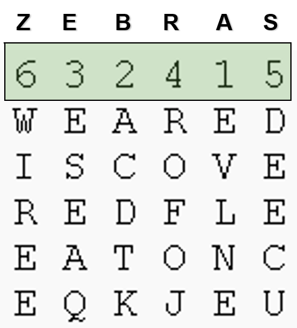

# Introduction to symmetrical key crypto
To be editted

We will first introduce what is cryptography.
Next we are going to introduce some trvial codes.
Then we will introduce modern secret key cryptography.
At last we are going to introduce hands-on labs.

## Introduction to Cryptography

Original meaning of cryptography is secret writing.
However secret writing is an art, not really science in terms of security.
You may have played with invisible ink.
If you put the writing in invisible ink under ultraviolet light, you can see it.
But really the security of secret writing is not so good.
If you know people wrote it in invisible ink, you can use ultraviolet light too to read it.

Cryptography becomes a science because of the mathematics, for example, number theory and algebra.
Let's see one cryptography example, encryption.
When we encrypt data, we process data into an intelligible form.
However, this encrypted data is reversible.
That is, we can decrypt the data and obtain the original data without any data loss.

Here is a big picture of encryption and decryption, one critical cryptographic application.
On the left we have Bob. On the right we have Alice.
Bob has a message which we call as plaintext to send.
He will use an encryption algorithm and an encryption key to encrypt this plaintext.
The output is called ciphertext, which is the encrypted plaintext.
The ciphertext can go through the Internet.
Even if somebody intercepts the ciphertext, we should be confident that our data is secure the attacker
cannot actually recover the plaintext from ciphertext.
Now the ciphertext arrives at the receiver, Alice.
The receiver will use the corresponding decryption algorithm and the corresponding decryption key
to decrypt the ciphertext and obtain the original plaintext.


It can be imaged when we do encryption, the enemy or bad guys will try to actually defeat the encryption and obtain the original message.
This process is called cryptanalysis.
In cryptoanalysis, we assume the encryption and decryption errors are known. 
then the goal of the attacker is to get the keys.
There are many different ways of cryptanalysis.
We are going to see one example later.

## Some Trivial Codes
Now let's look at some trivial codes to
have a good understanding of cryptography, particularly encryption and decryption.

### Mono-alphabetic Cipher

So the first encryption approach is called mono alphabetical cipher.
With a mono alphabetical cipher, we map one letter in the plaintext to another letter as the ciphertext ketter.
Here we are talking about English letters.
The mapping must be one-to-one for a mono alphabetical cipher.
Otherwise we cannot reverse the mapping procedure and obtain the original plaintext.
The mapping process here is also called substitution.
If we map a sequence of 26 English letters to another sequence of 26 English letters, how may different ways of mappings can we have?
26!

#### Caesar Cipher
One mono alphabetical substitution cipher is called Caesar cipher.
In Caesar cipher, we replace each letter in the plaintext with a letter *K* positions down the alphabet.
As shown in the picture below, we map the letters on the inner ring to letters on the outer ring.
If we rotate the inner ring, we get one mapping.
There are 26 possible mappings.
The shift of the inner ring is the key. In the picture below, the shift and key is 3.


Let's look at one example of Caesar cipher.
In this example we have a key of 3.
It means we replace each letter with the one
three letters later.
We replace *a* with *d*. *b* with *e*, etc. 
We use this key of 3 to encrypt a message *hello*.
What is the output?


#### Cryptanalysis against Caesar Cipher

Now let's look at how can we defeat Caesar cipher.
Let's look at
this a crypt analysis approach which is called frequency analysis.
As you know Enlish letters have diffrent frequencies of apprearing in text.
The picture below shows the frequency of English letters.
If a message is long, letters in the message will have such frequencies.


How do we use the letter frequencies for cryptanalysis against Caesar Cipher?
If we know a message is encrypted with Caesar cipher, but do not know the key,
we get the ciphertext message and can count the frequency of all the letters in the ciphertext.
We can identify which letter in the ciphertext has the highest frequency.
Then it is highly possible that this ciphertext letter corresponds to the plaintext letter *e*.
Now you align the plaintext letter *e* over this ciphertext letter. In this way, you get the key and the rest of the mapping.

### Poly-alphabetic Ciphers

Of course you can see the mono alphabetical cipher is not that secure.
That's why people invented the poly alphabetical cipher.
In a poly-alphabetic cipher, one letter in the plaintext may be mapped to different letters in the ciphertext.

#### Columnar Transposition Cipher
Columnar transposition cipher is based on permutation.
Let's look at one example in the picture below. 
We have a plaintext message "attack postponed until 2 a.m".
For the columnar transposition cipher, we write the message in rows of fixed length, e.g., 7 in this example.
Then we read column by column in a scrambled order as the ciphertext.
Since the last row misses three letters, we put "x y z" there as padding.
The key is "4 3 1 2 5 6 7". 
When we produce the ciphertext, we read the third column of the plaintext first, the fourth colum second, and so on to obtain the ciphertext.


#### Columnar Transposition Cipher with Keyword
Apparently, a key of "4 3 1 2 5 6 7" is hard to remember.
This example of a columnar transposition uses a keyword, z-e-b-r-a-s.
The permutation is defined by the alphabetical order of the letters within the keyword.
In "z-e-b-r-a-s", z'order is 6 within the keyword.
e's order is 3, b's order 2, r's order is 4, and so on.
What is the ciphertext if we use "zebras" to encrypt this message "we are discovered flee at once".
Pay attention to the padding.



## Secret Key Cryptography
Now let's look at the modern secret key crypto.
With secret key crypto, when we use an encryption algorithm to encrypt a message
the encryption key is same as decryption key. 
We have seen that.
In Caesar cipher, the encryption key and drcryption key are the same.
In Columnar cipher, the keyword is the encryption and decryption key.


The basic technique of secret key crypto is to perform multiple applications of interleaved
substitutions and the permutations to scamble the plaintext.
The picture below shows this process.
The plain text message is on the left will go through substitution and permutation a lot of rounds.
How to perform substitution or permutation in each round is controlled by the key.
Finally it will produces the ciphertext.
If you don't know the key, you don't how exactly the
substitution and permutation is performed.
It will be very hard for you to reverse the encryption process and guess the plaintext based on the ciphertext.

### DES
Here is one example symmetric key crypto algorithm DES, which is a block cipher.
DES processes a block of 64 bits (8 bytes) messsage each time.
The block first goes throughh an initial permutation and then 16 identical rounds of function application, each using different 48 bits of key generated from a master key of 56 bits. The function application involves substitution and permutation.
After final permutation, the ciphertext is produced.
So you can imagine right after 16 rounds, the plaintext is really scrambled a lot.


### AES
The problem of DES is it its key size, only 56 bits.
How mamy possible 56-bit keys? 2<sup>56</sup>.
Given today's computer power, that is not a lot.
That's why people invented the advanced encryption standard (AES).
This is the current standard for secret key crypto encryption.
The key size of AES can be 128 192 or 256. It is pretty secure. 

Here i have a question,
AES can be used as block cipher, encrypting 128 bits of data one time.
How can you encrypt a message longer than 128 bits?
basically if a message is more than like

### Applications of secret key crypto
One critical application is secret data transformation.
When you send a message to your friend,
you can first share a secret key with your friend.
You can use the key to encrypt messages. Your friend can use the key to decrypt messages.

Another application is secure data storage.
You can encrypt the data stored on a hard disk with a secret key.
Nobody but you can decrypt the data with the secret key.

Another application is called integrity check.
Here is a naive message integrity code.
If we use this approach to send a message and the
message is changed by somebody, you will
be able to find it.
Here is how we do it.
When you send a message, you will the message and the encryted message with a shared secret key with the receiver.
The encrypted message serves as the message interity code.
When the receiver receives the message, to check if the message is changed, the receiver can decrypt the message integrity code
and compare the decrypted message with the message.
if they are the same, the message is not changed.
Otherwise, the message is changed.
Of coruse, this message integrity code is not efficient since we use the entire encrypted message as the message integrity code.
When we discuss hash algirithms, we will see the real message integrity code.

The secret key crypto can also be used for authentication.
What is authentication?
The purpose of authentication is ensure we communicate with the right person.
In the figure below, we assume Bob and Alice share a secret key K<sub>A,B</sub>. 
so
one
wants to
check if she's talking with bob she can
pick up a random number whatever that
member is is random nobody
can guess what you are using and so you
send the number to bob and bubba can use
the shared key between
and is the bob to include message
then bumper will send
the encrypt message back the one and it
receives this incorrect message and it
can decrypt it
then if the secret message is same as
rna it must be bob because only bob has
not
shared a secret key and
so that's the reason
of course bob can use the same approach
to authenticate ns


okay so now let's introduce our hands-on
exercise
okay so first i want to introduce open
ssl
so
this
open ssl actually is a crypto library
but
this leverage comes with a
command line 2
with the same name
but it's just all lower letters open ssl
and this command line two uses
all the cryptographic graphic functions
of
the open ssls crypto library so you can
see here this command line too can be
used for encryption decryption can be
used for message digest basically
message integrity code and many other
things so we will see more
as we
talk more about
our topics in this gen server program
so here is our hands-on one
decipher scissor sever encrypted text
so in this case you know
the plain text i'm going to provide you
a message the plain text is an english
paragraph
encrypt we succeeded several of a
particular shift with a particular key
here
and i don't tell you the key so but you
have to use a frequency analysis and i'm
also giving you another tool which can
produce the scissor
sephora shifter table and then you can
use another tool
for see the sampler to actually
decrypt
the separate text
okay
and so i'm going to give you that
so the hands-on two here
is an encryption with a aes so here this
is wrong
okay
and
so
this is a command you can actually use
anchor open ssl apko is a
linux command so we usually perform this
hands-on
within candidates okay our candy vm and
so you can see here we do ankle open sl
this message
and then
here
this bar here
is uh
called actually redirection
okay so basically the input the output
of the first command this angle command
will be the input
of the second
command open ssl
and so you can see here we are using
openssl the encryption
function
and
here
our key will be generated from
a passcode called hello
and then
we are going to generate a key
with 100 1000
round of
operation and uh so to make you know
the
general key very random okay
and also we are going to use a
an encryption algorithm called es 256
means here to this is a key lens cpc is
a special
uh
way of aes
okay and here
the e is a b64 output
it means you know if you don't have this
dash aim the output will be boundary
numbers with a dash a
the output will be printable itself so
basically
the binary output the binary server text
is encoded
in base64 one kind of encoding approach
so that the output is printable
okay
so then once you get
the
separate text then you can use open ssl
to decrypt
the output
right the ciphertext so this is how you
do it again you can see we use echo
and here
the message
echoed by
anchor here is a
separate text
so
you know so basically the output of the
echo command will be input off of this
open ssl command
so
within the open ssl enc command
dash d means decryption so again we have
to provide a hello
and
we had to provide the iteration
times
right so that we can create
the correct
key from hello
and uh so dash a means you know the
input message is encoded with bits 64.
so in this way you know we can use
openssl enc command
to decrypt
the ciphertext
and then so here it's a
handout
three encryption
and the decryption
of a file with es so you basically
once you understand the previous command
you can understand this very well
and we are using
the es
algorithm
to actually
encrypt
a file okay so the input of the file
i mean the input file is sequencer.tkc
the other project is a
secrets.txt enc of course you can give
any name
to
the output file
okay
and then
so once uh
you
got to
your encrypted file
then you can do the decryption
and uh
so here is how you do the decryption i
think
you can understand that the command
easily
our hands-on form is a
we want to send the server text
through our chat server so one student
encrypts the messages and send out the
server text
via the chat server that's why you can
see why we want a b64 encoding
otherwise you know
our channel server cannot take a battery
input right and you can send you cannot
send the banner messages
and uh with base64
you know the separate text will be in
the big k4 format which is printable
okay and uh so once you
encrypt the message and send on the
separate text the other person
can receive
the cipher text and then perform the
decryption so you need to actually
select
the
message that was sent over
and then you right click and copy it and
then you can use the previous approaches
for decryption


## Hands-on

### Hands-on 1: Decipher Caesor cipher encrypted text

#### Ciphertext
The plaintext is English paragraphs, encrypted with Caesar Cipher of a particular shift. Ciphertext is shown below.
```
Qb qa i xmzqwl wn kqdqt eiza qv bpm oitifg. I jzidm ittqivkm wn cvlmzozwcvl nzmmlwu nqopbmza pia kpittmvoml bpm bgzivvg ivl wxxzmaaqwv wn bpm iemawum OITIKBQK MUXQZM.

Abzqsqvo nzwu i nwzbzmaa pqllmv iuwvo bpm jqttqwv abiza wn bpm oitifg, zmjmt axikmapqxa pidm ewv bpmqz nqzab dqkbwzg qv i jibbtm eqbp bpm xwemznct Quxmzqit Abizntmmb. Bpm MUXQZM nmiza bpib ivwbpmz lmnmib kwctl jzqvo i bpwcaivl uwzm awtiz agabmua qvbw bpm zmjmttqwv, ivl Quxmzqit kwvbzwt wdmz bpm oitifg ewctl jm twab nwzmdmz.

Bw kzcap bpm zmjmttqwv wvkm ivl nwz itt, bpm MUXQZM qa kwvabzckbqvo i aqvqabmz vme jibbtm abibqwv. Xwemznct mvwcop bw lmabzwg iv mvbqzm xtivmb, qba kwuxtmbqwv axmtta kmzbiqv lwwu nwz bpm kpiuxqwva wn nzmmlwu.
```

#### Tools to use for decryption
- <a href="https://www.dcode.fr/frequency-analysis">Frequency analysis</a>
- <a href="https://www.usna.edu/Users/cs/wcbrown/courses/si110AY13S/resources/ceasar-shift/shiftTable.html">Ceasar shift table</a>
- <a href="https://cryptii.com/pipes/caesar-cipher">Caesar cipher tools</a>

What is the plaintext message?

### Hands-on 2: Encryption with AES
Encrypt a message like "OpenSSL"
```
echo "OpenSSL" | openssl enc -iter 1000 -aes-256-cbc -a -k hello
```
- *echo "OpenSSL"*: display a message, in this case, "OpenSSL"
- *|*:  with the pipe character ‘|’, the output of one command (*echo "OpenSSL"* in this case) acts as input to another command (*openssl ...* in this case)
- *<a href="https://wiki.openssl.org/index.php/Command_Line_Utilities">openssl</a> <a href="https://wiki.openssl.org/index.php/Enc">enc</a>*: *Enc* is used for block and stream ciphers using password based keys or explicitly provided keys
  - Can be used for Base64 encoding or decoding.
- *-k hello*: The key will be generated from hello 
  - Without -k hello, the command will ask for a password, which will be translated into a key 
- *-iter 1000* is related to creating a strong key from the password 
- *-a*: means BASE64 output

### Hands-on 3: Decryption with AES
Decrypt the encrypted message
```
echo "U2FsdGVkX1+lVCnMEVpKXisqA1IlycMvDFkv72ILasg=" | openssl enc -aes-256-cbc -iter 1000 -a -d -k hello
```
- *-d*: means decryption
- *-a*: means BASE64 encoded input
- *-k hello*: hello was used to generate the key

### Hands-on 4: Encrypting and Decrypting File with AES
Encrypt a file
```
openssl aes-256-cbc -a -salt -in secrets.txt -out secrets.txt.enc -iter 1000 -k hello
```
- *aes-256-cbc*. Use aes-256-cbc algorithm
- *-salt*. Use salt in strong key derivation

Decrypt the encrypted file
```
openssl aes-256-cbc -d -a -in secrets.txt.enc -out secrets.txt.new -iter 1000 -k hello
```

### Hands-on 4: Send Encrypted Message via Chat Server
- One person encrypts messages and sends
- The other person receives encrypted messages and decrypts

## References
